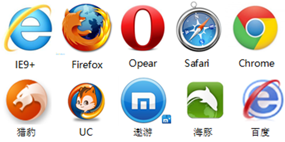
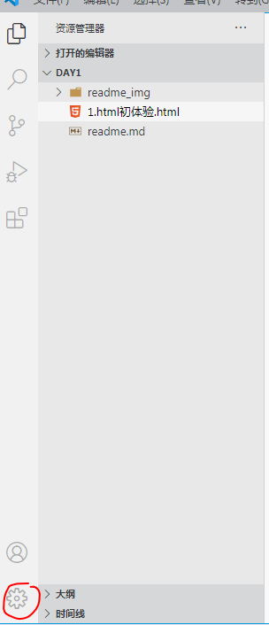
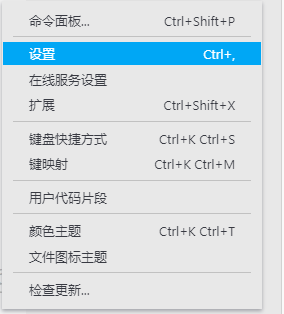
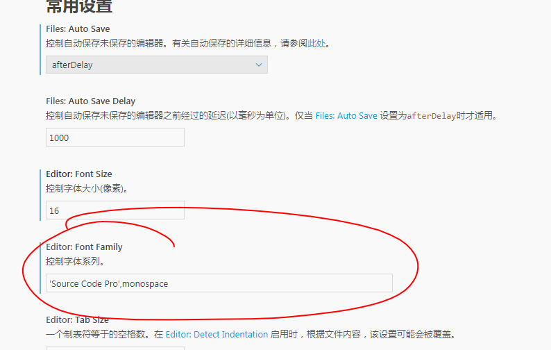
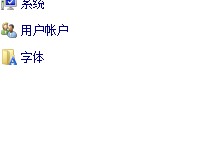
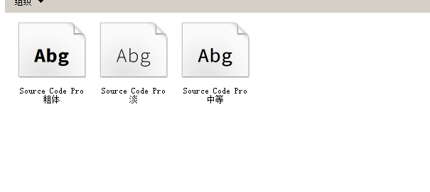
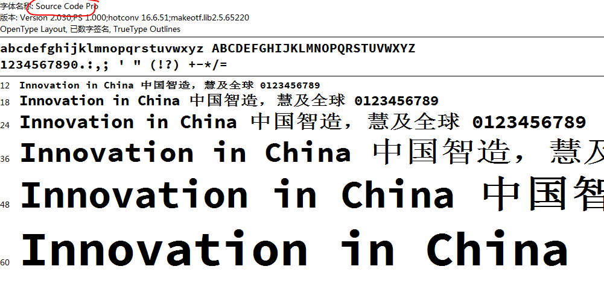
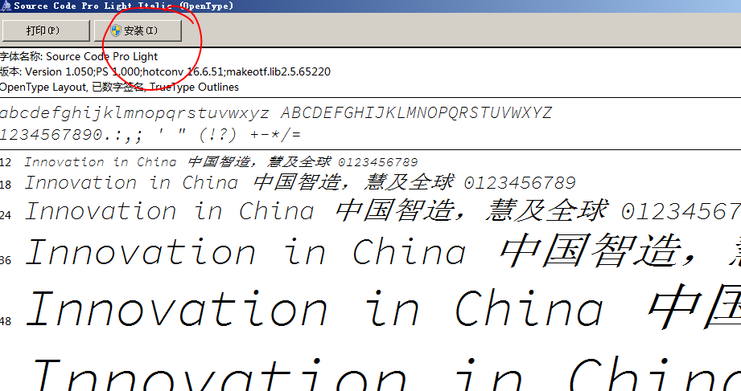
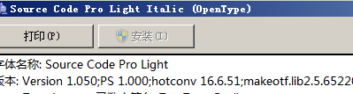

知道你们应聘的岗位叫什么吗？

__web__前端工程师

#### web

网站：多个网页组合起来就形成了一个网站。

万维网：无数个站点和网页的集合。它的外国名字叫word wide web ，也简称3w、www或web。

#### 什么是前端

后端和前端就好比电视的信号塔和电视的关系，后端发送数据，前端拿到数据之后展示出来。

#### 前端的重要性

* 结合现代人的审美来进行网页的页面的设计。

* 结合大数据环境下的网站前端。

  网站越来越大，用户越来越多。

#### 网络的划分

* 局域网：范围较小，小于10KM的范围。

* 城域网：规模限制在一座城市范围。

* 广域网：跨国界的网络，最经典就是inter网。它提供了万维网、文件传输、电子邮件、远程登录这些服务。

  上网：inter网。

#### 网络软件

web网站属于网络软件的一种。

* 什么是客户端端，什么是服务器端。

  * 客户端就是发起请求，接收服务器端发来消息的一方，在web里面指的就是浏览器。
  * 服务器，用来接收客户端发来的请求并且给出回应。

* 网站由什么组成

  * 客户端：浏览器，是www服务器的客户端，向www服务器发送各种请求，__对服务器发来的网页进行解析。__并且让用户和这些文件进行交互。

  * HTML（超文本标记语言）

    HTML用来进行标记。将网页中的各个部分标记出来让浏览器进行解释。

  * CSS

    HTML用来进行标记，但是标记出来的网页中的各个部分比较混乱，比较丑。CSS将HTML标记出来的内容进行合理的摆放，进行美化。

  * 客户端脚本语言（javascript）

    * 脚本：一种程序，不能独立运行。需要一个载体让他来运行。

    * 客户端：浏览器。

    * 客户端脚本语言：在浏览器上运行的脚本语言，在网页上看到的特效、各种交互效果都是客户端脚本语言完成的。

      `JavaScript`

    HTML、CSS、JavaScript的关系：HTML用来标记、CSS用来美化、JavaScript用来进行交互。

    不是还有其他的框架、Vue、React之类的。

  * web服务器

    www服务器，通常的服务器就是指的web服务器。

    能够提供网页的访问的这种服务，那我们叫他是web服务器。

  * 服务器端脚本语言。(后端语言  JavaScript  、 python 、PHP)

    * 在服务器端进行工作，用来协助web服务器的。

  * 数据库

    * 就是放置数据的仓库。
    * 数据库中放置的是供服务器端脚本语言调用的数据。

#### 早期web的工作方式

#### 当今的web的工作方式

#### 浏览器

我们的浏览器接收到了HTML、CSS、JavaScript之后  解释着里面的东西。

浏览器是网页运行的平台，常见的浏览器有 IE 、火狐（Firefox）,谷歌（Chrome）,Safari和Opera等，我们平时称为五大浏览器，第六个是Edge浏览器，是微软改进IE新出的内置浏览器

因为内核的不同才导致有了所谓的5大浏览器。

所谓的内核就是指的渲染引擎，负责对网页语法的解释（如标准通用标记语言下的一个应用HTML、CSS、JavaScript）并渲染（显示）网页。 所以，通常所谓的浏览器内核也就是浏览器所采用的渲染引擎，渲染引擎决定了浏览器如何显示网页的内容以及页面的格式信息。

不同的浏览器内核对网页编写语法的解释也有不同，因此同一网页在不同的内核的浏览器里的渲染（显示）效果也可能不同，这也是网页编写者需要在不同内核的浏览器中测试网页显示效果的原因。 __但它们都需要遵循W3C的标准（HTML5、CSS3、ES标准等等），所以浏览器和浏览器之间会有一些差别，但是差别不大。__

* IE IE是Trident内核。Window发布后，windows10发布以后IE将其内置浏览器命名为Edge,Edge最显著的特点就是新内核EdgeHTML。

* Firefox(火狐) Gecko内核，Gecko的特点是代码完全公开，因此开发程度很高，全世界的程序员都可以为其编写代码，增加功能，可惜这几年没落了，比如打开速度慢，升级频繁，猪一样的队友flash，神一样的对手chrome。

* Safari 采用的是大名鼎鼎的WebKit。 现在很多人错误的把webkit叫做chrome（即使chrome内核已经是blink，之前采用的是webkit内核）。

* chrome(谷歌) Blink内核,在Chromium项目中研发Blink内核渲染引擎（即浏览器核心），内置于Chrome浏览器之中，Blink其实是Webkit的分支，大部分国产浏览器最新版用Blink内核

  这是我们开发的浏览器，这个浏览器是当今世界上用的最多的浏览器。

* Opera Presto内核(已经废弃)是挪威产浏览器opera的“前任”内核，为何说是“前任”，因为最新的opera浏览器早已抛弃投入到谷歌的怀抱了，采用Blink。

* 其他国产浏览器都是在国外浏览器的内核的基础上加上了自己的UI壳子，就成了自己的浏览器了。

#### URL***

这种地址叫URL（统一资源定位符），它是用来表示要请求的资源的具体的地址。

`www.baidu.com`

`http://www.ceshi.com:80/test/test.html?par1=arg1&par2=arg2#p`

* `http://`，协议名。就是一个约定双方怎么通信。http://是可选的。

* `www.ceshi.com`，服务器地址。

* `:80`，端口号。

  端口号就好比教室里面有很多个门，每一种应用程序的数据都从不同的门进来。对于web来说数据是从第80号门进入的。 默认就是80端口号。

* `/test/test.html`，文件所在的路径  这里写的就是表示的是在web服务器上的test目录下的test.html

* `?par1=arg1&par2=arg2`，查询字符串，用来给服务器端脚本语言传递数据。  查询字符串放在?以后， 以 `键=值`成对出现。  多个之间使用`&`来分隔。

  

* `#p`，片段标识符。学HTML的时候我们再说。

无聊。。。。

#### 域名

我们访问网络主要靠IP地址来进行访问，但是IP不便于记忆，所以有了域名和DNS。

百度的网站

腾讯的网站10.201.3.5

* 域名（英语：Domain Name），简称域名、网域，是由一串用点分隔的名字组成的Internet上某一台计算机或计算机组的名称，用于在数据传输时标识计算机的电子方位（有时也指地理位置）。

* 网域名称系统（DNS，Domain Name System，将域名和IP地址相互映射的一个分布式数据库）是因特网的一项核心服务，它作为可以将域名和IP地址相互映射的一个分布式数据库，能够使人更方便地访问互联网，而不用去记住能够被机器直接读取的IP地址数串。

  `www.wikipedia.org`是一个域名，和IP地址208.80.152.2相对应。DNS就像是一个自动的电话号码簿，我们可以直接拨打wikipedia的名字来代替电话号码（IP地址）。我们直接调用网站的名字以后，DNS就会将便于人类使用的名字（如www.wikipedia.org）转化成便于机器识别的IP地址（如208.80.152.2）。

域名的结构：3部分组成。

www.baidu.com

1. 顶级域名：一级域名

   1. com，商业机构
   2. net，网络组织
   3. org，非盈利组织
   4. edu，教育
   5. gov，政府
   6. cn，中国

2. 二级域名

3. 主机名

   www.baidu.com  有一个商业机构，baidu。访问的是baidu这个商业机构网站中里面叫www的这台主机。

`www.baidu.com`

#### 什么是HTML（超文本标记语言）

  超级文本标记语言（`Hyper Text Mark-up Language`），它通过标记符号来标记显示的网页中的各个部分，HTML是一种标准，一种规范。

HTML 

文件标记语言：用标记将文本标识出来的语言。

超：指的是文本标记语言中可以标记出来图片、视频等等。

#### HTML的发展史

1. 是在91年一个叫tim-Lee的写了一份名为HTML的文档，在文档里面他用20多个标记将文字进行标记。这就是传说中的1.0。

2. 最早的HTML的官方规范是由IETF（因特网工程任务组）发布的HTML2.0，实际上不存在HTML1.0

3. 继IETF之后，__W3C（万维网联盟）__，成为了HTMl后续的标准制定者。90年代中期以后，W3C对HTMl进行了几次升级，直到1999年发布的HTMl4.01

4. HTMl4.01后的修订版为xhtml1.0（x的意思为可扩展的），实际上XHTML1.0规范内容与HTML4.01完全相同，没有添加任何新元素或新属性，这两个规范的唯一的差别是对

   HTML语法作出了不同的规定，HTMl为开发人员提供了很大的自由度，可以按照自己的意愿去编写元素和属性，但XHTML要求开发人员遵从XML规则，XHTML1.0规则要求比较严格，要求所有标签和属性都必须为小写。

5. 之后为了更加规范，W3C发布了xhtml1.1，但是很多浏览器厂商不配合不检查xhtml的规范

6. W3C开始着手开发XHTML2，但是XHTML2与所有的网页内容都不兼容，甚至于以前版本的HTML也不兼容。

7. 这时有一些人开始反对XHML2.0尤其是来自opera、apple、moailla的代表，__它们希望支持以前的版本并开发一些新功能__，但是被驳回。

8. 之后他们创建了WHATWG组织，开始开发一些规范，就是HTML5的前身，之后因为XHTML2.0的推进速度不快，人们又不愿意使用。所以W3C开始和WHATWG组织协商接受HTMl5。

9. 2014年10月28日，HTML 5.0，W3C正式发布HTML 5.0推荐标准

#### HTML语法

问题：

1. 右键没有`用code打开`。
2. 如果没有`资源管理器`，按`ctrl+b`。

写代码一定要运行。

不要凭感觉写代码。

对文本进行标记：

`<marquee>闫海静真英俊！</marquee>`

`<marquee></marquee>`叫标签，它是HTML最基本的单位，也是最主要的组成部分。

标签需要使用两个尖括号`< >`包起来，包含指定的字母。`<marquee>`

`<标签名></标签名>`这种叫双标签，标签有两个标记，一个代表开始，一个代表结束。结束使用`/`后加标签名，开始和结束的标签名是相同的，成对出现。

`<标签名 />`，这种叫单标签，它不是成对出现的，以`/`来结尾。

` `，这个标签表示的是换行。

`闫海静 真英俊！`

HTML标签不区分大小写，但是我们推荐使用小写，因为更符合标准。

`<MARQUEE loop="3">闫海静真英俊！</MARQUEE>`，上面的`loop="3"`这种叫属性，用来修饰、控制标签。即使你不写某个属性，也会属性也会有一个默认值。，比如loop如果不写默认值是0，表示的是一直循环。

格式：`属性名=属性值`

注意：

1. 属性要写在开始的标签里面。
2. 写属性值的时候可以使用单引号、双引号将值包裹起来也可以不写。但是建议使用双引号包裹属性值。
3. 标签中属性的书写顺序不区分先后。

bgcolor属性表示的是背景颜色。`bgcolor="颜色值"`

颜色值有两种表示方式：

1. 直接使用对应的英文。

2. 使用6位16进制的值来表示。

   十进制 0~9

   0~9a~f

   6位，分成三组。每两位一组，分别代表红、绿、蓝的比例。表示颜色的时候要在前面加上`#`号

   `#FFFFFF`

HTML对于空格和回车的处理

1. HTML中有一个空格和多个空格都会当做一个空格来处理。
2. HTMl有一个回车或多个回车也会当做一个空格来处理。

实体：在HTMl中有些字符是系统预留下来的不能打出来，所以你要打印出来的时候就需要使用到实体。

实体格式：`&字母;`

* 空格：`&nbsp;`
* `<`：`&lt;`
* `>`：`&gt;`
* `"`：`&quot;`
* `'`，`&apos;`
* `&`：`&amp;`

`<MARQUEE loop="3" bgcolor="#DE7D2C">闫海静&nbsp;&nbsp;&nbsp;&nbsp;真 英俊！</MARQUEE>`

双标签中嵌套了单标签。双标签中可以嵌套单标签也可以嵌套双标签。

__HTML标签的格式：__

* `<标签名 属性名1="属性值1" 属性名2="属性值2">要标记的内容</标签名>`
* `<标签名 属性名1="属性值1" 属性名2="属性值2" />`

#### HTML的注释符

`<!-- 要注释的内容 -->`

注释符的使用情况：

1. 说明代码意思的时候
2. 调试代码的时候
3. 代码暂时不使用的时候。

~~刚才只是说了标签的基本写法，但是写的相当不标准，如果这样出去干活会被人打死。~~

## 主体标签

1. 写代码的时候要说明这个文档用什么方式来解释。

   在HTML4.0中是使用：

   * `<!DOCTYPE HTML PUBLIC "-//W3C//DTD HTML 4.01//EN" "http://www.w3.org/TR/html4/strict.dtd">`
   * `<!DOCTYPE HTML PUBLIC "-//W3C//DTD HTML 4.01 Transitional//EN" "http://www.w3.org/TR/html4/loose.dtd">`
   * `<!DOCTYPE HTML PUBLIC "-//W3C//DTD HTML 4.01 Frameset//EN" "http://www.w3.org/TR/html4/frameset.dtd">`

   在HTML5中使用：`<!DOCTYPE html>`，因为HTML5是向前兼容的，所以现在就直接使用这种方式。

   `<!DOCTYPE html>`告诉浏览器我这个HTML文档要使用HTMl5的方式进行解释。

   `document type`，`文档类型`

   __注意：__

   1. 必须放在第一行。
   2. 不区分大小写。

2. HTML文档的最外层要有一组`<html>`标签成对出现，它是唯一的，是网页文件中的最外层标签。

   1. 在HTML文档中的所有标记都应该在`<html></html>`中。
   2. `<html>`这个是HTML文件的起点。
   3. `</html>`这个是HTML文件的终点。结束。

3. 在`<html>`标签中要有`<head>`和`<body>`标签。

   1. `<head>`标签：头标签，这里面的内容不会显示在浏览器中，通常里面的内容用来描述当前页面。
   2. `<body>`标签：主体标签，这里面放置的是网页真的真正的内容。比如文字、图片。

__head标签和body标签中的内容周五再说。__

敲代码。

编程字体 ：`source code pro`

告诉浏览器应该以什么方式来解释这个文档。

[`http://localhost:52330/1.html%E5%88%9D%E4%BD%93%E9%AA%8C.html](http://localhost:52330/1.html初体验.html)`

vscode设置字体：

1. 打开编辑器。

2. 找到设置

   

3. 找到设置选项

   

4. 把要设置的对应字体写进去

   

字体的名字怎么找

1. 我的电脑-》控制面板

2. 找到字体

   

3. 找到新安装的字体

   

4. 双击字体然后找到字体的名字。

   

如何安装字体

1. 找到要安装的字体。

2. 双击要安装的字体。

3. 安装字体

   

4. 安装完成图示

   