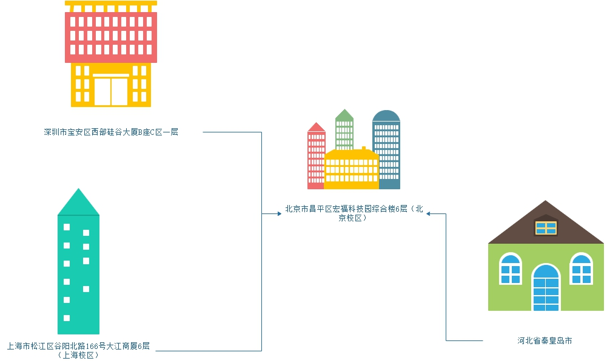
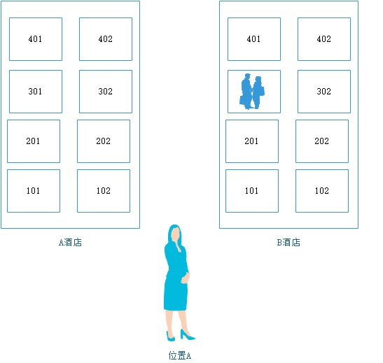
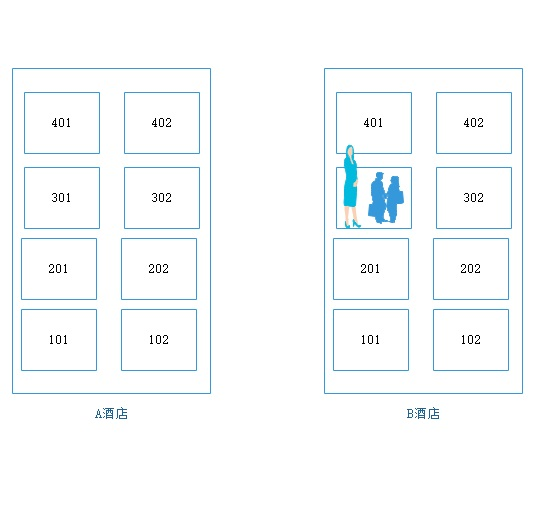
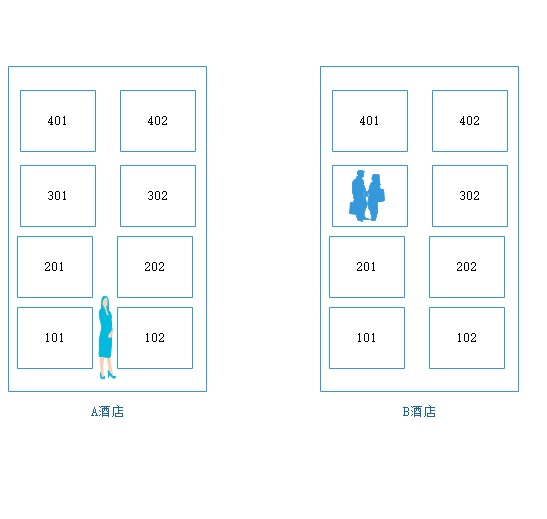
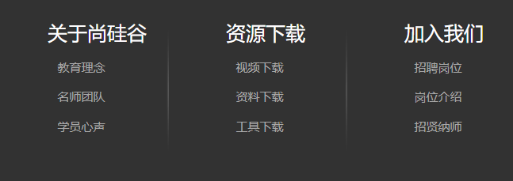
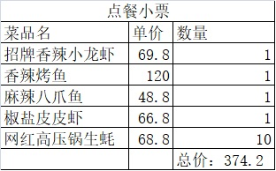
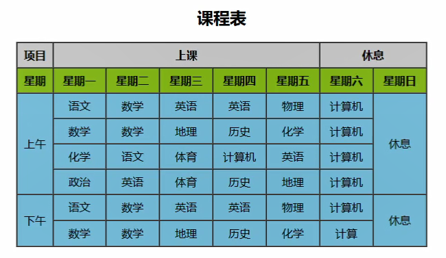
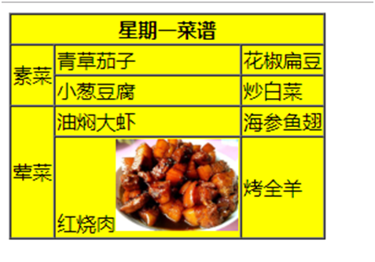

#### `<head>标签`中的内容

1. `<title>`标签

   title标签定义整个HTML文档的标题，显示在网页的标题栏上的，在整个HTMl文件中只有一个。

   __作用：__

   1. 让用户一看就知道网页要表达的意思。
   2. 搜索引擎在搜索的时候，会将title当做关键字来显示。

2. 字符集

   字符集：字符的集合。

   编码：规定了字符集里面的每个字应该怎么存储。

   __发展过程：__

   1. 美帝国主义发明了电脑，为了操控电脑发明了常用的ASCII码。ASCII编码只包含英文字母和一些符号，一个字占用一个字符。

   2. 随着电脑的普及，每个国家的人都需要和电脑进行沟通，然后大家商量以后每隔国家都开始制定自己的字符集（ANSI字符集，其中包含了很多的编码），中国制定了GB2312和GBK编码。一个汉字占据2个字符。

   3. 为了解决不同地区的编码不同的问题，所以国际化标准组织发明了`unicode`字符集，这个字符集里面有`utf-8`编码、`utf-16`、`utf-32`，utf-8存储的大小是可变的一个字占据1~4个字节。

      unicode字符集又称为万国码

3. `<meta />`标签，定义对页面的描述。

   1. `<meta charset="编码"/>`

      告诉浏览器强制使用`某个编码`来对这个HTML文档进行解释。

   2. `<meta />`的其他用法

      name属性：其中的值是固定好的。

      * `keywords`，用来指定网页的关键字
      * `description`，指定网页的描述

      content属性：

      * 当name的值为keywords时

        作用：搜索引擎在抓取网页时将这些关键字提取出来保留在搜索引擎内部。

        可以设置多个关键字，每个关键字之间使用逗号进行分隔。

      * 当name的值为description时

        作用：搜索引擎搜索关键字结果标题下面的内容。

   3. 其他的头部标签。

      1. `<script>`标签用来定义一段javascript脚本。
      2. `<style>`用来在其中写CSS。
      3. `<link />`标签，设置外部文件的链接标志，用于确定本页面和其他文档之间的关系。

#### `<body>标签`中的内容

* `p`标签：定义一个段落。

  p标签会在每个段落前后自动创建一行空白。

* `hn`标签：定义文字的标题

  n表示的是数字`1~6`

  `<h1>~<h6>`

  注意：

  1. 被`h`标签标记的文本会自动加粗并且自动换行。

  2. h标签代表的是标题，是html网页中对文本标题进行强调的标签。

     重要程度从h1~h6依次递减。

* `<hr />`标签：定义一条水平线。用来进行内容的分隔。

案例 ： 气象新闻

# 第二天

#### 语义化标签

`最近我在减肥，几乎很少吃东西，但是一个月过了竟然又胖了五斤。正在纳闷的时候。听到二货老婆在和闺蜜打电话：“我告诉你啊，我老公可好玩了——他每天晚上睡觉磨牙，我就往他嘴里塞吃的，一晚上能塞进去好多呢！”老婆闺蜜:“是啊，你老公睡觉时磨牙特别烦人！”`

* `<b> & <strong>`，加粗文本。
* `<i> & <em>`，斜体文本。
* `<u> & <ins>`，文本下划线。
* `<s> & <del>`，删除文本（以前存在过但是现在因为某种原因删除了。）。

__注意：__

1. 第一种标签只具有显示效果，第二种标签不但具备显示效果，更强调语义。
2. 标签语义化：每个标签几乎都有自己的意义，在网页中，用合适的标签，通过自身的语义来布局。
3. 语义化标签是给搜索引擎看的，搜索引擎只认识HTML标签。CSS和JS代码不认识。使用strong、em、ins、del来让搜索引擎更加重视其中的内容。


你非得勾天雷，引地火。 你是要渡劫。


#### 绝对路径和相对路径

路径：当前文件和其他文件的位置的关系。

* 绝对路径：从头开始计算文件出现的路径

  `http://localhost:52330/3.语义化标签.html`

  `Z:\vShareo\HTML+CSS\第一天`

  上面两种都属于绝对路径。

  不管当前在哪里都是从头开始计算的，完整的路径。（不管我在哪里我要到北京校区买车票都得到 北京市昌平区宏福科技园综合楼6楼。）

  




* 相对路径：相对于编码文件当前的位置来计算路径。

  * 相对路径中`.`表示当前目录。前面不加任何内容时也是表示当前目录。
  * 相对路径中`..`表示当前目录的上级目录。

  相对路径的三种情况：

  * 下级：




​		`./b酒店/301/yanhaijing`

* 同级：

  `./yanhaijing`

  或

  `yanhaijing`



* 上级

  `../b酒店/301/yanhaijing`



#### a链接

* 链接：在web中项目是网页相互连接的。

* `<a>`标签：连接到指定的文档。

  * `href`属性：要跳转的页面，值为一个URL，可以是绝对路径也可以是相对路径。

  __注意：__

  1. 路径大小写的问题。window server系统下不区分大小写，在Linux中是严格区分大小写的。
  2. 如果要跳转到指定的网站那么需要加上`http://`，否则你找到的是当前目录下的内容。
  3. href不要写本地的绝对路径（File Protocol 本地文件传输协议，file协议主要用于访问本地计算机中的文件。）
  4. 空链接，`<a href="#"></a>`

  * title属性：鼠标移动上去时给出提示。
  * target属性：点击链接后在哪里打开链接。
    * `_blank`，在新窗口打开
    * `_self`，在本窗口打开。这个是默认值。

`shift + alt + a` 注释的快捷键

`ctrl + /  `

* 锚点：URL中的片段标识符，请求指定资源的子资源，点击指定链接的时候跳转到指定的位置。

  步骤：

  1. 分块

     ```html
     <a name="article1"></a>
     ```

  2. 标记链接

     ```html
     <a href="#article3">第三章：成长</a>
     ```

  

__注意：__

1. 标记链接时要加上`#`号
2. 标记链接的时候名称要和分块的名称要能够对应上。
3. 直接在url地址上输入`#标记名`也可以使用，但是不方便，我们为了方便所以才加上了`标记链接`

#### img标签

``图像标签，单标签。

* `src`属性：必须，值为一个URL。
* `alt`属性：图像不能正常显示的时候告诉浏览网页的人和搜索引擎这张图片应该表示什么内容。
* `width`属性：图像的宽度
* `height`属性：图像的高度


px，`pixel`的缩写，它不是咱们自然界中的长度单位。px是一种图像中最小的点，一张图片就是由这些点组成的。


如果单独设定了宽度或高度，将会进行等比例缩放。


背景图和img元素：

#### 块级元素及行内元素

* 行内元素与块级元素最直观的区别：行内元素会在一条直线上排列，在同一行，水平方向排列。
* 块状元素：每个块状元素都会独占一行，垂直方向排列的，块状元素从新开始结束时都会接着一个断行。
* 块级元素里面通常可以包含行内元素和块级元素，但是行内元素中不包含块级元素。

#### 列表

字不如表，表不如图。

* ul无序列表

  * ul标签包含列表的内容
  * ul的子元素必须是li
  * li中包含列表的每一项

* ol有序列表

  * ol标签包含列表的内容
  * ol的子元素必须是li
  * li中包含列表的每一项

* 定义列表，由项目描述和项目解释组成，项目解释自动缩进。

  * `dl`：说明定义了一个`定义列表`
  * dt：定义列表中的项目（标题）
  * dd：描述列表中的项目

  dl只能包含dt和dd，dt和dd中可以包含其他标签。

   

   

  

#### 内框架

`iframe`标签，用来在本网页中包含其他的文档。

* `src`属性：打开网页时你要载入哪个文档。
* `frameborder`属性：显示内框架的边框。1显示边框，0隐藏边框。
* `width`属性：
* height属性：
* `name`属性：给这个窗口起一个名字。 然后我们就可以配合页面中的target 来在这个窗口中打开指定的网页。

#### 表格

表格和excel一样，都是用来展示数据的。




`<table>`标签：告诉浏览器在`<table>`内包含的内容属于表格。

`<caption>`标签：给表格添加标题

`<thead>`标签：表示这是一个表头。

`<tbody>`标签：表示的是表格的主体数据部分。

`<tfoot>`标签：表示表格的脚注部分。


在thead、tbody、tfoot中每一行使用tr来表示。


thead中的tr中的每个单元格使用`th`标签表示。


tbody和tfoot中的tr中的每个单元格使用td标签表示。


_注意：_

1. 很多程序员写table表格的时候不加thead、tbody和tfoot，这样写也行。加上之后更加规范。如果没有表头和脚注部分那么就可以不用写thead和tfoot。

   thead、tfoot是可以没有的，但是一个表格肯定会有主体数据，也就是肯定会有tbody。

2. 对于tbody来说就比较特殊。即使不写tbody标签浏览器在解释html代码时也会自动加上。


案例：课程表。




作业：

