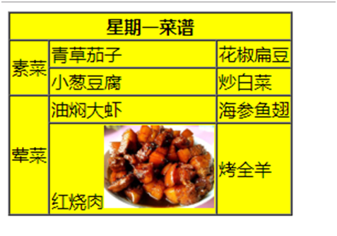
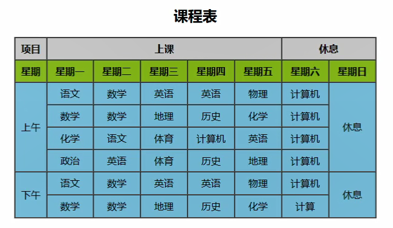

table中常用的属性：

* border属性
* width
* cellspacing：单元格与单元格之间的间距。

tr中常用的属性：

* height：设置tr的高度。
* align属性：其中的文本的水平对齐方式。
  * left（默认）
  * center
  * right

td中常用的属性

* colspan属性：规定单元格可以横跨的列数
* rowspan属性：规定单元格可以竖跨的行数。

案例：课程表。

