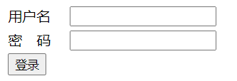

# 第三天

#### 表单

* `<form>`标签：告诉浏览器这个双标签中包含的内容是表单的内容

    * action：将数据提交到哪里去。直接写提交的地址。(了解)

    * method：提交数据的方法。(了解)

        * get 通过URL地址的方式来进行提交。
        * post 将URL和数据分开进行传输。

        

* `<input />`标签：定义输入框

    * type属性：定义输入框的类型（根据type的值来配合使用哪个属性）

        * **text值：表示是一个文本输入框，让用户进行输入的。**   

            * **name属性：该文本框传递数据到服务器上的标识。**
            * ~~size属性：用来设置显示字符的宽度。（知道一下就行。）~~
            * `maxlength`属性：表示允许的最大输入字符串的个数。
            * **disabled属性：表示禁用此输入框。**
            * **value属性：默认值。**

        * **password值：表示一个密码框**

            * **name属性：该文本框传递数据到服务器上的标识。**
            * ~~value属性：用来表示默认值。~~

        * **submit值：表示这是一个提交按钮**

            * **value属性：表示的是按钮要显示出来的值。**

             `?userName=yanhaijing&passwd=zhenyingjun`  查询字符串

        * radio值：表示一个单选框，只能选择一个。

            * name属性：该文本框传递数据到服务器上的标识。

            * value属性：传递到服务器上的值。

            * checked属性：选中该单选按钮   `checked=checked`

                如果属性名和属性值相同那么可以只写属性名

            注意：多个单选框中的name值必须相同，否则不会出现单选效果。

        ---------------------

        * `checkbox`值：复选框，可以选择多个。

          * name属性：传递到服务上的标识。
          * value属性：传递到服务器上的值。
          * checked：属性

          __注意：__

          1. 因为用户不能输入内容所以必须使用value属性事先定义好要传递给服务器的值。
          2. 每个复选框name的值需要相同，名字后面要加上`[]`，表示的是传递一组值过去。

        * file：上传框

          * name属性：该上传框传递到服务器上的标识。

        * image：图像按钮，用图片替代submit按钮原来的样式。

    

    

* `<label>`标签：为`<input />`标签定义标注。

  `for`属性：和input进行绑定，值为标注的`<input />`输入框的ID的值。

  ​    
  
    
  
* select标签：定义一个下拉列表

    name属性：这个下拉列表叫什么名字。

    disable属性：禁用下拉列表。

* option标签：用来定义列表中的每一项

    value属性：传递给服务器的值。

    disabled属性：禁用该选项。

* `textarea`标签：用来输入大段的文字。

    * name属性：传递给服务器的标识。

    注意：`textarea`中的默认值应该在标记的中间，如果`textarea`标签中有回车空格，输入的内容也会换行回车。

* button标签：用来表示一个按钮

    * type属性：定义按钮的类型：值可以为button、submit

    如果不写type属性，那么根据浏览器的默认设置来进行处理。

案例：注册详情页

#### 无意义的标签

* `div`，无意义的块状元素标签。
* `span`，无意义的行内元素标签。

__主要在CSS中使用。__

明天的作业：把HTML讲过的这些标签都敲3遍。