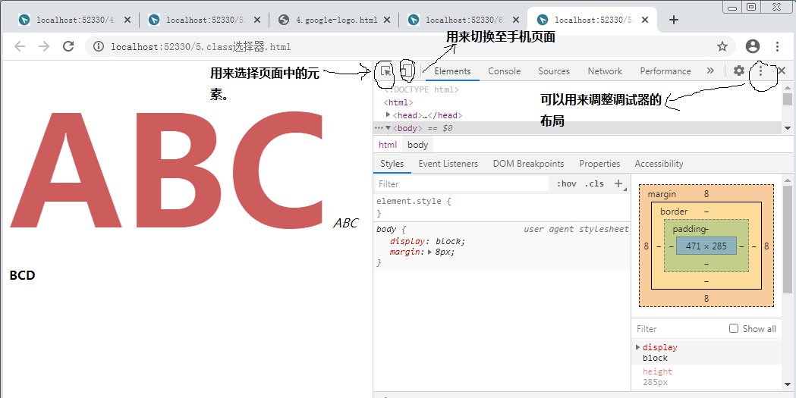
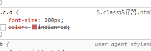
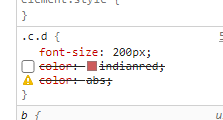
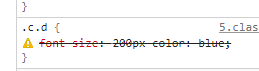
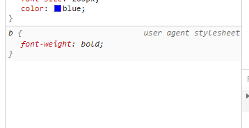

#### CSS简介

`CSS（cascading style sheet）`，层叠样式表，主要是控制网页的样式和布局（好比在word中控制文字的居中、颜色等，这只是CSS中的一点功能，还有很多），使样式、布局和标记能够分离的标记性语言。

随着人们审美观点的提高，现在网页中的CSS和HTML有着举足轻重的地位，他俩是配合使用的，分工明确的。

CSS3是CSS规范的最新版本，CSS2.1单一的规范，而CSS3被划分成几个模块组，每个模块组都有自己的规范。这样的好处就是整个CSS3的规范发布不会因为部分难缠的部分而影响其他模块的推进。

#### CSS基本语法

```html
<!-- 崔旺 -->

2个女朋友（假如   ---> 时间管理、逻辑能力）

女朋友1（刚子）{
	身高:165CM; -> 买双高跟鞋
}

女朋友2（赵铁蛋）{
	眼睛：大一点; -> 割眼角
}
```

__CSS的本质就是选择，然后改变某个属性。__

```html
选择器{
	属性1:值1;
	属性2:值2;
	属性名3:值3;
	.......
	属性n:值n;
}
```

选择器：告诉浏览器应该操作哪些样式作用于页面中的哪些元素。

声明：告诉浏览器如何渲染指定的对象，它由两部分组成：

* 属性名：属性名是CSS预定的，由一个或多个单词组成。
* 值：定义对应的属性名应该显示的效果的参数。


__注意：__

1. 每个`属性名/值`是一对数据后面要加上分号。
2. `属性名/值`不要横着写，不容易维护。
3. 浏览器在解释CSS的时候回忽略空格和回车。


* 选择器：标签选择器，把HTML的标签名作为选择器来使用。

  ```html
  span{
  	font-size:20px;
  	color:rgb(255,0,0);
  }
  ```

* 常用的属性：

  * font-size，设置字体的大小，单位px。
  * color，用来设置字体的颜色。

#### CSS中的颜色

1. 16进制的值。

2. 英文单词。 pink blue yellow。

3. rgb颜色值：格式：`rgb(红,绿,蓝)`，值0~255之间的值。

   `rgb(27,72,114)`

4. rgba颜色值：格式：`rgba(红,绿,蓝,透明度)`，前面三个和rgb相同，后面一个a代表的是透明度，0为完全透明，值越大透明度越低，可以使用`.5`代表就是。值的区间就是`0~1`。

#### CSS的使用方式

1. 内联方式：在html标签中使用style属性来设置CSS样式。

   格式：`<标签名 style="属性1:值1;属性2:值2;....">被标记的内容</标签名>`

   特点：只能作用于本标签。

2. 内嵌方式：在head标签中使用style标签。

   ```html
   <style type="text/css">
       span{
           color:royalblue;
           font-size:100px;
       }
   </style>
   ```

   特点：作用于当前的整个页面。

   __注意：__

   1. 声明CSS时，不一定要包含type属性。`type=text/css`表示的是这一块代码是css格式的。
   2. 最后一个`属性:值`规则可以不用加上分号，但是__强烈建议__加上。

3. 外部导入方式：使用`<link />`标签导入。

   link标签用来导入css文件，作用于本页面，实现CSS样式。将其他文档和当前文档关联起来。

   通过link标签链接的样式表不是HTML文档中的一部分，但是却可以给HTMl文档使用。

   `<link href="./index.css" type="text/css" rel="stylesheet"/>`

   * href属性：链接的文档来自哪里。
     * 链接的文件扩展名为`.css`。
     * 链接的这个文件中只能包含CSS的代码不能包含其他的代码。 
   * rel属性：（relation，关系）：当前文档于被链接文档之间的关系。
   * type属性：规定被链接文档的数据类型。

   一个文档可以关联多个样式表，浏览器会加载这些样式。

   这样可以将整个网站中公用的部分提取出来。这样方便维护。

   __以上三种方式，当样式冲突时，采用就近原则。哪个属性离被修饰的内容近就使用哪个，如果没有属性冲突那么就采用叠加效果。__

#### CSS特性

1. css的层叠性：CSS样式允许重复声明，相互覆盖。

2. CSS的继承性：被包含的元素拥有外层元素的样式。（不继承的我会在讲的时候说明。）

#### CSS中的注释符

```html
/*
需要被注释掉的内容。
*/
```


#### CSS中的空白

CSS对待空白的方式和HTML差不多，解析时连续的空白会被合并成一个空白。

#### 选择器

1. 标签选择器：也称为类型选择器，直接使用的就是HTML标签名。一般利用标签选择器规定标签的默认样式。

2. 通用选择器：选择文档中的所有HTML标签。目的就是选择所有标签。

   `*.*`所有后缀的所有文件。

   `*.mp4`

3. `.className`类选择器

   什么叫类：  物以类聚人以群分。

   具有相同特征的一类事物。

   类选择器以一个`.`前缀开头，后面跟随着一个自定义的类名。

   在HTML中需要为标签定义class属性。

   __注意：__

   1. class的名字是区分大小写的。
   2. `标签名.class名`，选择只具有`class名`的标签。
   3. 同一个标签可以具有多个类名。
   4. 类选择器可以写为`.c.d`这种格式，表示的是这个元素应该是`class="c d"`，并且顺序不做限制。

4. `#id值`，ID选择器

   __注意：__

   1. ID选择器也需要区分大小写。
   2. ID具有唯一性（你如果很任性个多个标签指定了同一个ID值，也可以用，但是后果自负），一个ID值只能使用一次。
   3. 类选择器相当于名字。

5. 组合选择器

   就是将其他的选择器写在一起，然后进行批量的操作。

6. `E F`，后代选择器，选择匹配的F元素，并且匹配的F元素被包含在匹配的E元素内。

   后代选择器两个元素之间的层级间隔可以是无限的。子元素、孙子元素、重孙子元素。......

   后代选择器两个或多个选择符之间必须使用空格隔开。

7. 链接伪类选择器

   链接伪类选择器只针对于HTML中的a标签。两种状态：已访问、未访问。

   `a:link`，匹配的a标签，且a标签定义了超链接（具有href属性），并且未被访问过。

   `a:visited`，匹配的a标签，且这个a标签定义了超链接并且被访问过。

   多个链接地址指向同一个地址，将会受到影响。

   访问过之后你的访问记录被存储在浏览器的缓存中了，不同的浏览器它的缓存是不一样的。

   可以使用`ctrl+shift+del`来删除浏览器记录。

8. 动态伪类选择器

   `e:active`选择匹配的E元素，且匹配的元素被激活的那一刹那生效。

   `e:hover`选择匹配的E元素，且用户鼠标停留在E元素上生效。

   注意：在a链接上应用上面的标签必须遵守一个原则“爱恨原则”，`LoVe/HAte`

   `link -> visited -> hover -> active`

#### chrome调试工具



常见错误：

* 注释掉的代码，在chrome中的表现。

  

* 无效的属性名和值

  

* 缺少分号

  

* 默认样式

  

  user agent stylesheet 指的是标签默认的样式。


#### 权重值

同一个元素可能被多个选择器选择，它们又应用了相同的规则（选择了同一个元素的多个选择器之间又因为同一个属性产生了冲突），这个时候需要计算权重值。

一个权重值由4部分组成：0,0,0,0

* ID选择器权重最高：`0100`
* 类选择器、伪类选择器：0010
* 标签选择器：0001
* 通用选择器：0000
* 行内样式权重为1000
* 后代选择器:每个选择器的权重相加。


__注意：__

1. 数值越大，权重越高。
2. 权重值相同最后一个样式胜出。
3. 如果要忽略权重值时，需要在任何需要保护的属性后面加上`!important`，这样它可以避免被权重更高的属性覆盖。

#### 字体

* 字体

  字体是文字的外在形式特征。就是文字的风格，是文字的外衣。

  一个字体的诞生经过如下几个步骤：

  * 经过字体设计师的创意设计
  * 字体制作人员一笔一划的制作、修改
  * 技术开发人员对字符进行编码、添加程序指令、装库、开发安装程序
  * 测试人员对字库进行校对、软件测试、兼容性测试
  * 生产部门对字库进行最终产品化和包装上市等几个环节。

  字体分为免费使用和商业使用。

  `C:\Windows\Fonts`存储位置

* 字体组成

  我们认为的"字体"很可能是一个不单纯的字体。一个字体很有可能是有多个字体变形而成，分别用来描述粗体、斜体、正常字体等等，每种变体都有一个具体的字体风格。所以我们电脑中安装的字体有可能是一个字体的系列（字体族），二不是单纯的字体。

* 字体族的类型

  字体族、字体系列可以分为很多类，大致分为下面的5类：

  * `serif`，衬线字体。

    笔画开始、结束的地方有额外的装饰，而且笔画的粗细有不同的自形。

  * `sans-serif`，无衬线字体。

    没有额外的装饰，笔画粗细差不多。

    字体。

  * `monospace`，等宽字体。

    针对英文文字来说。所谓的等宽指的是每个英文字符占据同等的宽度。

  * `cursive`，手写字体。

  * `fantasy`，奇幻字体。

  上面6种字体族中，`cursive`和`fantasy`对于中文应用场景有限，所以不做讨论。

#### 字体系列

格式：`font-family:name`

后面跟字体的名字。

__注意：__

1. 设定的字体名如果包含空格，你应该使用引号括起来。  'abc d'
2. 常用的中文字体，宋体、微软雅黑，一般不会这样用。可以使用汉字说明使用哪种字体，但是会有乱码的风险。所以项目中使用的字体一般都是英文名字的字体。
3. 可以定义多个字体。多个字体将优先按照排列顺序查找，先找到谁就使用谁。
4. 我们会在多个字体的后面加上`sans-serif`。
5. 如果定义的多个字体都没有那么将会使用浏览器默认的字体。

#### 字体大小

假如说没有给css指定一种文本尺寸，web浏览器会使用它预先设定好的大小，大部分浏览器是16px的大小。

格式：`font-size:value`

value:

1. px，像素
2. %，根据从父元素继承下来的大小来进行计算。
3. em，相对于父元素继承下来的大小来进行计算。
4. rem，它的值基于根元素的文本尺寸来进行定义。`<html>`

#### 字体粗细

格式：`font-weight：value`

值：

* normal，正常字体。

* 100~900，使用100~900作为关键字，来设置字体的粗细。

  __为什么有时候没有效果，完全看你使用的这个字体是否安装了各种字体的变体，也就是你使用的字体得真正的映射了9级才可以。__

* bold，粗体。通常对应的是数值700

如果说字体或字体族中并没有设定粗体，浏览器自行计算，生成粗体。

#### 定义字体风格

格式：`font-style:value`

vlaue：可以设定的字体风格。

* normal，默认值。
* italic，显示成斜体。