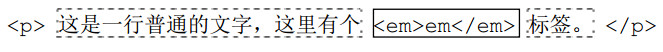
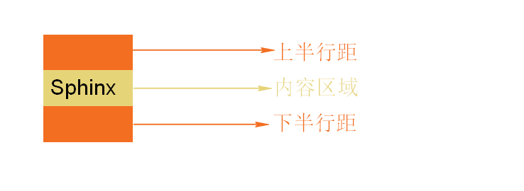

#### 字体简写格式

格式：`font:font-style font-weight font-size font-family`

__注意：__

1. font-style和font-weight的顺序可以颠倒。
2. 这种简写的方式，font-style和font-weight可以省略不写。
3. 一旦使用简写那么font必须有size和family。

#### 字体颜色

`color:颜色值`

#### 字体下划线（不可继承）

格式：`text-decoration`

value：字体的线的效果。

* none，标准的文本，将应用在元素上面的装饰线去掉。
* underline，文本的下划线。
* overline，上划线
* line-through，贯穿线

__注意：__

1. text-decoration可以有多个值。`text-decoration:underline line-through overline`

#### 字符间距

格式：`letter-spacing:value`，定义字的距离。

value的值：

* `normal`，等同于`letter-spacing:0`
* `px`，像素。

#### 盒子模型的基本元素

* width:设置元素的宽度。
* height:设置元素的高度。
* background-color:设置元素的背景色
* border:设置边框

#### 元素的显示模式

* 块级元素（`block`）：

  * 独占一行，前面和后面都会有换行。多个块级元素会各自新起一行。
  * 默认情况下block元素的宽度是父亲元素的宽度。
  * 块状元素可以独立的设置宽度和高度，但是即使设置了宽度，它仍然是独占一行。
  * 人为设置的自身的宽度可以大于父元素的宽度也可以小于父元素的宽度。

  ~~常用的块级：div、h1~h6、p、ul、ol、li、dl、dt、dd、form~~

* 内联元素、行内元素（inline）

  * 不会独占一行，多个相邻的行内元素会排列在同一行里，知道一行排列不下才会进行换行。
  * 行内元素设置宽度和高度没有效果。

  ~~常用的行内元素：span、b、em、i、strong......~~

* 内联块状元素(`inline-block`)

  它在内部表现为块状元素，可以设置宽度和高度，在外部排列方式类似于内联元素，既水平排列。

  常用的元素：img、表单中的元素。

* 更改显示类型

  格式：`display:value`（不可继承）

  * block，将元素显示为块状元素
  * inline，显示为行内元素。
  * inline-block，显示为行内块状元素。
  * none，隐藏元素。

#### 文本缩进

将块状元素的文本缩进指定的长度，不能用于行内元素。

格式：`text-indent:value`（可继承）

值：

* `px`，像素。
* em：根据父元继承下来的大小计算。1em=1个设置的字体的大小。

__注意：__

1. text-indent不能应用到内联元素中。
2. 文本缩进只会影响元素的第一行。
3. 在设定了元素的宽度，且元素中的内容超出了元素的宽度之后，将会超出显示。

#### 换行

CJK的文本遇到容器边界会自动换行；非CJK文本由word-break属性的值来决定。

CJK，china 中文、japan 日文、korean韩文三国文字的缩写。   CJK。

`word-break:value`，用来标明怎么样对单词进行断句。

none：根据浏览器默认的设置来判断是否进行断句。

break-all，如果使用break-all软换行（宽度不够自动换行）会出现任何字符之间。

keep-all，如果使用keep-all即使文本超出文本所在行的宽度也不会换行。  但是要注意特殊的标点符号。

#### 隐藏内容

overflow：值

visible，超出元素的内容是可见的。

hidden，超出元素内容被隐藏。

scroll，超出的元素内容会被剪切，但是会显示出滚动条可以拖动它显示出剩下的内容。

auto，浏览器自己确定。

### 水平对齐

格式：text-align:value（可继承的）

left，默认值，文字放到左边。

right，文字放到右边。

center，文字放在中间。

现在有居中或左边、右边显示前提是我得有空间。

__注意：__

1. text-align只能用于块状元素或者行内块状元素（行内块状元素要设置了宽度）
2. text-align只用来处理元素中的内容的对齐方式，对元素自身没有影响。

#### hn标签和a标签的默认样式

后代的标签可以继承父标签中所有关于设置文本的CSS属性（除了text-decoration），继承的权重是0。

对于a标签来说默认对字体颜色进行了设置，所以会覆盖掉继承下来的颜色。

h标签默认对字号进行了设置，所以也会覆盖继承下来的字号。

权重值拼的是自己的权重值，继承下来的属性不会参与到权重比较中去。

#### 行内框盒子模型

所有的内联元素的样式表现都与行内盒子模型有关。

* 内联盒子（`inline box`），不会让内容成块显示，而是排成一排。

  

* 内联盒子类型：

  * 如果内容被行内标签所包含（span、a、em），属于内联盒子。（上图中的实线部分）
  * 如果只是光秃秃的文字，属于匿名内联盒子（虚线部分）

* 内联盒子的组成：

  

  * 内容区域（content area）：是一种围绕文字看不见的盒子。内容取余大小和font-size有关。

    * 非替换元素，内联元素。
    * 替换元素，内联块状元素（图片）。

    

* 行间距

  多行文本之间相隔的距离。

* 半行距

  在css当中行间距被分散在文字的上方和下方。

* 行框盒子（`line box`）

  每一行都是一个行框盒子，每个行框盒子都由一个一个的内联盒子组成。

* 包含盒子（`containing box`）

  此盒子由一行一行的行框盒子组成。

  每个行框边框刚好与各行的顶边和底边刚好吻合。

#### 行高

line-height - content area = 整个的行间距 

整个的行间距 / 2  =  上半行间距或下半行间距

格式：`line-height`：定义行高，实际上是定义两行文字基线之间的距离。

* baseline（基线），基线是小写英文字母x的下边缘，为了排列整齐用的。

  如果是图片基线是底部。

* x-heihgt，表示该字体中x的高度。
* 中线，指的是内容区域高度的1/2处的一条线。
* 上边线、下边线：内容区域的上变线和下边线。

vlaue可以使用的值：

1. number，将数值作为行高的值。根据当前的font-size大小来进行计算。表示的是当前font-size的多少倍。
2. px，像素值。
   1. 不设置块状元素高度的情况下，line-height的改变会撑高盒子，文字垂直居中于盒子。也就是该盒子的高度和行高相同。
   2. 如果设置块状元素的高度，line-height改变只会将文字在垂直方向上改变不会改变盒子的高度。
   3. 如果我想让一行文本垂直居中于当前的元素时，行高等于元素的高度。

#### vertical-align

