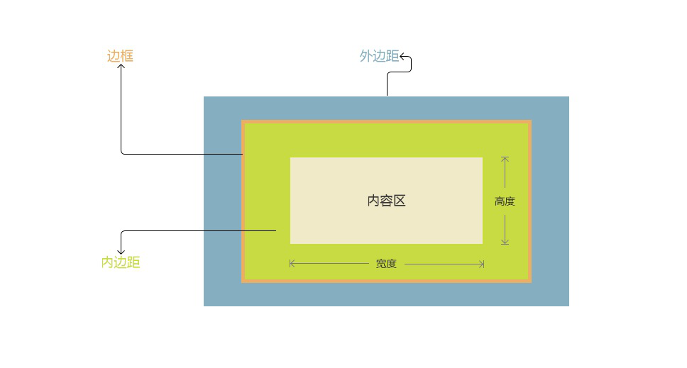

# 第五天

#### 元素框

文档中的每个元素都会生成一个矩形框，称为元素矿。这个框描述了元素在文档布局中所占的空间。


默认情况下，渲染出来的文档中的内容，各个盒子的排布方式从视觉上不会出现重叠。

#### 整体结构



* 内容区：用来存放具体内容。
* 宽度：设置内容区的宽度。
* 高度：设置内容区域的高度。
* 内边距：用来定义内容区域和边框的距离。
* 边框：边框是内容区和内边距周围的一条或多条线。
* 外边距：定义元素盒子和元素盒子之间的距离。

#### 宽度

格式：width:value（不可继承的）

适用于块状元素、行内块状元素。

* auto，默认值。无特定的宽度。

  对于块状元素，宽度默认是父元素的宽度。

  对于行内元素来说，宽度是内容的宽度。

* px

* em

* %，相对于包含的块状元素的宽度来进行设置。

#### 高度

格式：height:value（不可继承的）

适用于块状元素、行内块状元素。

* auto，默认值。

  没有内容高度为0。

  行内元素设置行高不会影响高度。块状元素如果没有高度设置行高

* px，像素

* em，按照当前的字体大小来进行计算。

* %，使用百分比来设置高度，相对于包含块元素的高度来进行设置。

#### 宽度、高度的最大值和最小值

* 元素的内容区域可以使用`min-width`和`min-height`定义最小值。取值和width、height是一样的。
* 元素的内容区域可以使用`max-width`和`max-height`定义最大值。

#### 内边距

适用于所有元素（块状、行内元素），元素默认的时候没有内边距的。

* 格式1：padding:value（不可继承的）

  * px，像素。
  * em，按照当前字体大小来进行计算。
  * %，使用百分比来设置内边距水平模式、垂直模式都相对于父级元素内容区域的宽度来进行计算。

* `padding:top/bottom  left/right`

* `padding:top right/left bottom`

* `padding:top right bottom left`

  值的格式为顺时针设置。

#### 单边内边距

* padding-top：上
* padding-right：右
* padding-bottom：下
* padding-left：左

#### 行内元素的内边距

一般情况下我们是给块级元素使用内边距，但是可以设置各种边距在行内元素上。


行内元素上设置的上、下内边距对行高没有影响。

```html
 <span style="padding:10px;background-color:yellow;">hello world</span><br />
    123
```

行内块级元素可以设置内边距并且有正常的效果。


#### 边框（不可继承的）

边框三要素：

* 宽度：默认由某个浏览器决定。默认的时候是3个像素。
* 样式：默认为none，也就是没有边框样式。即使有宽度也没有边框。
* 颜色：默认的边框颜色，是元素自身的文本颜色。

边框样式：

`border-style:value(不可继承的)`

值：

* none
* solid 实例
* dashed 虚线

`border-style:top/bottom left/right`

`border-style:top right/left bottom`

`border-style:top right bottom left`

值的格式为顺时针设置。


边框宽度：

`border-width:value(不可继承的)`

`border-width:value(不可继承的)`

值：

* px

`border-width:top/bottom left/right`

`border-width:top right/left bottom`

`border-width:top right bottom left`


边框的颜色：

`border-color:value(不可继承的)`

`border-color:value(不可继承的)`

值：

* px

`border-color:top/bottom left/right`

`border-color:top right/left bottom`

`border-color:top right bottom left`

`transparent`，透明。

简写格式：

`border-top: width  style color`

`border-right:`

border-bottom:

border-left:


`border:border-width border-style border-color`


1. 上课时候能跟上吗？
2. 照着笔记先过一遍。
3. 如果有不懂的地方  记着问。


问问题：你得描述清楚了。