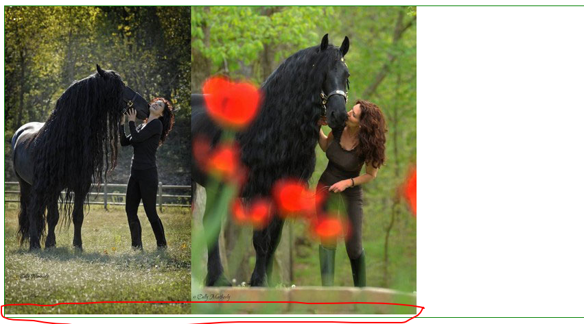

#### 垂直居中 

格式：`vertical-align:值`

vertical-align：起作用的前提，仅作用于inline、inline-block

值：

1. baseline，默认值。强制元素的基线对齐。

   如果元素是图像，图像的底边与基线对齐。

2. bottom，将内联盒子与行框的底边对齐。

3. top，将内联盒子的顶边与行框的顶边对齐。

4. middle，元素的垂直中心点（中线）和父元素的x-height的1/2处对齐。

#### 块状元素只包含一张图片时会有不知名的空白

问题分析：

1. 在HTMl5的文档声明中，内联元素所有解析和渲染表现如同每个行框盒子前面有一个`空白的节点`，这个节点透明，没有宽度，没办法获取。但是只在设置了`<!DOCTYPE html>`时才会出现。
2. 有了所谓的`空白节点`就是在图片前面有一个看不到内容。即使是内容，那么默认就是采用的`vertical-align:baseline`对齐，图片是行内块状元素，它的基线是图片的底部，所以才会导致图片下面有一段空白。

怎么解决：

1. 图片块状化，块状化之后就没有所谓的基线对齐了。
2. 方法二：底线对齐法 
3. 方法三：父元素的font-size设置为0。

#### 已知（父元素的）宽度、高度下图片水平、垂直居中

#### 已知（父元素的）高度，图片、多行文本垂直居中(图文混排)。

所谓的垂直居中并不是真的绝对垂直居中：

问题解析：

1. 图片本身有一条中线就是垂直的中心点（横线）
2. vertical-align:middle中图片的中线永远和x-height的1/2处对齐。
3. 但是字体在设计的时候不会正好占据content-area的1/2处，一般来说字体都会有一些下沉。
4. 你字号小的时候相差的不会太大，但是随着字号设置的越来越大，content-area就会越来越大。content-area越来越大，字体的x的位置就会越来越靠下。

这种对齐方式的弊端，字体越大垂直居中的偏差就会越大。

解决办法：如果要绝对对齐只需要将父元素的font-size设置为0px;