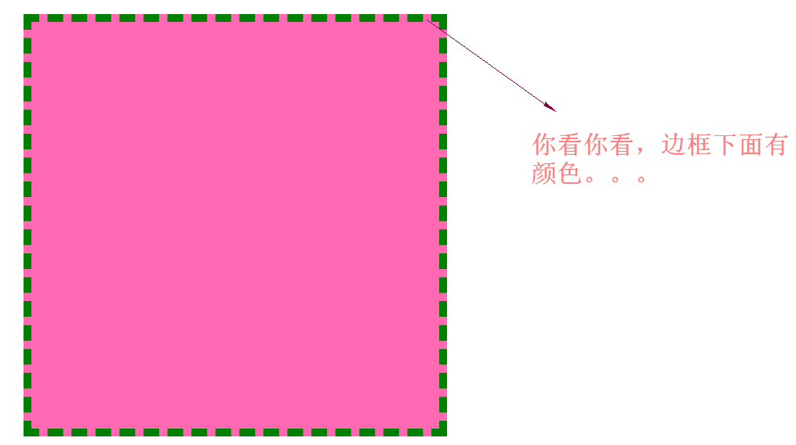
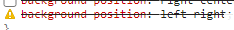

#### 内联元素的边框


* 行内元素上设置的上边框和下边框对行高没有影响。
* 行内元素上设置的左边框和右边框会将周围的文本推开。

#### 外边距&外边距设置

CSS在设置任何元素的外边距时都使用margin属性。外边距是添加在边界的外侧。


外边距的默认值是0，也就是默认时没有外边距。

但是浏览器会给很多元素提供预设（自带默认）的样式，包括外边距。


* 格式：margin：value（上、右、下、左）

  * px，像素。
  * %，百分比外边距的值相对于父元素的内容区域的宽度来计算。

* 格式：`margin:top/bottom left/right`

* 格式：`margin:top left/right bottom`

* 格式：`margin:top right bottom left`

  顺时针原则。

#### 外边距折叠

为什么设计成外边距折叠：实际上就是为了页面排版美观。

* 情况一：盒子的下margin和它下一个兄弟元素的上margin产生了折叠。

  折叠的时候上、下外边距谁的大就使用哪个值。

  解决方法：设置第一个元素inline-block或直接设置元素一边的外边距（设置上外边距或下外边距）

* 情况二：盒子的上margin和它第一个子元素的上margin产生的折叠（父级塌陷）

  ```html
  <!DOCTYPE html>
  <html>
      <head>
          <meta charset="utf-8" />
          <style>
              div{
                  background-color: olive;
              }
              h1{
                  margin:50px;
              }
          </style>
      </head>
      <body>
          <div>
              <h1>他来了，他走了</h1>
          </div>
          
      </body>
  </html>
  ```

  上面的代码按照逻辑来说是h1标签在各个方向向外推出50px;。但实际上左右推出了50px，但是上下并没有。上、下外边距是存在的只不过超出了div这个元素（div是包含它的父级元素），与div这个元素的上外边距进行了合并。

  产生外边距折叠的根本原因：margin之间有直接接触。

  解决方法：父元素设置边框、内边距。

  ```html
  <!DOCTYPE html>
  <html>
      <head>
          <meta charset="utf-8" />
          <style>
              div{
                  background-color: blue;
              }
              h1{
                  margin:50px;
              }
          </style>
      </head>
      <body>
          <div style="padding-top:1px;border-bottom: 1px solid transparent;">
              <h1 style="background-color:brown">他来了，他走了</h1>
          </div>
          
      </body>
  </html>
  ```

  外边距折叠只有块状元素的垂直外边距会折叠，左右外边距不会折叠的。

#### 单边外边距

* margin-top:
* margin-right:
* margin-bottom:
* margin-left:

#### 行内元素的外边距

行内元素上设置的上、下外边距对行高没有影响。设置的左右外边距可以正常使用。

行内块状元素上、右、下、左都可以正常使用。

#### 横向格式化

默认情况下块级盒子组成部分（横向）

`包含它的父块级元素的宽度 = 子元素的margin-left + 子元素的border-left + 子元素的padding-left + 子元素的width+子元素的padding-right + 子元素的 border-right + 子元素的margin-right。`

七个属性中只有子元素的width、子元素的margin-left、子元素的margin-right可以设置为auto。其他的属性只能设置为具体值或使用默认值（默认值为0）。

* 情况一：width、margin-left、margin-right，其中两个设置为具体的值，一个为auto的情况。

  这种情况下，设置为auto的值的那个属性必须满足上面所说的公式，你可以将auto理解为补全总和。

* 情况二：width、margin-left、margin-right，三个属性都设置为auto之外的值，这种情况下`margin-right`不生效，这种情况CSS中叫过度约束。

* 情况三：width、margin-left、margin-right其中两个设置为auto。

  1. 如果margin-left和margin-right两个设置为auto，那么两侧外边距相等元素在父元素中间显示。
  2. 某一外边距和width设置为auto时。外边距为auto的那个值等于0，width被设置为填满容纳块所需的值。
  3. 如果三个属性都设置为auto，那么两边的外边距都设置为零，width则是要多宽有多宽。


#### 纵向格式化

块级元素的内容决定高度。如果给块级元素设定的具体的高度高于我们内容的高度，那么多出来的内容有点像内边距。如果你给元素设置的高度小于内容的高度，具体的行为靠overflow属性的值。 

`包含它的父块级元素的高度 = 子元素的margin-top + 子元素的border-top + 子元素的padding-top + 子元素的height+子元素的padding-bottom + 子元素的 border-bottom + 子元素的margin-bottom。`

高度、上、下外边距可以设置为auto。内边距和边框必须为具体的值，否则取默认值默认为0。


* 情况一：height、marign-top、margin-bottom，两个设置为具体值一个为auto。

  __height、margin-top、margin-bottom，其中margin-top和margin-bottom都设置为具体的值，height的值设置为auto，这个时候高度不会被自动拉开。__

* 情况二：height、margin-top、margin-bottom都设置为auto之外的值。

* 情况三：height、margin-top、margin-bottom其中两个值设置为auto。

  __margin-top或margin-bottom为auto，二者自动计算去0。__

  某一外边距和height设置为auto时，外边距为auto的那个值将会被设置为0，height被设置为内容高度。


#### 调整宽度和高度的计算方式

默认情况下，块级元素的宽度等于内容区的宽和高。

我们可以使用box-sizing来让浏览器不这样计算。

格式：`box-sizing:值`（不可继承的）

* content-box，默认值。内容区域宽度等于width、内容区域高度等于height。内边距和边框都在这个基础上面增加。（w3c盒子模型的计算方式，标准盒子计算方式。）
* border-box，宽度、高度等于`内容的区+内边距+边框`，相应的内容区域会被缩小。（IE盒子模型的计算方式，也叫怪异盒子模型。）

#### 背景

* 前景色：前景色指元素的文本、周围的边框。通常使用color属性来设置前景色或使用border-color来设置边框的颜色。

  ~~边框颜色采用了字体颜色，如果没有设置border-color那么默认值是内部计算出来的是一个叫currentcolor的值，这个currentcolor始终等于color属性计算出来的值，所以边框颜色默认的时候是字体的颜色。如果设置了border-color，那么这个值将会覆盖currentcolor。~~

* 背景色

  在前景色的后面，元素的背景在边框的外边距处终止。（默认时包括内容区、内边距、边框）不会延伸到外边距区域。

  

#### 背景色

格式：`background-color`

* transparent，透明。

#### 背景图

background-image:value（不可继承的）

值：

none，没有背景图

url(url)，设置图像的URL的地址。


背景图和盒子的大小没有关系。

#### 背景重复方式

格式：background-repeat:value

值：

* repeat，默认值，横向、纵向平铺。
* repeat-x，横向平铺。
* repeat-y，纵向平铺。
* no-repeat，不重复。

#### 背景定位

backgorund-position:value（不可继承）

value的值：

* 关键字

  * left
  * right
  * top
  * bottom
  * center

  一般情况下来说接收两个值，第一个值表示横向的位置，第二个值表示纵向的位置。

  如果只有一个关键字，另外一个假定为center。

  在写两个横向的关键字或两个纵向的关键字时整个值将会被忽略。

  

* px像素

  相对于元素内边距的外边界（包括内容区、内边距）的左上角来进行定位。

  第一个值也是横向偏移量 ，第二个值纵向偏移量。

  **如果横向的偏移量为正数那么背影图往右边走，负数背景图往左边走。**

  **如果纵向的偏移量为正数那么背景图往下边走，负数背景图往上边走。**


#### 精灵图

精灵图（雪碧图，css Sprites），是一种网页图片的应用处理方式，允许将一个页面中需要使用的多个零星的小图片包含到一张大图中去。

优点：节省请求次数。