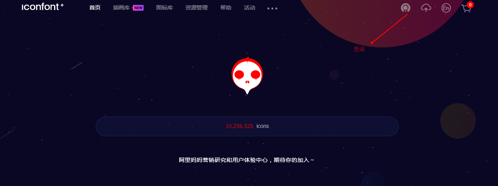
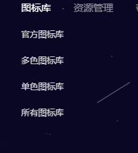
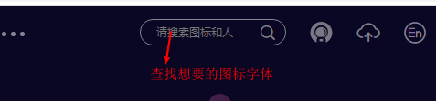
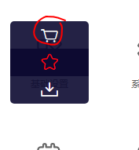
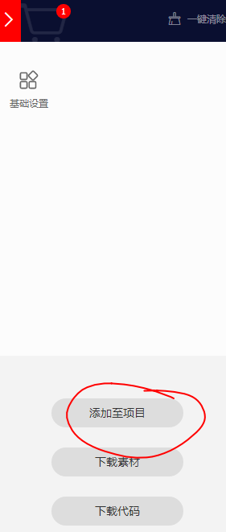
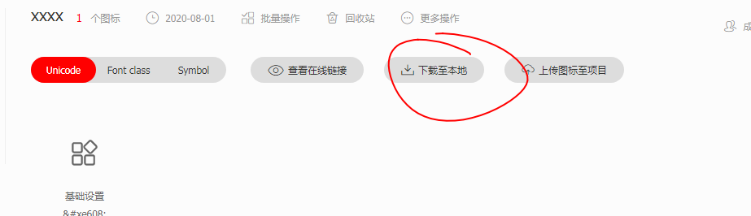
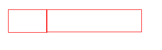
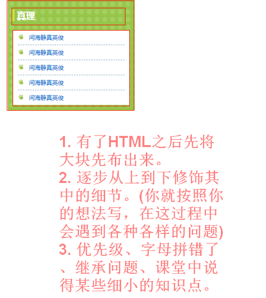

#### 精灵图

精灵图（雪碧图，`css Sprites`），是一种网页图片的应用处理方式，允许将一个页面中需要使用的多个零星的小图片包含到一张大图中去。

优点：节省请求次数。


#### 图标字体

图标字体，也是字体。宋体、微软雅黑。

`https://www.iconfont.cn/`

1. 登录

   

2. 选择所有图标

   

3. 查找想要的图标字体

   

4. 将想要的图标字体放入到购物车中。

   

5. 去购物车中查找，并且新建项目。

   

   6. 将项目下载到本地

      

   7. 打开压缩包，里面有一个`demo_index.html`文件。


#### 厂商前缀


如果在源代码中发现类似`-webkit-`类似开头的代码，这种东西叫厂商前缀。浏览器厂商通过它来标记实验性或专属的属性。

* `-moz-`，firefox浏览器
* `-ms-`，微软
* `-o-`，opera的浏览器
* `-webkit-`，safari或chrome浏览器。

目前厂商前缀使用的趋势有所减缓，新版本浏览器逐渐删除了对前缀的属性的支持（但是这种现象还会存在）。

#### 列表

CSS中的每个列表选项是块级元素再加上记号。



前面的盒子用来放记号，后面的盒子用来放内容。但是前面的盒子不参与文档布局。不管列表项在哪里记号都会随着列表项的移动而移动。


每个列表外部的包含元素都会有默认值。margin-left、padding-left


通常先将padding和margin都干掉，但是干掉之后，那么列表项的标志会跑到屏幕外面去，看不到。

```html
<!DOCTYPE html>
<html>

<head>
    <meta charset="utf-8" />
    <style>

        ul{
            margin:0;
            padding:0;

            /* margin-left:100px; */
        }
    </style>
</head>

<body>
    <ul>
        <li>1</li>
        <li>2</li>
        <li>3</li>
    </ul>
</body>

</html>
```

#### 列表标记

`list-style-type:value`

value的值：

* none，禁止在本该显示记号的位置上出现内容。但是不阻断有序列表的计算。
* decimal，数值。
* disc，实心圆。

```html
<!DOCTYPE html>
<html>

<head>
    <meta charset="utf-8" />
    <style>

        ul{
            /* margin:0;
            padding:0; */

            /* margin-left:100px; */

            /* list-style-type:none; */

            list-style-type:decimal;
        }
    </style>
</head>

<body>
    <ul>
        <li>1</li>
        <li style="list-style-type:none;">2</li>
        <li>3</li>
    </ul>
</body>

</html>
```

添加列表图像：`list-style-image:url('地址');`


列表记号的位置：`list-style-position`

* `outside`，叫标记放在标记盒子中。
* `inside`，将标记放在内容盒子中。（附加的标记盒子依然存在，只不过为空。）



#### 表格

表格不管单元格的内容是多少，一行中所有的单元格都具有相同的高度。同一列中，不管单元格的内容是多少，一列中的所有单元格都具有相同的宽度。

* 设定标题的位置

  `caption-side:value`

  值：

  * top，默认放在表格框上
  * bottom，放在表格框下。

  left和right不支持。

* 单元格的边框

  `css`中单元格边框有两种模式：

  1. 分离边框模式，在单元格与单元格之间又间隔时起作用。
  2. 折叠边框模型，从视觉上看单元格与单元格之间没有间隔，单元格之间的边框将合并或折叠在一起。

  格式：`border-collapse:value`

  * separate，分离边框模式（不常用，知道一下就行。）
  * collapse，折叠边框模式。

  为什么折叠边框中，单元格之间没有间隙：相邻的边框会折叠在一次，所以只会绘制一条折叠的边框。