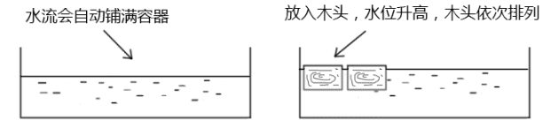
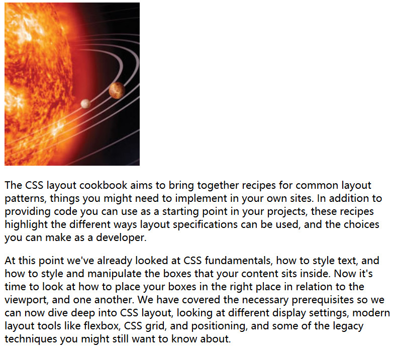
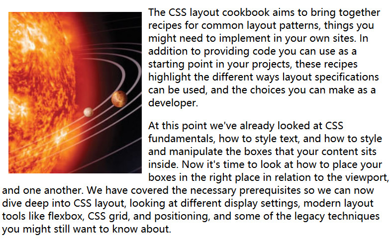
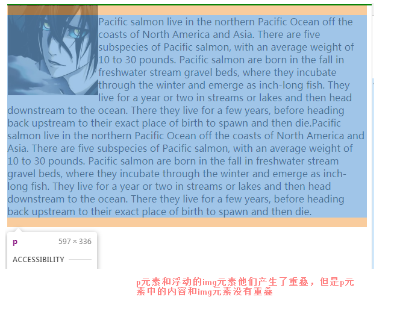
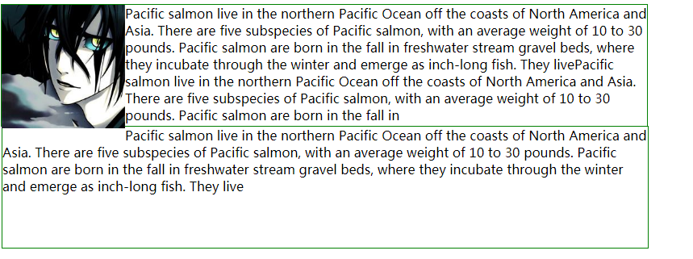

#### 文档流

文档流：它是CSS世界中的一种基本的定位和布局机制，这个流和现实世界的水流有些类似。



文档源代码书写时有正常的顺序，是从上到下从左到右的。在解释其代码时就会从上到下、从左到右来进行解释，解释时如果是行内元素就当在一行、如果是块状元素就有分隔的行。



#### 浮动

浮动的出现是为了打破这种正常的文档流而实现__环绕效果__。__浮动的本质是为了实现文字环绕效果__（文字环绕图片显示的效果）。



格式：`float:value`(不可继承)

`value`的值：

* `none`，无浮动。
* `left`，元素向左浮动（其他内容包围在浮动元素的右边）。
* `right`，元素向右浮动（其他内容包围在浮动元素的左边）。

```html
<!DOCTYPE html>
<html>
	<head>
		<meta charset="utf-8" />
		<style>
			div{
				width:800px;
				border:1px solid green;
			}
			img{
				width:150px;
				float:left;
			}
		</style>
	</head>
	<body>
		<div>
			
			<p>Pacific salmon live in the northern Pacific Ocean off the coasts of North America and Asia. There are five subspecies of Pacific salmon, with an average weight of 10 to 30 pounds. Pacific salmon are born in the fall in freshwater stream gravel beds, where they incubate through the winter and emerge as inch-long fish. They live for a year or two in streams or lakes and then head downstream to the ocean. There they live for a few years, before heading back upstream to their exact place of birth to spawn and then die.
			</p>
		</div>
	</body>
</html>
```

利用float形成图片、文字环绕的原理：

1. 父类高度塌陷，让跟随的内容可以和浮动元素在一个水平线上。
2. 块状盒子和浮动元素会重叠，但是块状元素中的行框盒子和浮动元素不会重叠。





导致上面的问题的原因：虽然父元素的高度和图片的高度设置的差不多。但是由于图片高度超出了外部边框，下面的元素`依然会让块状元素重叠，行框内容不重叠。`


#### float属性的副作用及规则

1. 浮动元素的上边缘位置，要考虑在它__之前__的块元素或浮动元素。

   （参考代码10，11，12）

2. 不管什么元素浮动之后将会自动变为块级元素，浮动之后得到的都是块级元素。

   ```html
   <!DOCTYPE html>
   <html>
       <head>
           <style>
               span{
                   float:left;
                   width:100px;
                   height:100px;
                   border:1px solid green;
               }
           </style>
       </head>
       <body>
           <span>疯了</span>
       </body>
   </html>
   ```

3. 子元素浮动将会导致父元素的高度塌陷。

   ```html
   <!DOCTYPE html>
   <html>
       <head>
           <style>
               #f{
                   width:500px;
                   border:1px solid red;
               }
               #z{
                   float:left;
                   width:300px;
                   height:300px;
                   border:1px solid blue;
               }
           </style>
       </head>
       <body>
           <div id="f">
               <div id="z"></div>
           </div>
       </body>
   </html>
   ```

4. 浮动元素四周的外边距不折叠。

   ```html
   <!DOCTYPE html>
   <html>
       <head>
           <style>
               #f{
                   width:300px;
                   border:1px solid red;
               }
               #f div{
                   float: left;
                   width:120px;
                   height:120px;
                   border:1px solid blue;
                   margin:10px;
               }
           </style>
       </head>
       <body>
           <div id="f">
               <div></div>
               <div></div>
               <div></div>
               <div></div>
               <div></div>
           </div>
       </body>
   </html>
   ```

5. 浮动元素的左边界不能超过容纳快的左内边界，右浮动最远只能到达容纳块的右内边界。

   浮动元素的顶边不 能比父元素的顶边高，为的是避免一直向文档的顶端浮动（跑出文档去了。）

   __你大爷永远是你大爷，没高度也是你大爷。__


今天上课万一有人问我为什么这样，我该怎么解释。


你要问我星星有几颗，我会告诉你很多很多。


周六晚上、周日的作业：把前面的东西敲一遍。今天讲的内容一定要掌握（现在还没说难的呢。），尚品汇的页脚。


所有的事第一次都会非常难受（写页面、写项目）


#### 清除浮动

#### 实例
