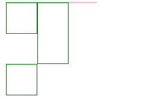

堆砌关键字。

#### float的规则及副作用

* 在文档源码中处于前面的元素向左浮动，那后面的浮动元素的左外边界在前一个元素右外边界的右侧。

  ```html
  <!DOCTYPE html>
  <html>
      <head>
          <meta charset="UTF-8" />
          <style>
              #f{
                  width:150px;
                  border:1px solid pink;
                  margin-left:20px;
              }
              #f div{
                  float:left;
                  width:50px;
                  height:50px;
                  border:1px solid green;
              }
          </style>
      </head>
      <body>
          <div id="f">
              <div></div>
              <div></div>
              <div></div>
          </div>
      </body>
  </html>
  ```

  如果后面的浮动元素不与前一个浮动元素在一行，那么将会另起一行并且将后面的浮动元素的左边距尽量与父元素的左内边距相接近，后面的浮动元素的上边距在前一个浮动元素的下边距下面。

  

  ```html
  <!DOCTYPE html>
  <html>
      <head>
          <meta charset="UTF-8" />
          <style>
              #f{
                  width:150px;
                  border:1px solid pink;
                  margin-left:20px;
              }
              #f div{
                  float:left;
                  width:50px;
                  height:50px;
                  border:1px solid green;
              }
          </style>
      </head>
      <body>
          <div id="f">
              <div></div>
              <div style="height:100px;"></div>
              <div></div>
          </div>
      </body>
  </html>
  ```

  

* 浮动元素的顶边不能比前方任何一个浮动元素的顶边高。

  

* 一个左浮动元素应该放在尽可能靠左的位置，右浮动元素应该放在尽可能靠右的位置。

  ```html
  <!DOCTYPE html>
  <html>
      <head>
          <meta charset="UTF-8" />
          <style>
              #f{
                  width:500px;
                  height:500px;
                  border:1px solid yellowgreen;
              }
              #f div{
                  float: left;
                  width:200px;
                  height:100px;
                  border:1px solid green;
              }
              #f #f3,#f #f4{
                  width:50px;
                  height:50px;
              }
          </style>
      </head>
      <body>
          <div id="f">
              <div id="f1">1</div>
              <div id="f2">2</div>
              <div id="f3">3</div>
              <div id="f4">4</div>
          </div>
      </body>
  </html>
  ```

  

* 浮动元素的后代也浮动时，将扩大范围，包含浮动的后代元素。

  ```html
  <!DOCTYPE html>
  <html>
      <head>
          <meta charset="UTF-8" />
          <style>
              #f{
                  width:500px;
                  border:1px solid yellowgreen;
                  float: left;
              }
              #f div{
                  float: left;
                  width:200px;
                  height:100px;
                  border:1px solid green;
              }
          </style>
      </head>
      <body>
          <div id="f">
              <div id="f1">1</div>
          </div>
      </body>
  </html>
  ```

  怎么样快速融入到一个环境中：

  1. 多请人家吃饭。
  2. 多干活。

#### 清除浮动

格式：`clear:value`，适用于块级元素


clear属性用来设置元素自身怎么样，而不是float的元素怎么样。


clear是清除浮动是不准确的，浮动依然存在，并没有消除。


官方解释：__元素盒子的边不能和前面的浮动元素相邻。__


value：的值。

* none：允许元素向另一个元素的任何一边浮动。

* left，元素左侧抗浮动。

* right，元素右侧抗浮动。

* both：两侧抗浮动。

  经常使用的是both，凡是使用clear:left或clear:right的时候都可以使用clear:both来代替。

  clear属性只对前面的属性有效，对后面的浮动元素无效。


#### 实例

**布局**

1. 你的CSS、javascript、图片都应该分门别类的放置。

2. 默认样式问题。

   一般的元素都会有一些默认样式。p、h1、li、ul，body 都会有默认的外边距、内边距。一般来说我们会去掉。

   1. 多数元素拥有自己的默认样式，但是我们不需要。

   2. 默认样式在不同浏览器中有可能有不同的效果。

      ```html
      body{
      	margin:0;
      }
      body,form,p,h1,li,ul,dl,dt,dd,ol,form,body{
      	margin:0;
      	padding:0;
      }
      ```

3. 一般在写的时候回直接引入一个已经写好的css文件。

   `reset.css`

   `normalize.css`

   1. normalize.css保护了有价值的默认值。

      其中有些默认样式保留下来了，但是对于多个浏览器中不同的样式它给逐一的修复了。

   2. `normalize.css`，修复了浏览器的bug。

      pc端的浏览器还是移动端的浏览器。

   3. 页面版心：pc端网页通常是一个固定宽度的水平居中的盒子，版心用来显示网页的主要内容。

      一般情况下来说：1100~1300像素之间。

      现在一般的电脑屏幕都是1366*768的分辨率。

      早期会设置为1000或960。

      通栏：占据全屏的宽度。