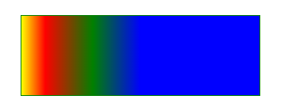
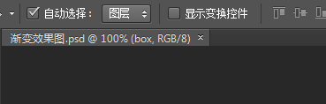
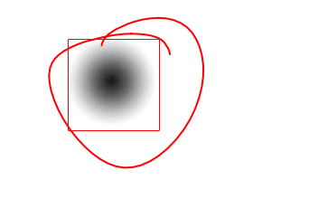
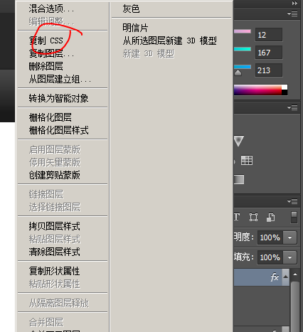

__这周五早起，交给组长，组长给我。__


#### 多背景图

如果说一个元素中同时出现了背景图和背景颜色，那么优先显示背景图。但是背景颜色依然存在。（如果要让后面的背景颜色显示出来，前面的背景图需要有透明的部分）


`background:img position/size repeat attachment origin clip color`


多张背景图先写的图片放在上面，后写的放在下面。


#### 元素透明度

opacity属性：指定了一个元素的透明度。当该属性的值被应用到某个元素上时，把这个元素当成一个整体来看待。(其中的内容、背景色、前景色、边框)


opacity属性的值是0~1的范围，0为完全透明，1为完全不透明。


#### opacity 和rgba和filter:opacity


`filter:opacity`一般用在图像上，因为filter可以使用多个效果。


`opacity属性`一般用在某个元素上，在动画中使用用来做淡入淡出效果。


rgba用来设置背景透明但是内容不透明的情况。


#### 过渡

过渡是元素从一种样式逐渐改变为另外一种的效果。


步骤：

1. 指定要添加效果的css属性。
2. 指定效果的持续时间。


#### 定义过渡属性


格式：`transition-property:value`，只有在该属性中定义的值（其他的属性名），才会以动画的形式持续一段时间而不是瞬间发生变化。

* none，不过渡任何属性。

* all，过渡所有的属性。

  不是所有的属性都能过渡。

  属性的值能够使用数字值的都支持过渡，不能转换为数字值的不能使用过渡。

  `display:none`不支持过渡。因为不是数值。

* 其他的值

  transition-property:width,height;

#### 过渡的持续时间

格式：`transition-duration:value`，指定的是从一个状态过渡到另外一个状态要多久。


默认为为0。

值：单位为s或ms。


如果让transition-duration支持多个属性，并且每个属性各自使用不同的持续时间，那么可以使用类似：

`transition-duration:1s,2s;`


#### 调整过渡的时序（调整过渡的快慢）


格式：`transition-timing-function: 值;`


ease：慢速开始，然后加速，然后再慢下来。

linear：整个过渡过程保持相同的速度。


ease-in，慢速开始，然后加速。

ease-out，快速开始，然后减速。

cubic-bezier(.71,.58,.22,1.22)，使用贝塞尔曲线的值来控制速度。


`https://cubic-bezier.com/#.17,.67,.83,.67`


#### 延迟过渡

`transition-delay`，属性在元素上发生触发过渡的变化与开始过渡之间引入一定的时间延迟。


默认为0，过渡立即开始，元素的状态发生变化就开始过渡。

其他的规则和`transition-duration`的规则是相同的。


#### 简写格式：

1. transition: 属性 要过渡多少时间 过渡的效果（快、慢） 延迟时间。
2. `transition:属性 要过渡多少时间 过渡的效果（快、慢） 延迟时间 , 属性 要过渡多少时间 过渡的效果（快、慢） 延迟时间 , 属性 要过渡多少时间 过渡的效果（快、慢） 延迟时间`


#### 反向过渡


如果只在:hover上面声明过渡，那么只在鼠标移入时才会触发过渡。移除时瞬间变为原来的状态。如果想让移除时也是有过渡效果那么我们就需要将过渡应用在默认状态上。

如果加在默认状态上，各个属性通过相同的过渡回到默认状态，延迟相同，但是时序函数是相反的。


#### 渐变

渐变指从一个颜色到另一个颜色的平滑过渡。它是图像，可以在CSS中任何一个使用图像的地方使用。

渐变的最大特点就是没有固定尺寸。


__渐变分为线性渐变、径向渐变__

__在上面的基础上又添加了循环渐变和不循环渐变。__


#### 线性渐变

线性渐变指沿着一条线进行填充得到渐变。


这条线是贯穿元素的中心点的一条线，这个线称为梯度线。


格式：`linear-gradient:[方向/角度] color1 color2...`

1. 简单的颜色值，你可以任何类型的颜色值，包括rgba、transparent，颜色可以有两个或多个。

   如果有多个颜色则平均分配在梯度线上。

   `background-image: linear-gradient(yellow, green,blue);`

2. 角度的设置

   梯度线的颜色的分配

   梯度线在分配颜色的时按照梯度线的90度的地方分散开来，分散出来了很多的虚拟的线条来进行无线的延伸。

3. 方向

   1. to bottom，默认值
   2. to top，梯度线方向向上
   3. to left 梯度线方向向左
   4. to right，梯度线方向向右
   5. to left top，左上角
   6. to left bottom ，左下角
   7. to right top，右上角
   8. to right bottom，右下角

4. 颜色值的详细设置

   默认的时候颜色平均分配在梯度线上，可以给颜色值指定一个位置，让它不平均分配。

   `background-image: linear-gradient(to right,yellow,red,green);`，yellow在0%的位置插入，red在50%的位置插入，green在100%的位置插入。

   可以指定px 或 %单位插入到指定颜色的后面。

   

   `background-image: linear-gradient(to right,yellow 0%,red 10%,green 30%,blue 50%);`，0的位置插入了黄色，30的位置插入了绿色（0~30之间就是黄色到绿色的过渡），50的位置插入了蓝色。

   排布的颜色没有到梯度线的末端将会将最后一个颜色一致延伸下去。

   通过上面的规则我们可以来实现`急停的效果`。


#### 径向渐变

径向渐变，沿着一个中心点向四周扩展颜色并且平滑过渡。

`radial-gradient([大小][at point] color1 color2...);`

默认时，径向渐变在中间显示，如果是在正方形渐变为圆形，矩形元素渐变为椭圆形。


* 控制大小

  一个值或两个值

  如果是一个值得到是圆形的渐变，值为半径。`background-image: radial-gradient(50px,red,blue);`

  如果是留个值，得到的是椭圆形渐变，第一个值为椭圆的宽度的一半，第二个值为椭圆的高度的一半。

  我们得到的渐变的形状和所在的图像的尺寸，没有关系。如果是圆得到的就是圆形渐变，如果是椭圆得到的就是椭圆形渐变。

* 梯度射线，梯度射线从渐变的中心向右延伸渐变的其他部分根据这根线构建。

* 颜色的详细设置

  默认时，如果有多个颜色则默认平均分配在梯度射线上（颜色和颜色之间尽量平滑混合），我们可以指定一个位置，让其不平均。

  颜色后面可以加px 或 %

* at point ，默认时径向渐变在的中心在元素的中心，可以使用at point 来进行改变。 point的值为background-position属性的值。


#### 重复性线性渐变

重复性渐变使用repeating-linear-gradient重复性渐变在梯度线上不断循环排布声明的颜色，最后一个颜色的长度值用于定义图案的整体长度，超过该长度之后就开始循环了。

#### 重复性径向渐变

```html
<style>
h1{
            margin:0;
            padding:0;

            width:500px;
            height:100px;
            border:1px solid pink;

            background-image: repeating-radial-gradient(yellow,blue);
        }
</style>
<h1></h1>
```

上面的代码不会循环渐变，因为使用的默认值，渐变在中心点扩散到元素四周。所以必须限制径向渐变的尺寸，才会在第一次渐变结束后开始重复。


#### 使用PS获得渐变的值

1. 选择移动工具

   

2. 选中自动选择、图层

   

3. 选中渐变的图像

   

4. 在定位的图层上选择复制css。

   


#### 响应式简介

响应式设计、编码是一种方法。使网站可以在任何类型的设备和任何尺寸的屏幕上轻松浏览和使用。

#### 网页设计的发展

* 固定宽度设计
  网站式被设计成固定宽度的，以便很好的适配最常见尺寸的台式机和笔记屏幕。`2000年`这个时间点设计的屏幕宽度是`800像素`，在`2005年`这个时间点设计的屏幕宽度是`1024像素`宽。即使有`800`和`1024`像素宽度的屏幕，但也有更大的屏幕。这个时候网页的设计式是两边留出来额外的空白来进行填充。


* 移动web浏览

  `20世纪90年代中期`(`1990~1999`)，手机访问因特网不具备显式实际网站的能力，只能显式文本数据（使用最基本的HTML格式显式天气预报、股票报告、比赛得分）。

  `2005年`左右在更加先进的智能手机的设备上，移动浏览器才能够显式使用了CSS2和JavaScript技术的`"真正网页"`。

  `07`年发布了`iphone`（第一代`Iphone`），它可以利用当时所有的`web技术`显式网页。但当时的网站都是`960像素`或更宽，但iphone的屏幕只有`320像素`宽。苹果的解决方案是自动收缩网页以适应屏幕的浏览区域。然后允许用户通过双击或捏合手势缩放页面的任何区域，但是一次只能浏览页面的一小块无法产生比较好的用户体验。

  对于`iphone`来说设计师还是习惯制定固定宽度的网页，给`iphone`单独的制作移动版的网站(固定的页面宽度，适配320像素宽的屏幕)。如果用户使用的是手机，通常会被自动重定向到移动版网站（移动版网站通常使用`m`子域名，比如正常网站是`www.baidu.com`而移动版网站为`m.badidu.com`）。

  为了更好的扩展市场，很多手机厂商都推出了相应的智能手机，以应对苹果公司的`Iphone`。但是这些新的智能手机并非拥有相同的尺寸。有些比`320像素`宽，有些比`320像素`窄，所以`320像素`的宽度的移动版网站并不能很好地适应那些屏幕。

  到了2010年，苹果发布了`iPad`，移动版的网站太小，不能充分利用`iPad`更大的屏幕空间，桌面尺寸固定宽度的网站对于纵向模式浏览的`iPad`来说又显得太大。

  __本质上上面的问题就是：__ 不创建多个单独的站点，如何使一个网站能够在窄屏上以单栏显式，在大屏上面以多栏显式。如何根据浏览网站的设备的特性来要求浏览器变换网页的布局。所以才有了响应式布局。

#### 响应式设计流程

* 思考网站目标

  网站是用来解决现实中出现问题的工具，应该从一开始就明确网站或项目的目标是什么，不过这个目标是从客户还是从项目经理那里得来的。

  创建网站的过程中要做出很多的创意决策，从网站要包含得内容，到这些内容的摆放位置，以及用户进入网站的路径。如果明确了网站的目标所在，在设计过程中将做出更好的决策。

* 网站的内容

  用户访问网站是为了获取内容，不是为了页面或使用了什么开发技术。他不在乎网站是否是响应式的、屏幕宽度是多少，他只关心自己使用的设备是否能够轻松获得相关的内容。

  所以对于响应式网站来说，首先要考虑的是内容，以确保内容在小屏幕上有良好的显式效果（就是先将内容放在小的屏幕上，因为将固定宽度网站中的现有内容，将很难将其硬塞进较小的屏幕中）。

  所谓的内容不仅包括文本，也包括其他形式的信息，比如图像、视频、音频。在考虑内容时你应该想的是网页实现什么目标，希望他们做什么。

  内容规划的两个规则：

  1. 确定网站中有什么内容的时候，可以列出一个内容的列表。

  2. 弄清了需要哪些内容要考虑它们放在哪里，以及如何编写具体内容。

     1. 可以使用`倒金字塔`方式来确保重要的系列首先出现，然后是用户可能看也可能不看的次要细节。

        

     2. 分级标题，如果页面内容超过两三个段落，就把它分割成小块。这样可以让用户更容易地了解页面结构，更好地认值页面内容的类型。

     写出好的标题可以将网页中的内容根据不同的重点分割成多个部分。

线性设计：就是从头到尾阅读网页上的所有内容。对于小型移动设备，所有内容基本上都是以单列形式显式，所以用户总是以线性顺序来阅读内容。

### 内容组件

我们要决定哪些内容组件会出现在页面上，比如网站Logo、搜索框、主导航栏、正文等。

本阶段的设计过程中需要把这些组件作为单独的内容块来考虑，这样在创建原型时就可以在页面上随一移动它们的位置。

多数在开始组织需要出现在新网站上的内容时，首先会创建一个简化的内容区域高级大纲，将其反映在网站的主导航中。

### 绘制草图、线框图

可以画只有少量细节的小草图，快速尝试多种想法。

草图的绘制从思考网站在各种尺寸的屏幕上（从小手机至大屏幕显式）将如何显式开始。这个阶段只需要简单的图形和线条即可，即使线条歪斜也没有关系。

为什么要从小手机到大屏幕显式：想象以下你住在16平米的小屋子里面，然后后来买了200平米的房子。这个时候你在16平米小屋子中的家具很容易放到200平米的房子中。但是反过来则不行。

### 绘制原型图

原型图是接近与最终产品的设计图，也就是高保真。但它只是个模型。

在高保真原型阶段，可以添加颜色、文字排版样式及关于网站的品牌的一些内容。

