#### 实现响应式布局

1. 网格布局

   使用网格布局设计的想法来源于平面设计，网格意味着设计师由多个同等宽度的列组成的，列与列之间又相同的间距，页面上的所有内容都是基于这些列的。

   

   我们经常用的是12列网格，因为设置为12这个数值有很大的灵活性。12/2/3/6/4，你的布局中可以包含任意这些列数的内容部分。

   12

   6

   4

   3

   2

2. 配合媒体查询

#### 弹性盒子布局

弹性盒子布局：弹性布局、弹性盒子、flex布局、伸缩布局、伸缩盒子。


弹性盒子是一种强大的布局方式，也比较简单。通过弹性盒子可以指明空间的分布方式、内容的对齐方式。而且他能够改变元素的顺序。


弹性盒子比较突出的特点是，让元素对不同的屏幕不同的显示设备做到更好的适应。


__弹性布局是父元素和子元素之间的关系。__


父元素：弹性空间或弹性容器。（先从父元素的属性开始讲）

子元素：弹性项或弹性元素。（再讲子元素的属性）


#### 弹性容器


在元素上声明：`display:flex`就已经激活了弹性盒子布局。这个元素随着成为了弹性容器。弹性容器负责在所占的空间内布置子元素、控制子元素的布局。


#### 弹性元素

弹性容器的子元素成为弹性元素（只有直接子元素使用弹性盒子布局，后代元素不受影响。）


弹性的元素包括弹性容器的子元素、生成的内容（`::before`、`::after`生成的内容）。


在弹性容器中，各弹性元素在__主轴__上排列。


* 主轴：内容沿着次轴开始流动，执行弹性元素的流动方向。默认主轴是水平方向，左边开始、右边结束。
* 垂直轴（交叉轴、侧轴、辅轴），弹性元素沿着此轴进行堆叠，指放置新弹性元素行的方向。__垂直轴始终与主轴垂直__，垂直轴是从上面开始，到下面结束。


#### 设置主轴方向


row  表示行。

column 表示列。


格式：`flex-direction`，用在父元素上。

用来指定在弹性容器中如何排放弹性元素（定义弹性容器主轴，弹性元素沿着这个轴排布，从主轴的起始 边开始放置，流向主轴的结束边）

* row，主轴的起始边在弹性容器左边，结束边在弹性容器右边(默认值)

  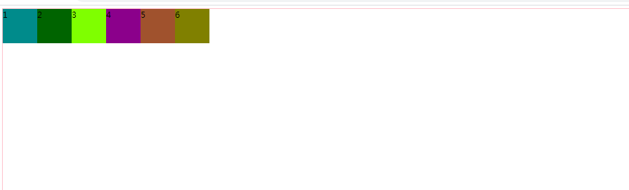

* row-reverse，主轴的起始边在弹性容器右边，结束边在弹性容器的左边。

  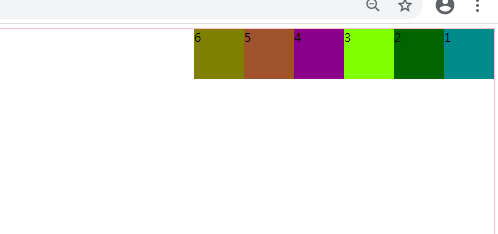

* column，主轴的起始边在弹性容器上面，结束边在弹性容器的下边。垂直轴变成了横向。

  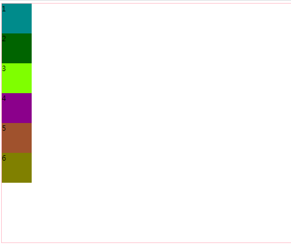

* column-reverse，主轴的起始边在弹性容器的下边，结束边在弹性容器的上边。垂直轴变成了横向。

  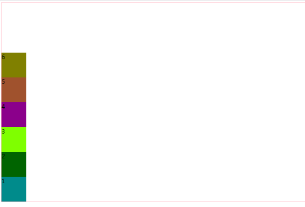


#### 换行

弹性元素在弹性容器的主轴放不下的情况下，默认弹性元素不会换行，会压缩自己。


可以使用flex-wrap：属性来进行换行。也用于弹性容器。

* nowrap，默认时会沿着主轴在一行上面排列，不会换行。

* wrap，超过弹性容器，将会沿着垂直轴的方向进行换行。

  不设置高度的情况下：

  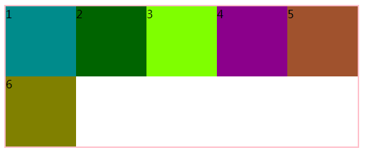

  设置高度的情况下：

  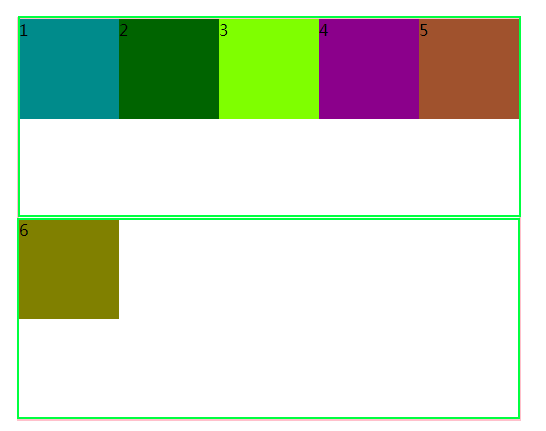

* wrap-reverse，如果超过弹性容器将会沿着垂直轴的反方向进行换行。

  设置高度的情况：

  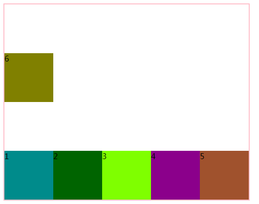


#### 设置弹性元素如何在主轴上分布

默认情况下，在弹性容器中放置全部的弹性元素后留下的空白始终出现在主轴结束边。

使用`justify-content`

用于设置在弹性容器主轴上面如何分布各行里的弹性元素。

* flex-start，默认值，弹性元素紧靠主轴起始边。

* flex-end，弹性元素紧靠主轴结束边。

* center，将弹性元素作为一个整体，居中显示于主轴的中点。

* space-between，把每一行的第一个弹性元素放在主轴的起始边，每一个最后一个弹性元素放在主轴的结束边，然后在剩下的每一对相邻的弹性元素之间放置等量的空白。

  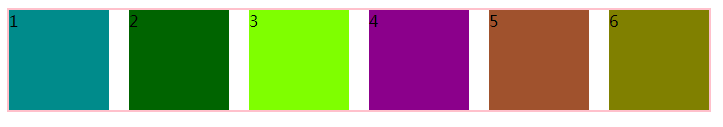

* space-around，将余下的空间除以该行的弹性元素的个数，得到每个弹性元素应该分配到的空间，然后将这个空间分成两份放在弹性元素的左边和右边。

  父容器100px，子项 20px 总共有2个子项。现在有60px的空余， 60/2 一个元素应该得到30px的空间，30px的空间/2   一边是15px;

  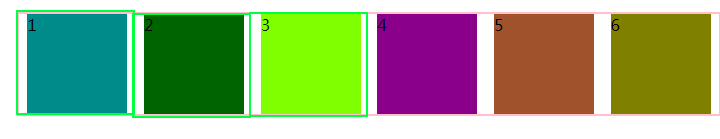

* space-evenly，计算弹性元素的数量，在此数量上+1

  比如宽度为810px，总共6个div，每个div100px，810-600=210，那么每一份就是30px;

  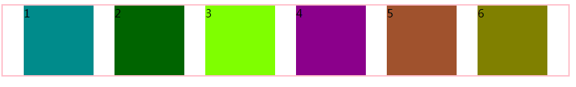

#### 设置弹性元素如何在垂直轴上分布

align-items属性定义在弹性元素的垂直方向上的对齐方式。(__设置弹性元素在当前行的位置分布__)

* flex-start：将各弹性元素与弹性容器垂直轴起始边那一侧对齐。

* flex-end，将弹性元素与弹性容器垂直轴的结束边那一侧对齐。

  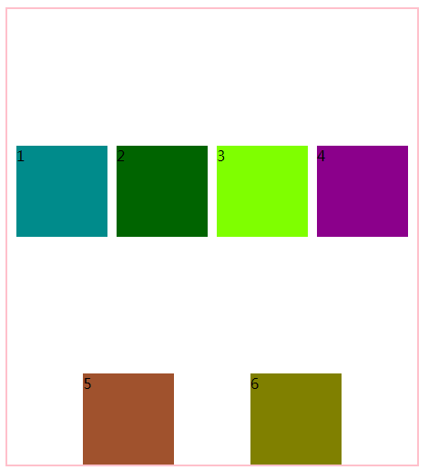

* center，弹性元素中点将与所在行的垂直轴的中点对齐。

* stretch（默认值）：如果子元素没有设置高度或高度设置为auto，将沾满整个容器（行）的高度。


__注意：__

1. flex容器的子元素也能当做flex的容器。

   ```html
   <!DOCTYPE html>
   <html lang="en">
   <head>
       <meta charset="UTF-8">
       <meta name="viewport" content="width=device-width, initial-scale=1.0">
       <title>Document</title>
       <style>
           #f{
               border:2px solid pink;
               /*父元素成为了弹性容器，其中的子元素横向排列了*/
               display:flex;
               /*设置主轴的方向*/
               /* flex-direction: row-reverse; */
   
               /* height:800px; */
               width:450px;
   
               /* flex-wrap: wrap-reverse; */
   
               /* height:400px; */
               /* height:500px; */
   
               justify-content: space-evenly;
   
               flex-wrap: wrap;
   
               height: 500px;
   
               align-items: stretch;
   
           }
           #f > div{
               width:100px;
               /* height:100px; */
               height:auto;
               /* 初恋 */
           }
           #f > div:first-of-type{
               background-color: darkcyan;
   
               display:flex;
               justify-content: center;
               align-items: center;
           }
           #f > div:nth-of-type(2){
               background-color: darkgreen;
           }
           #f > div:nth-of-type(3){
               background-color: chartreuse;
           }
           #f > div:nth-of-type(4){
               background-color: darkmagenta;
           }
           #f > div:nth-of-type(5){
               background-color: sienna;
           }
           #f > div:nth-of-type(6){
               background-color: olive;
           }
           #f > div > div{
               width:20px;
               height:20px;
               border:1px solid pink;
               background-color:orange;
           }
       </style>
   </head>
   <body>
       <div id="f">
           <div>
               <div>1</div>
           </div>
           <div>2</div>
           <div>3</div>
           <div>4</div>
           <div>5</div>
           <div>6</div>
       </div>
   </body>
   </html>
   ```

   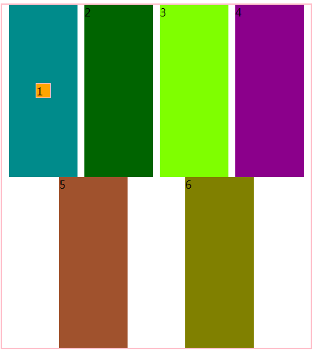

2. 如果弹性元素有外边距，弹性元素的外边距也会影响弹性元素在垂直轴上的分布。

   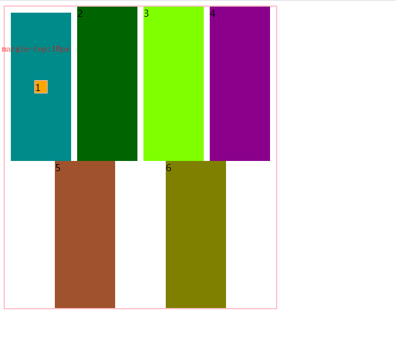

   ```html
   <!DOCTYPE html>
   <html lang="en">
   <head>
       <meta charset="UTF-8">
       <meta name="viewport" content="width=device-width, initial-scale=1.0">
       <title>Document</title>
       <style>
           #f{
               border:2px solid pink;
               /*父元素成为了弹性容器，其中的子元素横向排列了*/
               display:flex;
               /*设置主轴的方向*/
               /* flex-direction: row-reverse; */
   
               /* height:800px; */
               width:450px;
   
               /* flex-wrap: wrap-reverse; */
   
               /* height:400px; */
               /* height:500px; */
   
               justify-content: space-evenly;
   
               flex-wrap: wrap;
   
               height: 500px;
   
               align-items: stretch;
   
           }
           #f > div{
               width:100px;
               /* height:100px; */
               height:auto;
               /* 初恋 */
           }
           #f > div:first-of-type{
               background-color: darkcyan;
               margin-top:10px;
   
               display:flex;
               justify-content: center;
               align-items: center;
           }
           #f > div:nth-of-type(2){
               background-color: darkgreen;
           }
           #f > div:nth-of-type(3){
               background-color: chartreuse;
           }
           #f > div:nth-of-type(4){
               background-color: darkmagenta;
           }
           #f > div:nth-of-type(5){
               background-color: sienna;
           }
           #f > div:nth-of-type(6){
               background-color: olive;
           }
           #f > div > div{
               width:20px;
               height:20px;
               border:1px solid pink;
               background-color:orange;
           }
       </style>
   </head>
   <body>
       <div id="f">
           <div>
               <div>1</div>
           </div>
           <div>2</div>
           <div>3</div>
           <div>4</div>
           <div>5</div>
           <div>6</div>
       </div>
   </body>
   </html>
   ```

3. 如果想单独修改某个弹性元素的对齐方式，可以为相应的弹性元素设置align-self属性。(用在弹性元素、用在子元素上)

   __到现在为止就这一个属性align-self在子元素上面设置__

   align-self:

   * auto，默认值，其对齐方式继承自容器的align-item属性。
   * flex-start，将元素与弹性容器的各行的垂直轴开始那一侧对齐。
   * flext-end，将元素与弹性容器的各行的垂直轴结束那一侧对齐。
   * center，弹性元素的中点与所在行的垂直轴中点对齐。
   * stretch，如果项目为设置高度或设置为auto，将占满整个容器的高度。


一对双胞胎 nv

1姐姐     2妹妹 

一对双胞胎 nan

1哥哥    2弟弟


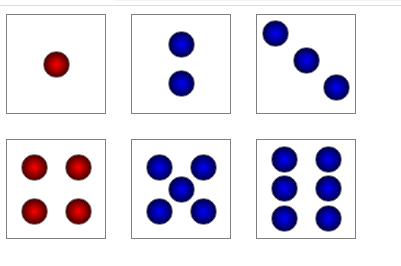