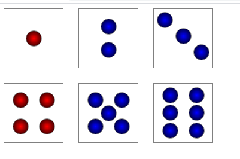
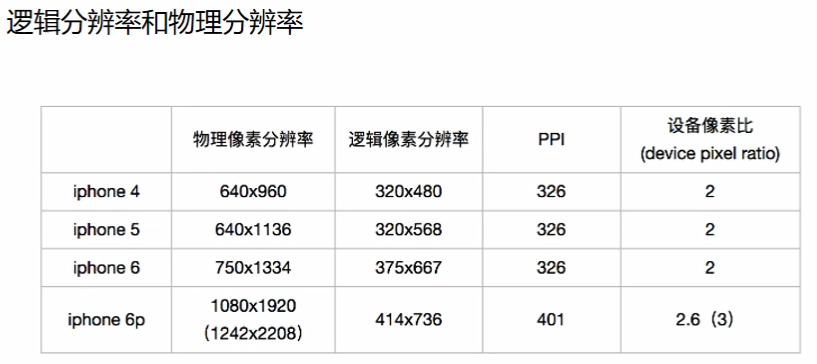
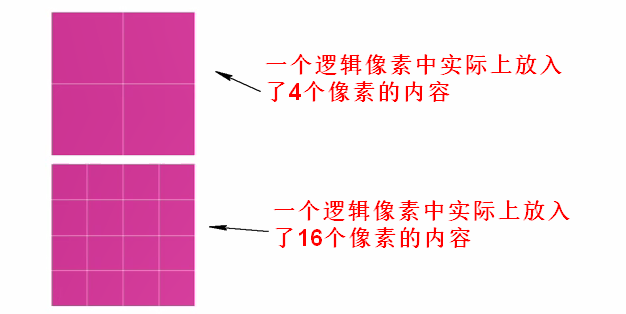

分析：



#### 设置弹性元素如何在垂直轴上分布

align-items属性定义在弹性元素的垂直方向上的对齐方式。(__设置弹性元素在当前行的位置分布__)

#### 设置整个弹性元素如何对齐

align-items是对每行进行对齐。align-content，是将整个弹性容器看成是一个整体然后进行对齐。

__align-content:属性对单行弹性盒子模型无效（必须得有flex-wrap:wrap）__


* flex-start，弹性元素紧靠垂直轴的起始边。
* flex-end，弹性元素紧靠垂直轴的结束边。
* center，居中显示。将弹性元素作为一个整体。
* space-between，将第一行里面的弹性元素放在垂直轴起始边，最后一行里的弹性元素放在垂直轴结束边。，然后余下的每一行弹性元素放置等量的空白。
* space-around，将余下的空间除以行数的个数，得到每行的空间，然后再除以2，分成两份放在上面和下面。
* space-evenly，计算行的数量，再次基础上+1,然后把容器垂直轴的空间分成那么多份，每一行前面放置一份空间，最后一份放在最后一行的后面。

align-content存在时align-items不起作用。

__align-content和align-items的区别在于:align-content将所有元素看成一个整体然后进行操作，align-item是针对于每一行的操作。__


# 上面所说的都是关于父元素的，这回说说关于子元素的


#### 弹性增长因子（设置在子元素上）

flex-grow，适用于弹性元素，用来定义有多余的空间时是否允许弹性元素增大，以及允许增大时占用多少空间。

默认为0，不允许增大。


#### 弹性元素排序（设置在子元素上）


默认时，弹性元素的显示和排序顺序与在源码中的顺序一致。`order属性`可以修改单个弹性元素的显示顺序。

格式：`order:value`，用于弹性元素。

默认情况下，所有弹性元素的顺序都是0。

修改弹性元素的视觉顺序，可以把order属性设置为一个非零的值。正数或负数。


order的数值越大越在主轴上靠后显示。


注意：只是视觉上的变化，就想在源码中的顺序发生了改变，但是实际上__没变__

#### 收缩因子

用的少。

flex元素仅在默认宽度之和大于容器时才会触发收缩。flex元素收缩时最小宽度不能小于其中内容的宽度。


如果我要控制收缩需要用到flex-shrink，适用于弹性元素。缩减因子定义的是空间不够放置所有弹性元素，而且弹性元素不能增加尺寸或不允许换行时如何分配`缺少的空间`


其中的值为1，使用其它指默认是始终是一个数字。


`calc(50% + 50px);`


对于元素宽度相等情况下可以使用我们刚才用的取份数的方法，但是如果元素宽度不相等：

1. `缩小比例=缺少空间/((宽度1* 缩减因子) + ............(宽度n*缩减因子))`

   `缩小比例=250/(400*0.7 + 300*0.8+ 300*1)`  = 0.3048780487804878

2. `最终缩小的宽度= 弹性元素宽度*（缩减因子*压缩比例）`

   `最终缩小的宽度 = 400 * 0.7 * 0.3048780487804878`

   85.36585365853658

3. 弹性元素的宽度-最终缩小的宽度= 现在的宽度。

   `400-85.36585365853658`


#### 移动端适配

解决方案：

1. 用一套代码访问一个域名。响应多个设备（响应式布局）

2. pc端使用网站，移动端使用APP。

   通常将纯IOS或纯安卓写的APP叫原生APP。

   把IOS或安卓+H5的APP我们叫混合APP。

3. 有些大公司既有PC端网站也有APP又有移动端的网站。

   有钱。

#### 视口设置


视口：`viewport`

移动设备上的`viewport`是设备屏幕上能用来显式网页的那一块区域，但是`viewport`不局限于浏览器可视区的大小（有可能比浏览器的可视区要大也有可能比浏览器的可视区域要小）,默认情况下移动设备上的`viewport`都是要大于浏览器可视区域的(因为考虑移动设备的分辨率相对于桌面电脑来说比较小，为了能在移动设备上正常显式传统的为桌面浏览器设计的网站，移动设备上的浏览器都会把自己默认的`viewport`设置为`980px`或者`1024px`，具体多少由设备自己决定)


为什么不同的手机浏览器其宽度不变，是因为默认设置导致的，手机厂商在设备出厂时就将其直接设置为了980px; 这种情况的出现将会导致页面要缩小才能完全放下。


高清屏。






苹果公司说了，要设置成逻辑分辨率相同的大小。这样用户体验更好。并且我还有高清屏让用户看的更加清晰。


#### vw适配

vw单位：

`1vw=当前屏幕宽度的1%`也可以理解为1vw占据当前屏幕1份。


一般移动端设计稿的宽度为750px，因为网页设计图是2倍图。iphone678这三个型号上。


我现在在设计稿中看到有一个元素的宽度为60px，在这种情况下应该占据多少vw呢？

d

* 元素为60px;宽

* 1vw=7.5px、100vw=750px。

* 得出来一个px等于多少vw、1vw/7.5px或100vw/750px;

  `1px=0.13333333333333333vw`

* 60像素宽度是多少vw。`0.13333333333333333vw*60`

```html
html{
	font-size:5.33333vw;
}
```


#### vm结合rem进行适配

可以将html的font-size大小设置为`0.13333333333333333vw`，每次乘的时候使用rem来进行运算，我们要配合上`calc()`

`width:calc(1rem * 60);`


问题：设置了字号之后有些浏览器只能最小识别12px的大小（如果小于12px解析成12px），有些浏览器可以识别12px以下的字号。


将字号扩大。

* 在0.133333vw的基础上10倍：0.1333333vw为1px，扩大10倍1.33333vw，在750px就是10px，在375的px下就是5px
* 0.133333vw的基础上扩20倍:`1.3333333vw*2=2.66666vw=10px`（375下）
* 0.1333333vw的基础上扩30倍：1.3333333vw*3=3.9999999=15px（375下）,但是如果是187.5的宽度的屏幕的话，那这个时候`15px/2`就变成了7.5px又小于12了。
* 0.1333333vw的基础上扩大40倍数：1.3333333vw*4=5.333333vw在375下面20px。


注意：这种操作的方式根据在于，我的font-size为12px一下的情况：我的字体设置12px以下的情况相当少，但是宽度和高度有没有情况设置为12px以下。


为了解决刚才所说的出问题我们才在html的font-size上面设置font-size:5.3332vw，归根到底就是我们现在所有计算都依赖于html的fonts-size属性，所以我们要让他准确。

有些浏览器对于font-size小于12px强制转换为12px，为了让浏览器能够识别html的font-size方便以后我们对宽、高度进行精确计算。所以才设置为了`font-size:5.33332vw`


1. html的fonts-size设置为5.3332vw；

   ```html
   html{
   	font-size:5.3332vw;
   }
   ```

2. 在使用vw的单位的地方使用rem并且除以40就可以了。

   设计稿上元素宽度为70px，那么你写css的

   `width:calc(calc(1rem * 70) / 40);`

动画 2d 3d   项目。