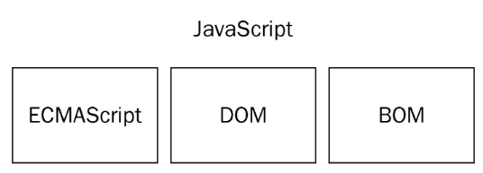

#### 移动端页面

### Font Awesome

1. `https://fontawesome.dashgame.com/`网站

2. 使用之前要将`font-awesome.css`里面的字体的路径更改一下。

   ```css
   @font-face {
       font-family: 'FontAwesome';
       src: url('../fonts/fontawesome-webfont.eot');
       src: url('../fonts/fontawesome-webfont.eot')
               format('embedded-opentype'),
           url('../fonts/fontawesome-webfont.woff2') format('woff2'),
           url('../fonts/fontawesome-webfont.woff') format('woff'),
           url('../fonts/fontawesome-webfont.ttf') format('truetype'),
           url('../fonts/fontawesome-webfont.svg')
               format('svg');
       font-weight: normal;
       font-style: normal;
   }
   ```

#### js简介

网景公司，决定开发一种客户端语言，来处理这种简单的验证问题。

### JavaScript的由来

1. `Netscape`开发一种名为`LiveScript`的脚本语言——该语言将同时在浏览器和服务器中使用（设计时可以在服务器端运行，但是在一直没流行起来，直到Node.js的成功，使这个语言开始在后端也流行起来，给整个开发带来了很大的变革）。
2. 为了敢在发布日期之前发布`Netscape`与`Sun公司`建立了一个开发联盟。(Sun公司发布了Java，而且大火，为了赶热度更名为了JavaScript)-------雷锋和雷峰塔、卡巴斯基和巴基斯坦的关系。
3. `JavaScript1.0`取得了巨大的成功之后又发布了`JavaScript1.1`。
4. 没多久之后微软在IE3中加入了自家的竞争产品`JScript`。（和javaScript差不多，微软的这个举措让网景公司日后蒙羞）。
5. 这个时候市面上就有两个版本了javaScript、JScript，但是因为没有标准，两种语言并存导致了很多的问题(比如实现这个功能在Jscript要这样，而在JavaScript要那样)。
6. 97年以JavaScript1.1为原型的建议提交给了ECMA(欧洲计算机制造商协会)，完成了ECMA-262的标准制定。
7. 98年ISO(国际化标准组织)，也采用了ECMA-262标准。这个时候所有的浏览器厂商都开始将ECMA标准作为JavaScript实现基础。


ES5   ECMA5


ES6 ECMA6

### JavaScript的作用

jeff atwood：stackoverflow

Atwood定律：`Any application that can be written in JavaScript, will eventually be written in JavaScript`

现在可以做很多事、表单验证、用户交互（主要学习的）、游戏开发、后端开发(Node.js)、硬件控制。


物竞天择适者生存。


### JavaScript特点

javascript是弱类型的语言、解释型的、脚本语言。

1. 弱类型语言：数据类型不固定、随时可以改变。

2. 解释型：相对于编译型来说。

   什么是编译：我们写的代码我们认识，计算机不认识，所以我们需要让计算机知道我们写的代码的意思，这个过程我们称为编译。

   1. 编译型语言：程序在运行之前要整体的编译。整体的都翻译过来。
   2. 解释型：程序运行的时候不会编译拿一行解释一行。

3. 脚本语言

   脚本：是一种程序，它不能独立运行，需要一个载体来运行它。它就像寄生虫一样。脚本程序也需要有一个运行的环境。__我们现在的运行载体是浏览器。__

### JavaScript的构成



* 核心，ECMAScript，负责核心语法部分

  ES和web浏览器没有直接的依赖关系，他定义的只是这门语言的基础。常见的web浏览器只是ES实现的宿主环境之一。

* 文档对象模型，DOM

  控制页面。

* 浏览器对象模型，BOM

  控制浏览器DOM之外的东西的。

### ECMAScript

### 文档对象模型（DOM，Document Object Model）

### 浏览器对象模型（BOM，Browser Object Model）

# JavaScript基础语法

### 初识使用JavaScript

```html
<script>
    //这里是输出
    alert('我就闫海静');
    console.log('我是个英俊的美男子');
    document.write('我今年18岁!');
</script>
```

1. script标签现在被放在head中。script标签中写的是javascript的代码。

2. 注释符

   ```js
   // 这是单行注释
   /*这是多行注释，块状注释*/
   ```

   注释的作用：

   1. 写程序说明。
   2. 代码暂时不用时，先注释起来。
   3. 调试代码

3. 刚才有三个输出内容的__小工具__。

   1. `alert()`，以弹出框的形式输出内容。

   2. `console.log()`，以控制台日志形式打印内容。

   3. `document.write()`，将内容显示在页面上。

      `document.write('<del>崔旺真英俊!!!!!!!!!!!!!!!!!!!!</del>');`，`document.wrtie()`中的内容可以是`html标签`。

4. ES中的每条语句都以一个分号结尾。可以省略分号，如果省略由解析器确定语句的结尾。

   我们写的时候虽然可以不加分号，但是强烈建议加上分号。这样可以避免很多错误。

5. 关于程序的空白（空格、换行、空行）

   javascript会忽略程序中的空白，所以你可以继续使用缩进来增加可读性。

   代码缩进：一般来说两种4个空格或2个空格。

__一定要注意：JavaScript中的一切都严格区分大小写。__

### 其他使用JavaScript的方法

1. 行内写法

   什么叫耦合。

   什么冗余。

   1. 局限性很大，只能针对事件进行添加,用的很少。
   2. 它的代码分离性最差，可读性不强。

2. 页面嵌入javascript代码。

   刚才我将`script`标签写在了head中。

   现在的script标签中的`type="text/javascript"`可写可不写。

   1. 我们这种写法在项目和教学中用的最多。

3. 外部包含javascript文件

   通过`script`标签来包含外部`javascript文件`，有一个属性`src属性`引入的javascript文件的具体路径。

   1. 在外部的js文件中去写js代码。
   2. 最后通过src属性，引入到自己的html文件中。
   3. 项目最终都会把代码文件进行分离。

   做项目的时候都会这样写。就是将js代码独立成一个文件。

   ```html
       <script src="./zhengyingjun.js">
           alert('崔旺真英俊，又帅又有钱!');
       </script>
   ```

   带有src属性的`script`标签不应该再在其中`<script></script>`之间再包含额外的js代码（即使包含也会被忽略。）。

# 变量

### 什么是变量

可以改变的量叫变量。量就是用来存储数据的容器。

### 变量的作用

可以有多个杯子，将水放在不同的杯子里。

我要对哪个杯子里的谁进行操作就调用哪个杯子，还可以对这个杯子中的水进行多次的操作。


运行一个程序之前，需要先将程序中的内容从硬盘中读取到内存中。一个变量作为容器存在内存中。它对应着指定的值。我要操作、使用哪个变量的值就调用哪个变量获得对应变量的值。


计算机的三大件：cpu（用来运算的）、内存（快，但是断电数据清空。）、硬盘（速度比较慢，断电数据依然存在）。

内存和硬盘一般是GB、TB。

1Byte（字节，最小存储单位）= 8bit（存储8个0/1的数字）;

1KB = 1024Byte

1MB = 1024KB

1GB = 1024MB

1TB = 1024GB

1PB = 1024TB

1EB = 1024PB


新买的移动硬盘1Tb只有900GB。硬盘厂家计算方式和电脑的计算方式不一样，厂家是1kb=1000b来计算的。电脑是1kb=1024b来计算的。


### 变量的定义

```js
 /* var a;//定义了一个容器。
        a = 10;
        a = 20;

        console.log(a); */

/* var a = 10;
        a = 20;
        console.log(a); */

//我们写代码不会这样写，但是这样写没错。
c = 200;
console.log(c);//200    undefined   找不到
```

`c = 200;`，现在我们刚开始学可以__暂时的__认为是定义变量。但是严格意义上面来说不是的，这是个坑。

定义多个变量：

```html
//完全等价于 var d = 1; var e = 2;
var d = 1,e = 2;

console.log(d);
console.log(e);
```


### 变量定义规则

我们给变量起名的时候是有一些规则存在的。


标识符（标识符指的是变量、函数、属性的名字、函数的参数名）定义的规则：

* 数字、字母、下划线和`$`符组成。

* 不能以数字开头。

* 不能和关键字、保留字同名。

  关键字：语言已经使用的字符。

  保留字：以后有可能使用的字符。


* 关键字和保留字

  ```html
  关键字
  break do instanceof typeof
  case else new var
  catch finally return void
  continue for switch while
  debugger* function this with
  default if throw
  delete in try
  
  保留字
  abstract enum int short
  boolean export interface static
  byte extends long super
  char final native synchronized
  class float package throws
  const goto private transient
  debugger implements protected volatile
  double import public
  ```

  变量起名字的时候，写多了自然就避开了。而且保留字是会随着规范版本的变化而变化的。

  起变量名字的时候起名字要有意义，不使用拼音、中文，只使用英文。

  

  约定俗成的起名方式：（建议使用）

  * 大驼峰：每个单词的首字母大写。前端使用的不多。
  * 小驼峰：第一个单词的字母小写，剩下的每个单词的首字母都大写。
  * 下划线：每个单词之间使用`_`来进行分隔。

* 案例：有两个变量一个中存储的是100一个中存储的是200，交换其中的值（请用两种方法）。

  

### 变量的类型

### 类型转换的类型

### 强制类型转换

### 隐式类型转换

