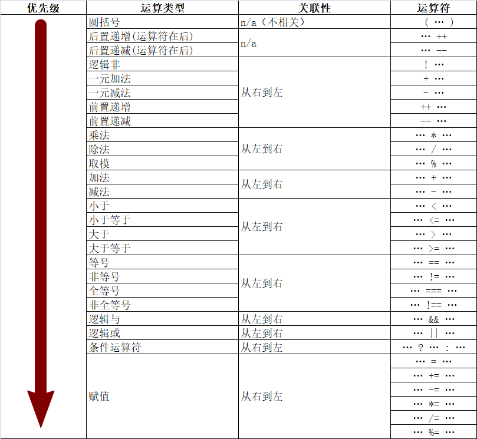

#### 三元运算符

格式：`运算元1 ? 运算元2 : 运算元3;`

运算元1是条件。运算元2为表达式。运算元3为表达式

* 运算元：

  `1 + 2`，1和2操作数（运算元），`+`运算符

* 可以分为： 

  * 一元运算符，一个操作数`!`、`++`、`+`
  * 二元，两个操作数`+`、`-`、`&&`、`||`
  * 三元，三个操作数，三元运算符只有一个。

* 运算过程：如果运算1为true则得到运算元2，运算元1为false则得到运算元3。


#### 运算符优先级

`JS`中严格按照从左到右的顺序计算表达式，然后再按照__优先级__和__关联性__计算各个表达式和运算符作用的结果。




1. 一元运算符优先级比较高，然后是二元，然后是三元。如果实在却不不了运算符优先级怎么办加`括号`。

关联性决定拥有相同优先级的运算符的执行顺序。

先看运算符的优先级是否相同，如果相同按照关联性来解决执行的顺序。

```js
a OP b OP c
```

左关联相当于把左边的子表达式加上了小括号`(a OP b ) OP c`。右关联`a OP (b OP c)`


#### 流程控制

* 程序的结构：

  顺序结构：最基本的结构，程序从上往下执行，前面咱们写的就是这种结构。

  分支结构

  循环结构

#### 分支结构

分支结构一共四种情况，不管多大的项目、多复杂的项目都是这四种情况。

* 单一分支结构

  格式：

  ```js
  if (条件表达式) {
      代码块1
  }
  ```

  如果条件表达式为true则执行代码块1的代码，如果为false，不执行代码块1的代码，继续向下执行。

  通俗理解可以理解为：__如果xxxx我就xxxx。__

  __注意：__

  1. 如果其中不是条件表达式，而是其他的值通过`Boolean`进行转换，然后根据结果判断是否执行。

  2. 如果大括号内只有一条语句，可以省略大括号。

     ```js
     var shuai = false;
     if (shuai)
     console.log('大帅哥！');
     ```

     及其不建议使用。

* 双向条件分支

  格式：

  ```js
  if (条件表达式) {
      代码块1
  } else {
      代码块2
  }
  ```

  如果条件表达式的值为true，则执行代码块1的代码，如果为false则执行代码块2的代码，不属于if的代码将不受影响。

  通俗理解为：`如果xxxx我就xxx，否则我就xxxx`

  __注意：__

  1. 程序中如果有if和else必须执行一个括号中的代码。

     ```js
     var year = 2020;
     if (year % 4 ==0 && year % 100 != 0 || year % 400 == 0) {
         console.log('闰年');
     } else {
         console.log('平年');
     }
     
     console.log('--------------------');
     ```

  2. 如果就一条语句也可以省略（不推荐）

* 多向条件分支 

  格式：

  ```js
  if (条件表达式1 ){
   	代码段1   
  } else if (条件代码段2) {
  	代码段2           
  }........
  else {
      条件都不成立的时候，可以执行的代码。  可选的。
  }
  ```

  如果条件表达式1为true就执行代码段1，如果条件表达式2成立就执行代码段2，if的条件都不成立的时执行else从句里面的内容。

  ```js
  var age = 35;
  
  if (age >= 20 && age <= 29) {
      console.log('期货');
  } else if (age >= 30 && age <= 39) {
      console.log('抢手货');
  }else if (age >= 40 && age <= 49) {
      console.log('现货');
  } else if (age >= 50 && age <= 59) {
      console.log('跳楼货');
  } else {
      console.log('不在讨论范围内!');
  }
  ```

  

  __注意：__

  1. else从句可以省略。

  2. if条件从上往下执行，执行了一处大括号内的代码之后，其他的代码不会检查、不会执行。

     ```js
     var age = 35;
     
     if (age >= 20 && age <= 29) {
         console.log('期货');
     } else if (age >= 30 && age <= 39) {
         console.log('抢手货');
     } else if (age >= 30 && age <= 39){
         console.log('崔旺是帅哥!');
     } else if (age >= 40 && age <= 49) {
         console.log('现货');
     } else if (age >= 50 && age <= 59) {
         console.log('跳楼货');
     } else {
         console.log('不在讨论范围内!');
     }
     ```

  3. if语句__通常__用来判断条件，比如一个学生的成绩。但是我们也可以使用if来判断某个值。

     ```js
     var day = 2;
     
     if (day === 1) {
         console.log('熊样，精神不佳');
     } else if (day === 2) {
         console.log('猫样，温顺听话，精神还好');
     } else if (day === 3) {
         console.log('狗样，神气活现');
     } else if (day ===4) {
         console.log('马样,跃跃欲试');
     } else if (day === 5){
         console.log('猴样，活力无限');
     } else if (day === 6 ) {
         console.log('鸟样，向往明天');
     } else if (day === 7) {
         console.log('猪样，一动不动');
     }
     ```

  #### switch

  从根本来说switch语句就为了避免大量的使用`if(){....}else if()`

  格式：

  ```js
  switch(有值的东西){
      case 值1:
      	代码块1
      break;
      case 值2:
      	代码块2
      break;
      ......
      case 值n:
      	代码块n
      break;
      default:
          默认匹配的代码块
      break;
  }
  ```

  * switch中的`有值的东西`和if中的内容不同，他需要得到一个值并且不会经过转换。
  * case后面的`值`，用来和switch的值做对比，如果能够匹配上就执行其中的`代码块`
  * 每个case下面的break用来跳出当前的`switch`语句。
  * 最后的default，表示case后面的值都没有匹配上应该怎么办。

  __注意:__

  1. switch比较值的时候使用的是全等操作，不会发生类型转换。

  2. default可以省略。

  3. 如果省略break关键字就会导致执行完当前case之后，继续执行下一个case（不管是否能够匹配上），直到遇到break。

     ```js
     var day = 4;
     
     switch(day){
         case 1:
         case 2:
         case 3:
         case 4:
         case 5:
             console.log('上课的心情比上坟还沉重！');
             break;
         case 6:
         case 7:
             console.log('周末真舒服!');
             break;
     }
     ```

  4. switch通常用来判断是否等于某个值。我用来判断范围也行（了解一下）。

     ```js
     var score = 80;
     
     switch(true){//值不进行转换  true
         case score <= 100 && score >= 90://case后面的值进行的是全等判断
             console.log('学魔');
             break;
         case score <= 89 && score >= 75:
             console.log('学民');
             break;
         case score <= 74 && score >= 60:
             console.log('学弱');
             break;
         case score <= 59:
             console.log('学渣');
             break;
         default:
             console.log('分数不合法!');
             break;
     }
     ```

#### 巢状分支结构

不是新语法。只是前面几种分支、综合、嵌套使用。

分支结构中可以写我们学过的任意的代码。 

但是嵌套的层次尽量不要超过三层。

```js
var age = 23;
var money = false;

if (age >= 23 && age <= 26 && money) {
    console.log('我们可以试试!');

    var fom = true;

    if (fom) {
        console.log('准备结婚吧....');
    } else {
        console.log('我们分手吧，我们不合适，以后还是朋友...');
    }

} else {
    console.log('你是个好人！');
}
```


#### while循环

程序中有些代码要反复执行，这个时候就用到了循环。


计算机最大的特点：快，善于做重复的事情。


格式：

```js
while(条件表达式){
     重复执行的代码。
}
```

执行过程：第一步先执行条件表达式，如果表达式为true，执行大括号中的代码。然后再执行表达式看是否为true，如果为true再执行大括号中的代码，一直这样执行。直到条件表达式为false为止。


while循环的三个要素： 

1. while外部的起始值。
2. while中的条件。
3. while内部的始终要改变起始值，让while条件有为false的时候。


循环中可以嵌套任意我们学过的代码，再嵌套循环，这样就形成了循环的嵌套。