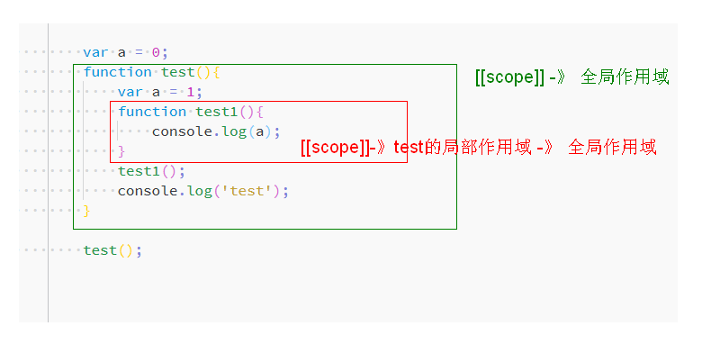
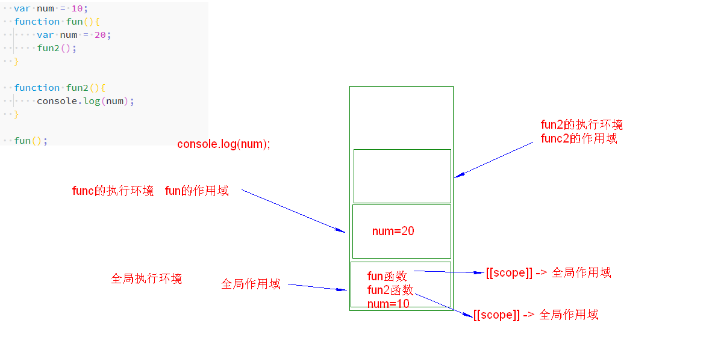
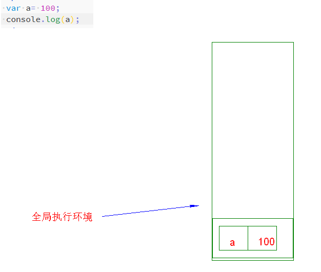
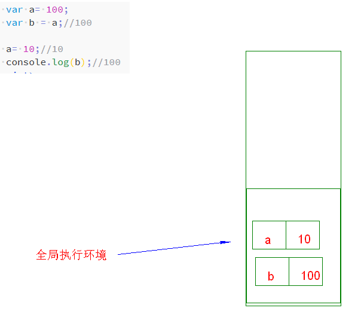
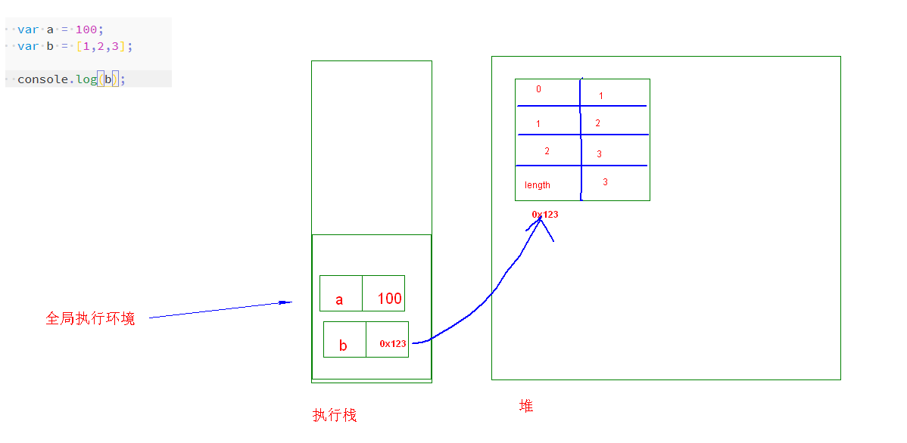
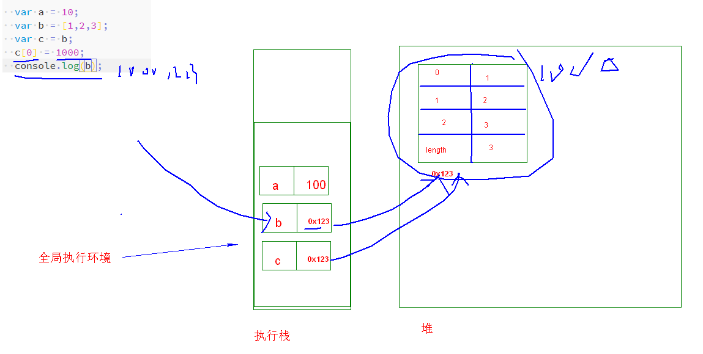

# 程序执行过程（重要）

#### 堆和栈

堆和栈是数据结构中的概念，堆（链表结构）、栈（栈结构）

程序在运行时内存按照逻辑分为了__堆内存、栈内存。__

* 栈：空间较小，速度快，操作系统自动分配自动回收。
  
    特点：先进后出。
    
    
    
* 堆：堆结构，空间比较大，速度比较慢。一般是由程序员自己用的时候再去申请；要想让内存回收回来，必须手动回收。
  
  特点：先进先出。


在我们的JS中所有的堆、栈都是自动回收的。JS中已经封装好了垃圾回收机制。

#### 执行环境

JavaScript运行分为两种环境：

* Global，全局环境，JavaScript代码一开始运行就进入到了全局环境。
* Function，函数环境。进入到javaScript函数的运行环境（函数调用时才进入到这个环境。）。

每个运行环境我们也称为执行上下文。

代码在执行的时候开辟出来一段栈空间来说明代码的执行顺序，这个栈我们叫__执行栈。__

1. 当JavaScript代码执行时会将全局执行上下压入到栈底，当执行到函数时会创建函数执行上下文，并将函数执行上下文压入到栈底。
2. 在函数执行完成之后将函数执行上下文弹出并且销毁（和执行上下文有关的一系列内容都会被销毁。）。
3. 一直到最后所有代码执行完成才将全局执行上下文销毁。

#### 执行环境的阶段

执行环境上来分为了阶段： 

1. 创建阶段（做这个执行环境相关的一些准备工作）
   1. 全局执行环境：一上来就马上进入到了创建阶段。
   2. 函数执行环境：当函数被调用，但是开始执行函数内部代码之前。
2. 代码执行阶段（真正的解释、真正的执行代码）；

#### 作用域及作用域链

* 什么是作用域？

  变量起作用的范围区域。

* 作用域的作用？

  作用域的作用：隔离变量。

  函数外部定义的和函数内部定义的变量即使变量名相同也没有关系。

* 作用域的确定时机？

  作用域就是进入到全局执行环境或函数执行环境时就确定好了。

* 作用域种类？

  ES5中作用域分为两种：全局作用域、函数作用域（也叫局部作用域）

  ~~在ES6里面加入了所谓的块级作用域。~~

  一执行javascript就进入到了全局执行环境就有了全局作用域，执行某个函数的时候进入到了函数执行环境就有了这个函数对应的函数作用域了。（局部作用域）

  ```js
  function test(){
      var a = 1;
      var b = 2;            
  }
  
  test();
  test();
  ```

  同一个函数多次调用会产生不同的执行环境，每调用一次都会产生一个执行环境。

​		__执行环境销毁，其对应的作用域也会被销毁。__

* 全局变量和局部变量

  * 全局变量：定义在全局环境中的就是全局变量（函数外部，全局作用域）
  * 局部变量：在局部环境中定义变量就是局部变量（函数内部，函数的作用域）；

  局部变量：只能在自己作用域中起作用，局部变量只能在函数内部使用，外部用不了。（如果要操作就得使用后面讲的闭包）

  ```js
  function test(){
      var a = 1;
      var b = 2;
      console.log(a);
  }
  test();
  console.log(a);
  ```

  全局变量：在整个程序所有的地方都可以起作用（整个程序当中任何地方都可以__操作__这个全局变量）

  ```js
  var c = 3;
  function test(){
      var a = 1;
      var b = 2;
      console.log(c);
  }
  test();
  console.log(c);
  ```

  全局变量可以被函数内部进行操作。操作包含（读取、修改）

* 作用域链

  函数内部是可以继续嵌套函数的。

  作用域是起作用的范围，作用域链是用来查找变量的一系列的过程。

  一个函数在__定义__时会生成一个`[[scope]]`属性（`[[]]`的都是不能访问的），这个属性中存储了函数定义时的作用域的层级。

  

  作用域链是在__函数执行__时创建的。作用域链是由：`当前函数的作用域 + [[scope]]属性中的作用域组成的。`

  函数当前执行的作用域是作用域链的歘一段，全局作用域是作用域的最后端。

  

* 总结：

  作用域链由：当前执行环境的作用域和[[scope]]属性组成。它是在函数调用时才会形成的。

  当前的作用域（调用）、`[[scope]]属性`是在函数定义时才会形成。、作用域链是在函数调用时才会形成。

#### 内存中的数据存储



变量如果是基本数据类型（String、 Boolean、Number、undefined、null）；会在栈内存开辟一段空间存储标识符，然后将基本数据类型的值也存储在栈内存中并且和标识符对应起来。





引用类型的值存储在堆中的，存储引用类型的时候给堆一个地址。但是标识符还是存在栈内存中，为了能够让标识符和真正的数据结合起来在栈内存中存储的值是引用类型的地址。（见上图）


查找变量的时候时候从栈里面找对应的数据（如果是引用类型找的是地址）。这个变量有没有和执行环境有关。堆只是用来存储对象类型的数据的。




还没讲完！！！！

#### 变量提升（预解析）
