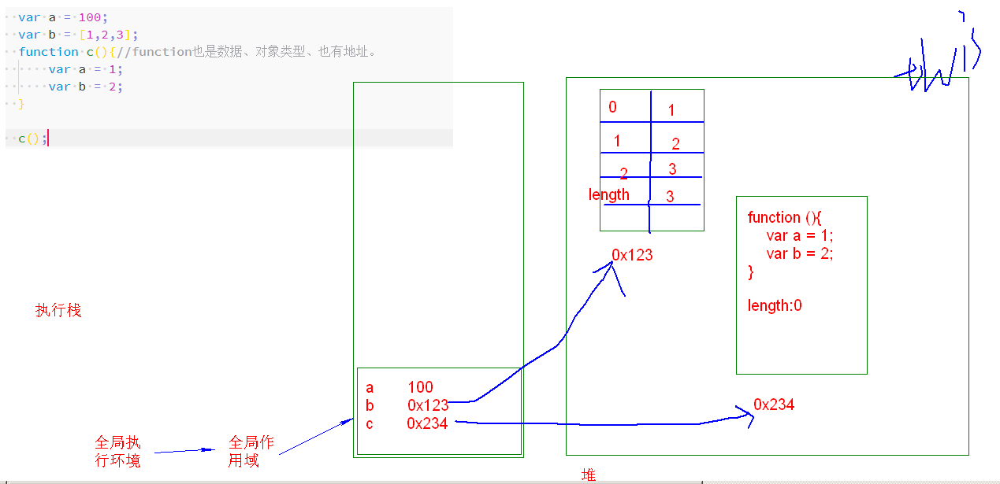
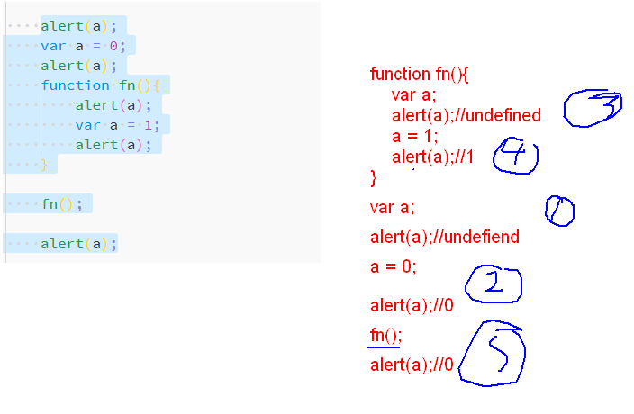
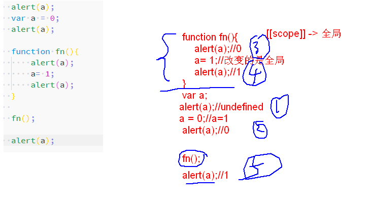
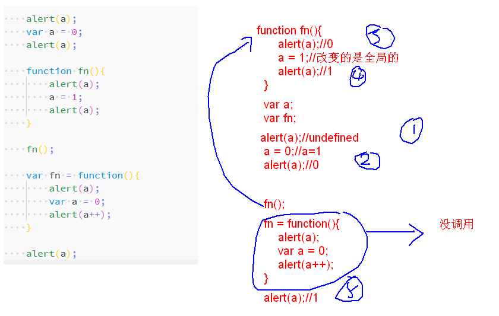
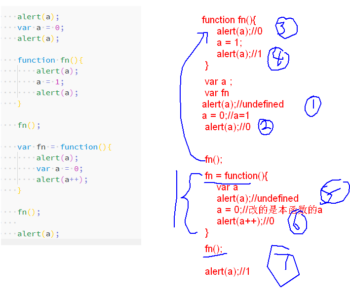
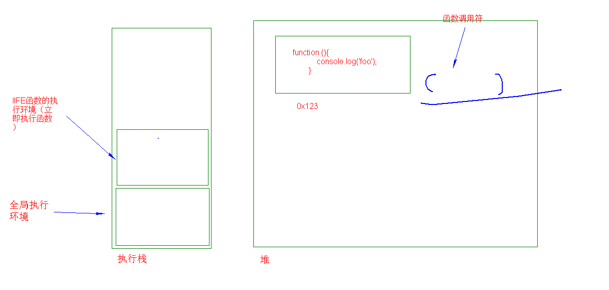
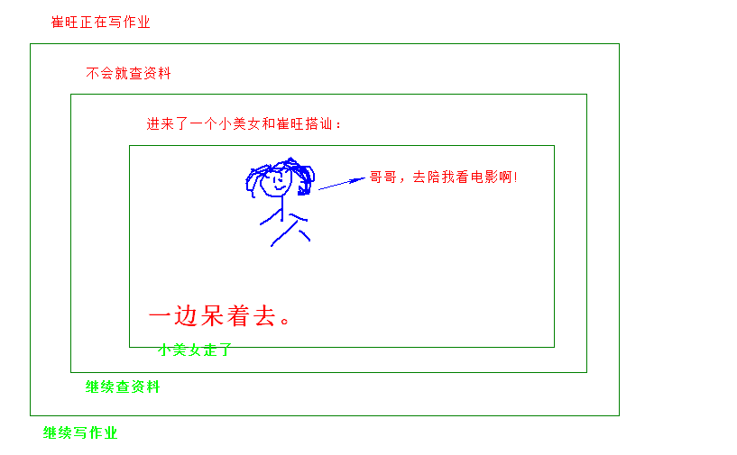

#### 作用域

作用域链由什么组成：当前的作用域+`[[scope]]`。
作用：查找变量的一系列过程。

三种情况：声明了形参、函数中声明了函数、函数中又定义了变量。

如果形参、函数同名：__函数覆盖形参。__


如果形参、函数、定义的变量同名：__变量声明如果在使用之前则会覆盖函数和形参，在使用之后则为函数。__

```js
function test(fn) {
    function fn() {
        console.log('fn');
    }
    //fn();//在定义的变量之前调用
    var fn = 123;
    //fn();//在定义的变量之后调用。


}

test('abc');
```

如果局部作用域中没有找的变量，会沿着作用域链向上层开始查找。

1. 如果上层能够找则使用、设置上层同名的变量。
2. 如果到最后没有找到从全局作用域中看有没有，如果有就使用、设置全局作用域中的同名变量，如果没有使用时候就报错（`变量未定义`）。

__如果你要声明变量一定要使用var来声明（ES5）__


#### 内存存储




#### 变量提升（预解析）

```js
console.log(a);
var a = 1;
```

在进入到执行环境的第一步时，将`带var的变量的声明`以及函数的声明放到了作用域中，在`执行阶段`时开始在原来的代码本身应该在的位置开始进行赋值和处理其他的逻辑。

```js
var a;//undefined，在创建阶段声明变量，值为undefiend

console.log(a);//在执行阶段时候，这个时候a没有被赋值。所以还是undefined。

a = 1;//赋值了，这个赋值在执行阶段赋值的。
```

案例：

```js
if (true) {
    var a = 1;
} else {
    var b = 2;
}

console.log(a);
console.log(b);
```

实际上：

```js
//在执行环境的创建阶段
var a;
var b;

//在代码的执行阶段
if (true) {
    a = 1;
} else {
    b = 2;
}

console.log(a);//1
console.log(b);//undefiend
```

注意：

1. 不管是全局执行环境还是函数执行环境每个执行环境都会对变量进行提升操作。

2. 函数表达式不会被提升。

   你写的代码：

   ```js
   foo();
   var foo = function (){
   
   }
   ```

   实际执行的代码：

   ```js
    //在执行环境的创建阶段
   var foo;
   
   //在代码的执行阶段
   foo();//foo=undefiend;
   
   foo = function(){
   
   }
   ```

   你写的代码：

   ```js
   var foo = function (){
   
   }
   
   
   foo();
   ```

   实际执行的代码：

   ```js
   //执行环境的创建阶段
   var foo;
   //执行环境的执行阶段
   foo = function(){
   
   }
   foo();
   ```

   __什么叫函数声明：代码开始以function开头的叫函数声明。__

   __什么叫函数表达式：不能以function开头并且不能以`{`开头这样的叫函数表达式。__

   ```js
   /* function (){//函数声明方式必须得有一个name  现在是以函数声明方式声明的，为这一行以function开头了。
   
   } */
   
   // (function (){});//因为这行代码以小括号开头 不以function开头也不以{开头所以这是一个函数表达式。
   ```

   `()`有两种叫法：有一种括号叫`分组操作符`，还有一种叫`函数调用符`。

   函数声明和变量都会提升，但是函数会首先被提升，然后才是变量。

   ```js
   foo();//崔旺 啥不输出 // 刘利 undefined。   // 史帅乐  不报错 1 //
   var foo;
   function foo(){
       console.log(1);
   }
   foo = function(){
       console.log(2);
   }
   
   /*
          function foo(){
   
          }
          var foo;//var foo;没赋值的情况不应该是undefiend吗？
          foo();//1
   
          foo = function(){
              console.log(2);
          }
   
          */
   ```

   变量提升练习：

   ```js
   //我叫不着急。
           //不要太相信自己的想像能力。
           /*
           function a (){
               alert('我是函数');
           }
           var a ;
   
           alert(a);//函数代码
   
           a = '我是变量';
   
           alert(a);//我是变量
   
   
           */
           alert(a);//undefined
           var a = '我是变量';
           function a (){
               alert('我是函数');
           }
           alert(a);//我是函数。
   
   ```

   

变量提升练习;

```js
/*
        function a(){
            alert('我是函数');
        }
        var a;

        alert(a);//函数代码
        a++;
        alert(a);//NaN
        a = '我是变量';

        alert(a);//我是变量

        */
        
        alert(a);//代码
        a++;
        alert(a);//NaN
        var a = '我是变量';
        function a(){
            alert('我是函数');
        }
        alert(a);//我是变量

```










#### 函数其他

#### IIFE

`IIFE:` `Immediately Invoked Function Expression`，意为立即调用的函数表达式，也就是说，声明函数的同时立即调用这个函数。

问题：括号前面是一个函数，在函数后面加上括号就是调用函数。但是上是有问题的（会提示需要一个函数名）。

```js
function(){

}();
```

为什么会导致上面这种情况：因为再规范中规定：`函数表达式`不能以大括号开始，也不能以function关键字开始。

根据上面的思路解决方法就是让其不以function或`{`开头就行了。所以我用小括号扩起来了。

方法一：

```js
(function (){
    console.log('foo');
})();
```

方法二：

```js
(function (){
    console.log('foo');
}());
```

第一种方法用的会偏多一些。第二种你也得知道。


__注意：__

1. IIFE函数只能运行一次，因为引用类型没有标识，执行完成之后就被垃圾回收机制释放掉了。

2. 定义之后马上执行，执行之后马上释放。

   

3. 两个代码相同的IIFE函数也是不同的对象。

   ```js
   (function (){
       console.log('foo');
   })();
   
   (function (){
       console.log('foo');
   })();
   ```

IIFE最大特点就是一次性。

* 初始化项目的时。具体的现在先知道一下就行，后面写第一个项目时会用。
* 框架、模块中也会去使用IIFE函数。目的就是为了初始化并且只暴露模块、框架自己需要暴露的功能。

#### 递归



通过这个故事，我们能发现什么：

1. 主角是崔旺，崔旺一直在做某些事情。
2. 崔旺一件事还没有做完就去做另外一件事情了。
3. 小美女的出现实际上是一个终止条件(__一边呆着去__)。 如果他去看了电影，那后面（不可描述.....），最终结果就是崔旺永远不会写完作业。
4. 当前的这件事做完之后会马上去做上一次还没做完的事。


递归函数（__函数的递归调用__） ，就是自己调用自己。

同一个函数多次调用产生的执行环境是不一样的，每次调用都会产生一个。每个执行环境中同名的变量之间相互不会影响。

* 递：进去。
* 归：出来。

注意：

1. 你自己就是这个函数，自己调用自己。当你自己做完一件现在的事情的时候，你会去做上次没做完的事。
2. 递归调用一定要有一个条线限制，否则你会一直调用自己，陷入调用自己的漩涡当中，永不翻身。这就是所谓的无限递归。
3. 递归调用适合用在不确定具体调用多少次的情况。

函数中的arguments对象中有一个属性始终指向拥有arguments对象本身的函数（引用），所以可以将该函数用在递归上面：

```js
function say1(a){
    console.log(a);
    if (a > 1) {
        //外部函数名字如果改变，函数内部的递归调用处不用动。
        arguments.callee(a - 1);
    }
    console.log(a);
}
say1(2);
```


#### 回调函数

回调函数的精髓： __函数是对象类型的值，可以被当做参数传入到函数中。__


```js
//将一个引用类型赋值给变量时，变量存储的是引用类型的地址。
/*  //a和b指向的是同一个地址。
        var a = [];
        var b = a;

        //foo和foo1指向的是同一个地址。 foo1里面放置的是foo的地址。
        function foo(){

        }
        var foo1 = foo; */


/*引用的是同一个地址*/
//一个引用类型可以有多个名字，一个改变引用类型的值，另外一个的值也会改变。s
/* var a = [];
        var b = a;
        a[0] = 1;

        console.log(b); */


//一个函数本身也是值，一个对象，所以可以被当做实参传入到函数中。但是如果传入的是普通值是赋值，如果传入的是引用类型赋的是地址。
/* function foo0(a){//a='hello'

        }

        foo0('hello');

        function foo1(arr){
            arr[0] = 'helloworld';
        }

        var arr = [1,2,3,4,5];

        foo1(arr);
        console.log(arr); */
```


#### 讲对象


原型和原型链-----> 初级原型链   -------》   js高级  ----》终极原型链。