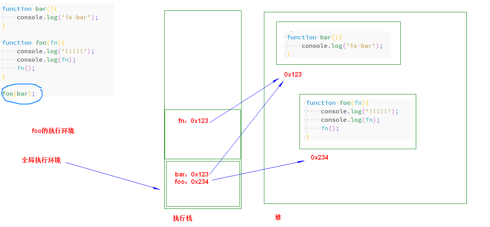
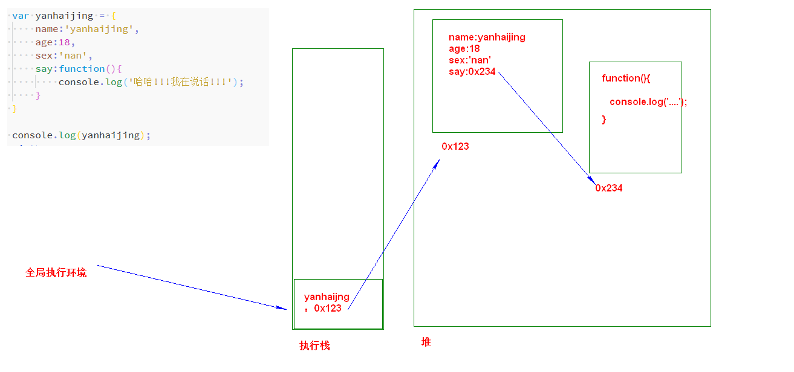
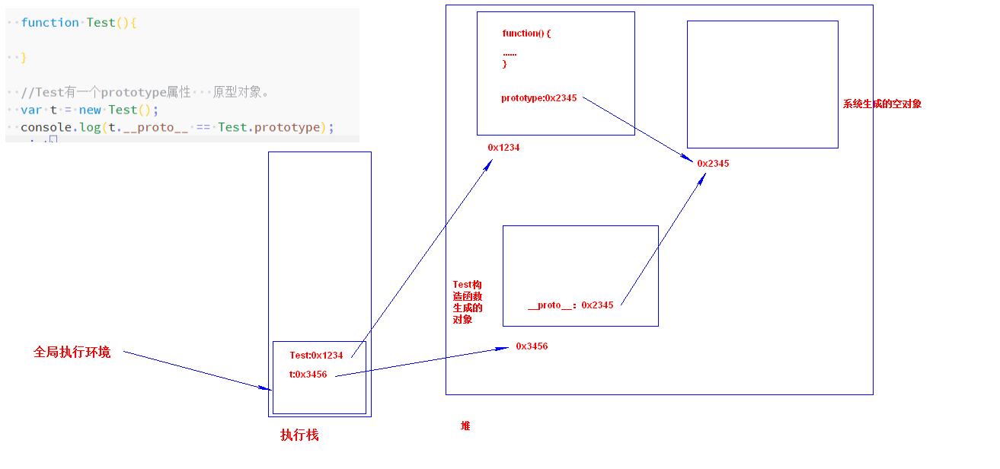
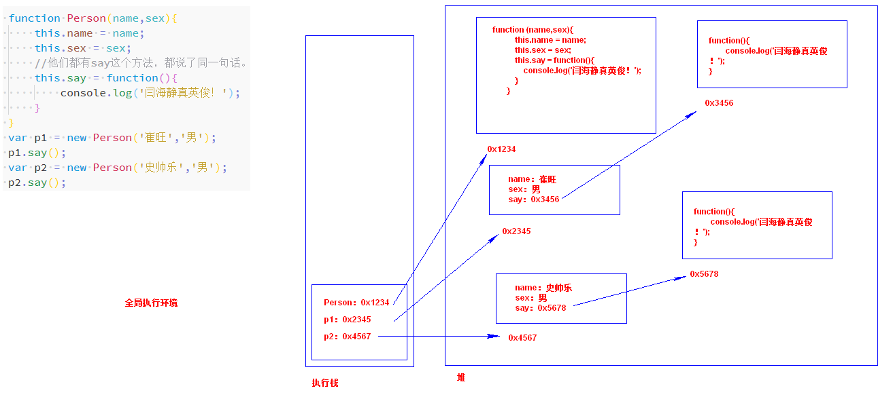
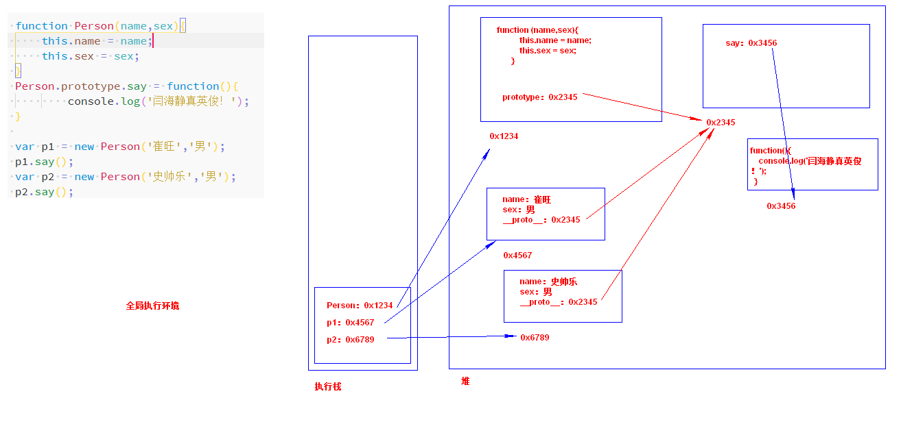
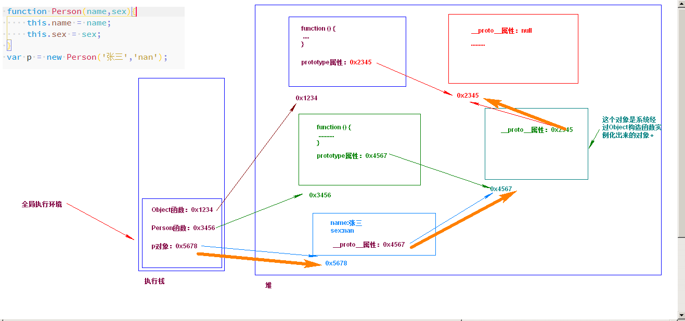

#### 回调函数

了解原理，然后按照步骤一步一步的来推算。

递归比较啰嗦。


回调：

```js
//一个函数本身也是值，一个对象，所以可以被当做实参传入到函数中。但是如果传入的是普通值是赋值，如果传入的是引用类型赋的是地址。
function foo0(a){//a='hello'

}

foo0('hello');

function foo1(arr){
    arr[0] = 'helloworld';
}

var arr = [1,2,3,4,5];

foo1(arr);
console.log(arr);
```

实例:

```js
function bar(){
    console.log('is bar');
}

function foo(fn){
    console.log('!!!!!');
    console.log(fn);
    fn();
}

foo(bar);
```



一个函数本身也是值，也是一个对象。所以可以被当做返回值返回回来。

#### 什么是回调函数

回调函数被认为是一种高级函数，一种被作为参数传参给另外一个函数（OF）的高级函数，回调函数会在OF内被调用或被执行。

回调函数的本质是什么：是一种模式，是一种解决问题的套路。


#### 回调函数的用处：

* 事件的监听和处理。
* 设置setTimeout和setInterval，超时和时间间隔。
* Ajax请求数据。
* 框架中的各种生命周期回调函数。

上面的这些应用归根结底就是代码的__通用化__，增加可扩展性。


写代码的时候理想状态：当有需求增加或者发生修改的时候应该是往上面增加代码而不是修改原来的代码。

```js

        //通用的调用函数
        //大嘴巴子

        //你们没有男朋友或女朋友是有原因的。


        function getNumber(num,fn){//5
            //i=3 i <= 5  true
            //i=4 i <=5 true
            //i=5 i<=5 true
            //i=6 i<=5  false
            for (var i = 3; i <= num; i++) {
                if (fn(i)) {//if(rules1(3))  if(true)//if(rules1(4))  if(true)//if(rules1(5))  if(false)
                    console.log(i);// 3 4
                }
            }
        }

        getNumber(100,rules3);

        //我现在写的是有可能以后遇到的规则。
        function rules1(n){//3//4 //5
            if (n % 5 === 0) {//3%5   3 ===0  false  //4%5 =4  4===0 false  //5%5 =0   0===0 true
                return false;
            } else {
                return true;
            }
        }

        function rules2(n){
            var pos = n / 1 % 10;

            if (pos === 3) {
                return false;
            } else {
                return true;
            }
        }
        //十位数带5的都去掉。
        function rules3(n){
            // console.log(n /10 % 10);
            if (parseInt(n /10 % 10) === 5) {
                return false;
            } else {
                return true;
            }
        }
```


# 对象

#### 面向过程和面向对象

这是两种思想（思想方面的东西就得慢慢体会。）。


* 面向过程：

  编程思想：以`过程`为中心。就是完成一件事的步骤。

  面向过程像流水线，一个阶段衔接着另外一个阶段。每个阶段都做自己的相关工作。

  典型的面向过程语言：C语言。

* 面向对象：

  编程思想：以`对象`作为中心。

  对象：可以理解为真真正正实实在在存在的东西。

  面向对象像足球队，你不能精确指定每个对象在场上的每个动作，但是你可以指定角色（前锋、中场、门将），这些角色都有自己的职责。

  典型的面向对象语言：Java、Python、PHP、JavaScript

#### 面向对象的优势。

1. 符合人类思维的习惯。

   你拿着遥控器增加音量。

   你是一个对象，遥控器又是一个对象。你按下了遥控器实际上就是两个对象的交互。

2. 对于软件行业来说尤其是互联网行业，需求变更太快，需求很复杂。

   对于需求的不断变更，面向对象能够很好的取应付（应付的特点：`可扩展性`）。

   

#### 类和对象

* 类：一组相似事物的统称。

  * 一组：多个，不是单个。
  * 相似：比较像，但是不完全相同。

  人  属于哺乳动物      

  人和猪是一类。

  如何划分类：站在你的观察的角度，能够看到相似的点他就是一类。

* 类型的组成：

  * 属性：是这个类具有的特征（通常是名词）；
  * 方法：指类具有的功能（通常是动词）；

* 对象是类的具体化、实物、是实体，由类创建出来的。

  类是模板，让多个对象之间拥有共同的属性、方法。


#### JavaScript中的对象

javaScript中没有具体的类，直接就是对象，而且在JavaScript中一切皆为对象。

为什么要这样设计：有类的概念无非也就是让代码复用（属性、方法），JavaScript中是使用一种叫`原型`的东西实现代码复用，所以不需要类。


__对象：无序的键值对，其值可以是基本值、对象或函数。__

__数组：有序的键值对儿。__


#### 对象声明方式

* 方式一：字面量方式声明。

  ```js
  var yanhaijing = {
  
  }
  
  console.log(yanhaijing);
  ```

  上面声明的是一个空对象。

  字面量方式声明的对象是由多个`键:值`对儿组成的，每个`键:值`对儿之间使用逗号分隔，最后一个不用逗号。

  ```js
  var cuiwang = {
      name:'cuiwang',
      age:18,
      sex:'nv'
  }
  
  console.log(cuiwang);
  ```

  __对象的属性值也可以是函数，因为函数也是数据（这个时候我们可以将该属性称为方法，但是这是在其他编程语言的角度来说。javaScript中严格意义上来说不是这样的。在javaScript中函数永远不会属于这个对象，它们只是相对于相同函数对象的多个引用。）__




注意：

1. 键是字符串并且不加引号（加上也行）即使是其他类型也会自动的转换为字符串。

   ```js
   var cuiwang = {
       name:'cuiwang',
       "sex":'都行',
       age:18,
       undefined:'haha',
       null:'world',
       1:'hello'
   };
   
   console.log(cuiwang.name);
   console.log(cuiwang.sex);
   console.log(cuiwang.age);
   console.log(cuiwang.undefined);
   console.log(cuiwang.null);
   console.log(cuiwang);
   // console.log(cuiwang.1);//不能这样用。 但是可以确定已经设置了上了1这个键。
   ```

2. 如果键名不符合变量命名规则那么必须加上一对引号。

   ```js
   var cuiwang = {
       name:'cuiwang',
       "sex":'都行',
       age:18,
       undefined:'haha',
       null:'world',
       1:'hello',
       'my category':'person'//因为my category中间有空格不符合变量命名规则所以要加上引号。
   };
   ```

   对象属性的值可以是对象。

* 方式二：使用Object构造函数创建

  ```js
  var cuiwang = new Object({
      name: 'cuiwang',
      "sex": '都行',
      age: 18,
      undefined: 'haha',
      null: 'world',
      1: 'hello',
      'my category': 'person'//因为my category中间有空格不符合变量命名规则所以要加上引号。
  });
  ```

  new是操作符，表示调用后面的内容（`Object`，可以__暂时__将Object看成是一个类，但实际上Object不是类），创建了一个Object对象。

  __new 后面的Object、Array不是类实际上是函数，当使用new来调用某个函数时，可以说就创建了一个`xxxx类型的`对象。__

  `new Array()`，创建了一个Array类型的对象。

  `new Object()`，创建了一个Object类型的对象。

  __注意：__

  1. 对象字面量表达式法，目的在于简化创建包含大量属性的对象的过程。

  2. 我们一般声明object类型对象时一般使用字面量方式声明。（第一种方式是我们常用的）

  3. `Object类型`的实例是个万能的对象，它可以根据其中的属性、方法，存储任何东西。

     `《国产凌凌漆》：凌凌漆：举个例子，这个型号F40，表面上是个大哥大，你看，这里有一层白色金属网膜，实际上它是一个刮胡刀，即使在我执行任务的时候，也可以神不知鬼不觉地刮胡子。至于这个，外观上看是一个刮胡刀，但它是一个吹风机。阿琴：那另外这个吹风机呢？凌凌漆：吹风机只不过是它表面的掩饰，实际上它还是一个刮胡刀！`

     ```js
             var daGeDa = {
                 chang:10,
                 kuan:15,
                 zhong:'1KG',
                 tongHua:function(){
                     console.log('打电话');
                 },
                 tixu:function(){
                     console.log('剃须');
                 }
             };
     
             var tiXuDao = {
                 pinpai:'007',
                 xingHao:'F40',
                 tixu:function(){
                     console.log('剃须');
                 }
             }
     
             var chuiFengJi = {
                 pinPai:'007',
                 xingHao:'NB520 Plus',
                 chuiFeng:function(){
                     console.log('吹呀吹呀我骄傲的放纵!');
                 },
                 tixu:function(){
                     console.log('剃须');
                 }
             }
     ```

     上面定义了大哥大、吹风机、剃须刀，他们分别存储了自己对应的属性、方法那他就是对应的东西。

     注意，上面定义的三个Object对象都有`tixu`方法。

     上面的例子反映出来了JavaScript的一个特点：`鸭子类型`

* 鸭子类型

  ```js
  var duck = {
      duckSinging:function(){
          console.log('嘎嘎嘎');
      }
  };
  //还有个鸡
  var chicken = {
      duckSinging:function(){
          console.log('嘎嘎嘎');
      }
  }
  
  var choir = [duck,chicken];
  
  for (var i = 0 ; i < choir.length ; i++) {
      choir[i].duckSinging();
  }
  ```

  国王要听的只是鸭子的叫声，这个声音的主人到底是鸡还是鸭并不重要。鸭子类型指导我们关注对象的行为，不过渡的关注对象本身。

  鸭子类型的思想：很重要，以后。。。。。


#### 对象的基本操作

* 访问对象中属性的值

  * 使用`.`表示法访问对象的属性。（最常用的）

  * 使用`[]`方法访问对象的属性。

    使用场景：

    1. 如果键不符合变量名规则需要使用`[]`来进行访问（没办法使用`.`来访问。）

       ```js
       console.log(cuiwang['my category']);//不能这样用。
       console.log(cuiwang['1a']);
       ```

    2. 可以借用表达式，中括号中可以进行运算。可以放置变量。

       ```js
        var cuiwang = new Object({
                   name: 'cuiwang',
                   "sex": '都行',
                   age: 18,
                   undefined: 'haha',
                   null: 'world',
                   1: 'hello',
                   'my category': 'person',//因为my category中间有空格不符合变量命名规则所以要加上引号。
                   '1a':'haha'
               });
       
       var t1 = 'name';
       
       console.log(cuiwang[t1]);//cuiwang['name']
       
       console.log(cuiwang['s' + 'ex']);//cuiwang['sex']
       ```

       如果访问的属性不存在，那么代码将会返回undefined。

  * 修改和增加属性（有就修改，如果没有就添加 ）

    ```js
    console.log(cuiwang.dashuaige);
    
    cuiwang.dashuaige = '对，你说的对!';//增加
    
    console.log(cuiwang.dashuaige);
    
    cuiwang.dashuaige = '呵呵';//修改
    console.log(cuiwang.dashuaige);
    ```

    添加、删除的键名不符合变量命名规则那么就用中括号。

    ```js
    cuiwang['da shuai ge']= '呵呵';
    
    console.log(cuiwang);
    ```

  * 删除属性

    格式：`delete 对象.属性`

    ```js
    cuiwang['da shuai ge']= '呵呵';
    
    console.log(cuiwang);
    
    delete cuiwang.name;
    console.log(cuiwang);
    delete cuiwang.sex;
    
    delete cuiwang['da shuai ge'];
    
    console.log(cuiwang);
    ```

    var声明的全局变量不能使用delete删除，但是不使用var声明的全局变量可以使用delete属性，因为它只是属性。

    ```js
    var a = 1;
    b = 2;
    
    console.log(a);
    console.log(b);
    
    delete a;
    delete b;
    
    
    console.log(a);
    console.log(b);//这里已经没有了所以在使用b的时候就报错了。
    ```

  * 遍历对象

    `for...in`可遍历的是可枚举的属性自身和原型链中的属性。


使用字面量和Object方式创建对象的缺点就是创建同一种对象时会产生大量的重复代码。

```js
var yanhaijing = {
    name:'yanhaijing',
    sex:'nan',
    age:17,
    say:function(){
        console.log('说话');
    }
};

var cuiwang = {
    name:'cuiwang',
    sex:'nan',
    age:18,
    say:function(){
        console.log('说话');
    }
}
```

#### 工厂模式声明对象

```js
function createPerson(name,sex,age){
    var o = new Object();
    o.name = name;
    o.age = age;
    o.sex = sex;
    o.say = function(){
        console.log('说话!!');
    }

    return o;
}

var yanhaijing = createPerson('yanhaijing','nan',17);
var cuiwang = createPerson('cuiwang','nv',19);
var shishuaile = createPerson('shishuaile','nan',16);


console.log(yanhaijing);
console.log(cuiwang);
console.log(shishuaile);
```


#### 使用构造函数来创建对象

我们现在所有的对象都是Object类型的实例，都是万能的对象。


我们可以使用`instanceof`操作符来进行检测。现在你要先知道`它可以用来检测某个对象是否是某个类型的`

```js
//cuiwang是Array类型的吗？
console.log(cuiwang instanceof Array);
//shishuaile是Object类型的吗？
console.log(shishuaile instanceof Object);
```

构造函数：就是普通的函数，但是使用了`new 操作符`进行调用，这个时候通常称为构造函数。实际上不存在所谓的`构造函数`，只有对于函数的`构造调用`。

需要使用构造调用的函数通常首字母都会大写：

```js
function Person(){
            
}
```

使用new操作符操作函数之后将会生成一个对象，这个对象就是`构造调用的函数`类型的。

```js
function Person(){

}

function Dog(){

}

var yanhaijing = new Person();
// console.log(yanhaijing);

var xiaoHua = new Dog();

// console.log(xiaoHua);

console.log(yanhaijing instanceof Dog);//false
console.log(yanhaijing instanceof Person);//true
```

加入属性：

```js
function Person(){
    this.name = 'yanhaijing';
    this.sex = 'nan';
}

var p1 = new Person();
var p2 = new Person();

console.log(p1);
console.log(p2);
```

现在引入了this关键字。this表示的是：__暂时__理解为this表示的是__函数构造调用所生成的这个对象。__

```js
 function Person() {

     //这里有一个你即将要返回的对象。

     //即将要返回的对象里面的name属性。
     this.name = 'yanhaijing';
     //即将要返回的对象里面的sex属性
     this.sex = 'nan';


     //这里有一个你将函数构造调用之后默认返回的一个对象。

 }

var p1 = new Person();//new Person()

var p2 = new Person();
```

上面的代码第一次调用`new Person()`时，this指的是第一个生成的对象，第二个调用`new Person()`时，this指的是第二个生成的对象。实际上两个对象不相等也就是说他们不是同一个对象即使拥有相同的属性和属性值。


我们可以在定义构造函数时定义形参，构造函数内容使用形参。new操作符调用函数时传入我们的`个性化数据`，让我们生成的对象具有不同的属性值。

由于`Object`类型的对象是万能的对象，不能识别类型，所以我们使用构造函数来生成对象，生成对象我们需要给生成的对象设置对应的属性和方法，所以我们引入了`this`，this表示当前生成的这个对象。为了让每个对象都具有相同的属性不同的属性值，所以我们给他加上了参数。


构造函数创建出来的对象都会有一个属性，这个属性叫`constructor`，这个属性实际上是指向创建该对象的构造函数的引用。

__注意：__

1. 构造函数中可以使用return语句，如果return语句后面是基本类型数据，那么return后面的值将会被忽略。 最终得到的还是新创建的这个对象。

2. 构造函数中返回的是`其他的对象`，那么就返回这个对象。

   ```js
           function Dog() {
   
               //
               // return 123;//不能返回123
               // return {name:'houhou',sex:'nv'};//能返回对象
               // return 'houhou';//不能返回字符串。
               return [1,2,3];//能够返回数组。因为数组也是对象。
           }
   
           var d1 = new Dog();
   
           console.log(d1);
   ```

#### 原型

* 函数的prototype属性

  每个函数在创建的时候都会创建一个属性，这个属性叫`prototype`，这个属性就是原型属性。

  这个属性指向了一个对象（是一个空对象。）

  构造函数创建出来的对象都会有一个constructor属性，指向了创建该对象所使用的的构造函数。

  原型对象中也有一个`constructor`属性，指向的是拥有这个原型对象的构造函数。

  ```js
  function test(){
  
  }
  
  console.log(test.prototype);
  
  /* var t = new test();
  
          console.log(t.constructor); */
  
  console.log(test.prototype.constructor);
  ```

* prototype属性只有在函数被构造调用时才生效，它的作用是：__由同一个构造函数生成的各个实例对象之间共享属性和方法。__

* 实例对象的`__proto__`属性。

   当调用构造函数创建一个新实例之后，该实例的内部包含着一个指针`__proto__`，指向构造函数的原型对象。

  咱们联系上面的：构造函数中的prototype属性和构造函数创建出来的实例对象的`__proto__`实际上指向的是同一个对象。

  

如果查询构造函数生成的实例对象时，本实例没有那么将会找本实例对象的`__proto__`所指向的对象中是否有该属性，如果有就使用了。


```js
function Person(name,sex){
    this.name = name;
    this.sex = sex;
    //他们都有say这个方法，都说了同一句话。
    this.say = function(){
        console.log('闫海静真英俊！');
    }
}
var p1 = new Person('崔旺','男');
p1.say();
var p2 = new Person('史帅乐','男');
p2.say();
```






在原型中查找的值过程是一个搜索，对原型对象所做的任何修改都能够立即从实例对象上面反映出来。（先创建了实例之后再修改也是一样的。）

```js
function Dog(){
    this.tail = true;
}

var xiaoHua = new Dog();
var dasha = new Dog();

Dog.prototype.say = function(){
    console.log('wang wang !');
}

xiaoHua.say();
dasha.say();
```

原型分为： 显式原型和隐式原型

* 显式原型：就是构造函数的protytpe属性。
* 隐式原型：就是调用构造函数创造出来的实例对象的`__proto__`属性。

虽然说这两个都指向了同一个对象但是我们还是依然区分出来了显式原型和隐式原型。因为再ES5里面只允许操作prototype属性，不允许直接操作实例对象的`__proto__`属性。

#### 原型链

原型链是难点、重点。

作用域链用来描述查找变量的过程。

原型链用来描述对象通过__隐式对象__查找属性的过程。


