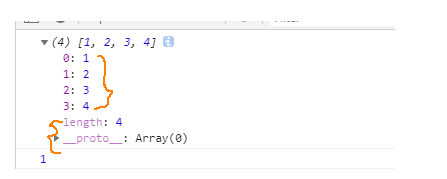
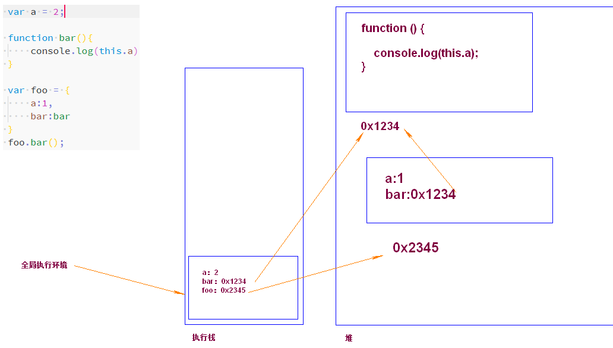
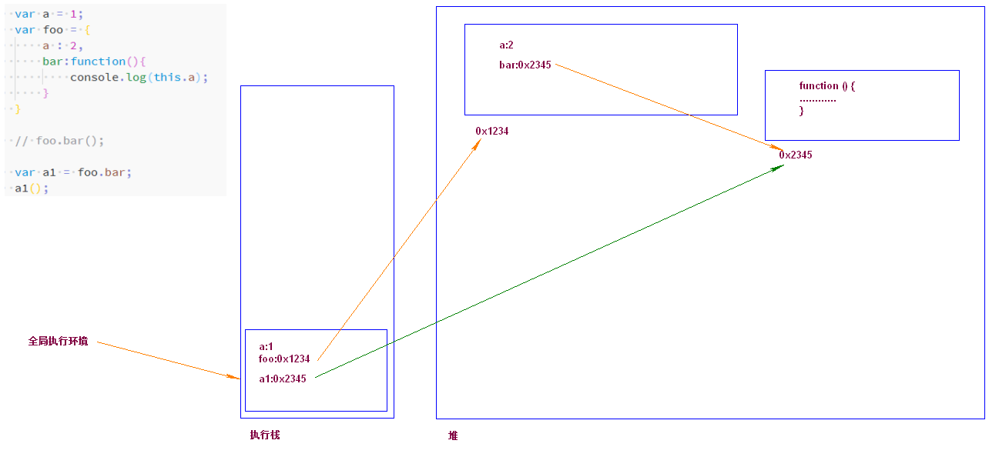
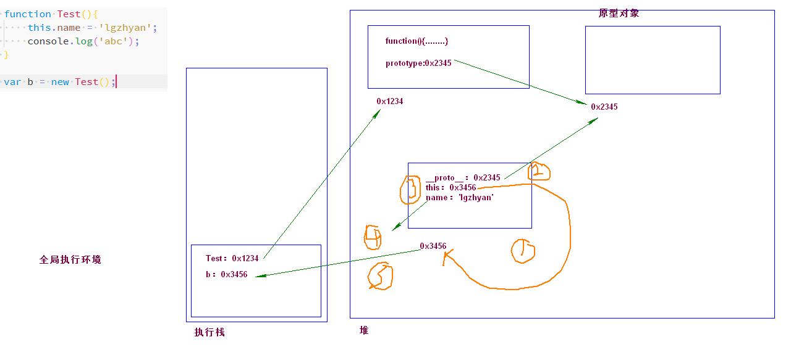

#### 原型链

原型对象中的属性，应该是给构造函数实例化出来的对象服务的，构造函数本身不能使用。

```js
function Person(name, sex) {
    this.name = name;
    this.sex = sex;
}

var p = new Person('张三','nan');
Person.prototype.say = function(){
    console.log('崔旺真英俊!');
}
// Person.say();//现在是找不到的。


// p.say();


//七夕青蛙   孤寡  
```

#### instanceof操作符

查找某个对象是否是指定的构造函数类型的。

* intanceof运算符的第一个变量是一个对象，暂时称它为a，第二个变量是一个函数，暂时称它为b。
* instanceof的判断规则是：沿着a的`__proto__`这条线来找，同时沿着b的prototype这条线来找，如果两条线能够找到同一个引用（同一个对象），那么返回true，如果找到重点还没有重合，则返回false。

__注意：__

1. 所有的引用类型都是Object的实例，所以在检测引用类型的值和Object时，instanceof始终会返回true。
2. 基本类型__不是对象__，所以在使用instanceof操作符检测基本类型的值是始终会返回false。

#### for...in遍历

`for...in`遍历可枚举的属性和原型链中的属性。

是否可遍历：一个对象中有些属性是不可以遍历出来的。可以理解为：`一般的时候用不到的属性`



如果在调试器中属性的颜色比其他的属性浅那么这个属性就是不可遍历的。


不要用`for.in`遍历数组，虽然数组是对象，数组的索引只是具有整数名称的枚举的属性，并且与通用对象属性相同。`for...in`不能保证遍历的顺序，而数组最主要的就是__有序__。

数组、函数都是对象，都可以添加属性。同样添加上属性之后还是会维持本来的功能的。(你大爷永远是你大爷)。


#### this指向

前面咱们说this指代的是__当前实例的这个对象__，这样说太片面。在JS中this始终表示的是__函数调用者。__

1. 全局执行环境中，this就是window。

   window对象是最顶层的对象，和它对应的是全局的执行环境。全局中定义的变量和函数都是作为window对象的属性和方法存在的。

   ```js
   console.log(this);
   ```

2. 如果就是光秃秃的函数调用this也指向window。

   ```js
   function test(){
       console.log(this);
       function test1(){
           console.log(this);
       }
   
       test1();
   }
   test();
   ```

3. 通过对象的方法调用。

   *  情况1：

     ```js
     var a = 'global';
     var foo = {
         a:'fooTest',
         bar:function(){
             console.log(this.a);
         }
     }
     foo.bar();
     ```

   * 情况2：

     ```js
     var a = 2;
     
     function bar(){
         console.log(this.a);
     }
     
     var foo = {
         a:1,
         bar:bar
     }
     // foo.bar();
     
     bar();
     ```

     

   * 情况3：

     ```js
     var obj2 = {
         a:'obj2',
         foo:function(){
             console.log(this.a);
         }
     };
     var obj1 = {
         a:'obj1',
         obj2:obj2
     }
     
     obj1.obj2.foo();
     ```

   * 情况4

     ```js
     var a = 1;
     var foo = {
         a : 2,
         bar:function(){
             console.log(this.a);
         }
     }
     
     // foo.bar();
     
     var a1 = foo.bar;
     a1();
     ```

     

     

   * 情况5：

     ```js
     var a = 1;
     
     var foo = {
         a:2,
         bar:function(){
             console.log(this.a);
         }
     };
     (foo.bar)();//foo.bar();
     ```

   * 情况6：这个记住就行了。

     ```js
     var a = 1;
     
     var foo = {
         a: 2,
         bar: function () {
             console.log(this.a);
         }
     };
     
     // (foo.bar = foo.bar)();//1
     // (foo.bar,foo.bar)();//1
     // (false || foo.bar)();//1
     ```

#### apply和call方法

每个函数都有call和apply()这两个方法，本质就是设置函数体内的this对象的值。

```js
var obj = {
    name :'sex',
    say:function(){
        console.log(this);
        console.log(this.name);
    }
};

obj.say();

var obj1 = {
    name:'hello'
}

obj.say.call(obj1);
```

* `call(this值,arg1,arg2,arg3.....)`
* `apply(this值,[参数的数组])`

apply和call的工作方式相同，不同之处在于传递给调用函数的参数的传递方式。

作用：

1. 借用其他对象的方法，让本对象使用。

   ```js
   var arr = [1,2,3,4,5,6,999,888,-1];
   
   console.log(Math.min.apply(null,arr));
   ```

2. 让其他的构造函数中的属性变成自己的

   ```js
   function Demo(name){
       this.name = name;
   }
   
   var obj = {sex:'nan',age:18};
   //执行了Demo，Demo中的this指向了obj，那么运行时this.name就等于了Obj.name   this.name=yanhaijing  obj.name=yanhaijing
   Demo.call(obj,'yanhaijing');
   
   console.log(obj);
   ```


#### new运算符的流程

流程：

1. 创建对象，开辟内存空间。
2. 设置原型链
3. this指向该内存地址（让函数内部的this指向新生成的对象）
4. 执行函数代码
5. 将创建的对象实例返回。




周五开始：晨读、分享  继续。

# JSON

JSON对象是内置对象，你不用定义直接就能够用了。

大写的JSON表示的是js的内置对象，如果是小写表示的是json这种数据格式。

* 现在我们大多数都是通过`json数据格式`来进行前后端交互的。

* json本质上来说就是字符串，简称`json串`

  前端往后端传数据时，我们通常要传json串，后端给我们数据时我们获得到的也是json串。

#### json的值

JSON语法可以表示三种类型的值：

1. 简单的值：使用JavaScript相同的语法，可以在json中表示字符串、数值、布尔值和null。
2. 对象：表示的是一组无序的键值对儿。
3. 数组：数组也是复杂的数据类型，表示一组有序的值的列表。键值对儿。

* 简单值

  javascript与json字符串最大的区别在于，json字符串必须使用双引号。

  ```json
  {
      5,
      "Hello world",
      null,
      false
  }
  ```

* 对象

  ```js
  {
      "name":"xxxx",
      "age":29
  }
  ```

* 数组

  ```js
  [
      25,"hi",true
  ]
  ```

我们使用最多的格式通常是对象和数组综合使用。外层是数组、里面是对象

```js
[
    {
        "name":"张三",
        "age":29
    },
    {
        "name":"李四",
        "age":30
    }
]
```


#### json数据处理


JS中处理json使用JSON全局对象。

* `JSON.stringify(值)`，将JavaScript转化为json字符串（用来向后端发送数据时将数据转换为json数据）。

  * JSON.stringify输出的JSON字符串不包含任何的缩进。（它就是字符串）

  * 在将JavaScript对象转换为json串时所有值为undefined的属性都会被忽略，不体现在结果中。

    ```js
    [{"name":"张三","age":29},{"name":"李四","age":30},{"name":"姜顶","sex":null}]
    ```

* `JSON.parse()`，将json字符串转换为我们的javascript的数据。

  如果传递给JSON.parse()的字符串不是有效的json格式那么将会报错。


# Math

ECMAScript还为数学计算提供了全局的内置对象，即Math对象。

* 将小数转换为整数，如果是整数则不改变。

  * `Math.ceil()`，进一取整。
  * `Math.floor()`，舍一取整。
  * `Math.round()`，执行标准的四舍五入。

* 进行数学计算

  * `Math.min() `，获得最小值。

  * `Math.max()` ，获得最大值。

  * `Math.abs()`，求绝对值。

  * `Math.pow(num,次方)`，进行幂运算。

  * `Math.PI`，圆周率，这是一个属性。

  * `Math.random()`，返回大于等于0小于1的一个随机数。

    公式：`Math.floor(Math.random() * (可能的最大值 -可能的最小值 + 1) + 可能的最小值)`

    随机 

    案例：验证码

# Date

Date是JavaScript给我们内置的一个函数。构造调用。用来处理日期、时间。

#### 时间戳

1. 是一个整数。可以用来进行计算使用。

2. 1970年的1月1日（计算机元年）~现在的毫秒数

   1s=1000ms

既然是函数就有两个角色：1.可以执行的代码   2.对象（其中包含属性和方法）

#### 时间处理方法

* `Date.now()`，获得当前的时间戳。
* `new Date()`，获得当前的日期对象。

#### 案例

1. 获得当前的日期和时间，格式为：`yyyy-mm-dd H:i:s`


# 包装对象

在JavaScript中提供了三个特殊的构造函数`Number()`、`String()`、`Boolean()`可以通过new操作符来调用，调用之后生成对应类型的对象。


我们写代码的时候根本就不用这三个构造函数。


```js
var str = 'abc';
console.log(str.length);//new String('abc').length//str = abc
```

上面代码的执行过程：

1. 声明了字符串abc放入到了str中（第一行代码）
2. 当发现你把它当做对象来使用的时候，js内部会自动的调用`new String('abc')`创建了一个对象（这种情况下创建的对象，我们叫包装对象）
3. 然后使用包装对象的属性、方法。当使用完成之后（本行结束之后），又会自动将包装对象转换为字符串。
4. 所以当你打印的时候str还是基本类型的字符串。


上面所说的执行过程number、boolean、string都会经过上面过程。


普通对象和包装对象的区别：主要区别就是他们两个的生命周期不同。

* 使用new操作符创建的引用类型的实例，在执行流离开当前作用域之前始终都保存在当前的作用域中。
* 如果是自动创建的包装类型的对象，只存在于一行代码执行的那一瞬间，然后立即被销毁。

#### 套路问题：

函数三部曲：

1. 功能（干什么用的）
2. 参数
3. 返回值

# 字符串方法

#### ES5方法

* charAt()，根据传入的位置取得其所在的字符。

* charCodeAt()，根据传入的位置取得其所在的字符编码（unicode码）。（不常用）

* String.fromCharCode()，根据传入的unicode码，转换为相应的字符。返回转化后的字符。

* concat()，将一或多个字符串拼接起来返回拼接的到的新字符串。

* indexOf(searchValue[,offset])，从一个字符串中向后搜索给定的子字符串，然后返回子字符串的位置（如果没有找到该子字符串，则返回-1）。第二个参数可以指定从哪开始(默认从0位置开始查找)；（常用）

* lastIndexOf()，从一个字符串中向前搜索给定的子字符串，然后返回子字符串的位置（如果没有找到该子字符串，则返回-1）。

* replace()方法，替换子字符串。（其他功能讲正则的时候说）将某个字符串置换成某个字符串。

  ```js
  var text = 'cat,bat,sat,fat,hat';
  
  var result = text.replace('at','bb');
  console.log(result);
  ```

  这种情况下只能替换一次，多次是不能自动替换的。

  

* slice(beginSlice[,endSlice])，提取一个字符串的一部分，返回一个新的字符串。beginSlice从0开始，endSlice可以省略，如果省略endSlice会一直提取到字符串末尾。（beginSlice是开启的位置，endSlice是结束的下标的----但结果不会包含结束的下标）---用的较多。（按下标取字符串）

* substr(start[,length])，返回一个字符串中从指定位置开始到指定字符数的字符。start，提取字符的位置，索引从0开始。length提取的字符数，length的最大值为字符串的长度减去1。省略length会从起始位置一直到字符串结束位置（按长度取字符串）

* split()，基于指定的分隔符将一个字符串分割成多个子字符串，并将结果放在一个数组中。(常用)

* toLowerCase()，将字符串转换为小写。

* toUpperCase()，将字符串转换为大写。

* valueOf()，返回对象的字符串、数值或布尔值表示。如果是包装类型返回包装类型的值，如果是对象则返回对象本身。

  __该方法没有参数__

  __返回值：如果是包装对象，返回的是包装对象中的基本值；如果不是包装对象类型，返回的是对象本身。__

* toString()，返回对象的字符串表示。

  __该方法没有参数__

  __返回值：如果是包装对象，返回的是包装对象中的基本值转换为字符串；如果不是包装对象类型，根据对象类型的不同返回值也不同。__

* match()，根据正则来匹配指定的字符串。

* search()方法，返回字符串中第一个匹配项的索引，如果没有找到则返回-1。该方法是中从字符串开头向后查找模式。

#### ES6方法

* includes(string,n)，返回布尔值，表示是否找到了参数字符串。

* startsWith(string,n)，返回布尔值，表示参数字符串是否在源字符串的头部。

* endsWith(string,n)，返回布尔值，表示参数字符串是否在源字符串的尾部。

* repeat(N)，返回一个新字符串，表示将原字符串重复N次。返回新字符串。

* padStart(length,str)，如果没有到达length的长度使用str在头部进行填充。

* padEnd(length,str)，如果没有到达length的长度使用str在尾部进行填充。


