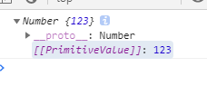

# 字符串方法

#### ES5方法

* slice(beginSlice[,endSlice])，提取一个字符串的一部分，返回一个新的字符串。beginSlice从0开始，endSlice可以省略，如果省略endSlice会一直提取到字符串末尾。（beginSlice是开启的位置，endSlice是结束的下标的----但结果不会包含结束的下标）---用的较多。（按下标取字符串）

* substr(start[,length])，返回一个字符串中从指定位置开始到指定字符数的字符。start，提取字符的位置，索引从0开始。length提取的字符数，length的最大值为字符串的长度减去1。省略length会从起始位置一直到字符串结束位置（按长度取字符串）

* split()，基于指定的分隔符将一个字符串分割成多个子字符串，并将结果放在一个数组中。(常用)

  split方法第一个参数不写，直接将整个字符串作为数组中的元素。

  如果第一个参数是空串（`''`）则将每个字符作为数组的一个元素。

  ```js
   var colors = 'red,blue,green,yellow';
  console.log(colors.split());
  console.log(colors.split(''));
  ```

  第二个参数是可选的参数，用于指定生成的数组的大小，确保返回的数组元素个数不会超过既定大小。

  ```js
  var colors = 'red,blue,green,yellow';
  console.log(colors.split(',',3));
  ```

* toLowerCase()，将字符串转换为小写。

* toUpperCase()，将字符串转换为大写。

* valueOf()，返回对象的字符串、数值或布尔值表示。如果是包装类型返回包装类型的值，如果是对象则返回对象本身。

  

  __该方法没有参数__

  如果对象中有`[[PrimitiveValue]]`属性那么将返回这个属性对应的值。

  ```js
  var num = new Number(123);
  /* var num1 = 123;
          console.log(typeof num1); */
  
  console.log(num.valueOf());
  
  
  var obj = {};
  console.log(obj);
  ```

  `[[PrimitiveValue]]`属性(基本值属性)只有包装对象才有，如果不是包装对象没有基本值。

  如果是包装对象的话valueOf取得值是`[[PrimitiveValue]]`属性对应的值，如果不是包装对象那么返回的是对象本身。

  ```js
  var num = new Number(123);
  console.log(num.valueOf());
  
  var str = new String('abc');
  console.log(str.valueOf());
  
  var bool = new Boolean(true);
  console.log(bool.valueOf());
  
  
  var obj = {};
  console.log(obj.valueOf());
  
  var arr = new Array();
  console.log(arr.valueOf());
  ```

  如果是基本包装对象会从基本包装对象的`__proto__`属性中找到`valueOf()`方法。

  非包装对象从本对象的`__proto__`属性中找到对应的valueOf()方法。

  __返回值：如果是包装对象，返回的是包装对象中的基本值；如果不是包装对象类型，返回的是对象本身。__

  该方法没有参数。

* toString()，返回对象的字符串表示。

  包装对象和非包装对象都可以使用`toString()`。

  __该方法没有参数__

  __返回值：如果是包装对象，返回的是包装对象中的基本值转换为字符串(`[[PrimitiveValue]]`)；如果不是包装对象类型，根据对象类型的不同返回值也不同。__

  ```js
   var obj = {};
  /* console.log(obj.toString()); */
  
  var arr = [1,2];
  function test() {
  
  }
  
  console.log(obj.toString());
  console.log(arr.toString());
  console.log(test.toString());
  ```

  * 数组：返回的是去掉中括号之后的值的列表。
  * 函数：返回的是函数本身的代码转换为了字符串。
  * 普通对象：返回的是`[object Object]`

总结一下：

对象分为包装对象和非包装对象，都可以使用valueOf和toString方法。

* valueOf：是用来获取对象中的基本值的。
  * 包装对象：调用的是各自的valueOf()，可以获得基本值。
  * 非包装对象：调用的都是同一个valueOf是Object原型当中的。获取不到基本值，返回的还是对象本身。
* toString：用来把对象转换为字符串。
  * 包装对象：把基本值拿出来然后转换为了字符串。
  * 非包装对象：转换的时候根据对象的不同转换结果也不同。
    * 数组：返回的是去掉中括号之后的值的列表。
    * 函数：函数本身的代码。
    * 普通的对象：`[object Object]`

* ~~match()，根据正则来匹配指定的字符串。~~
* ~~search()方法，返回字符串中第一个匹配项的索引，如果没有找到则返回-1。该方法是中从字符串开头向后查找模式。~~

#### ES6方法

* includes(string,n)，返回布尔值，表示是否找到了参数字符串。

* startsWith(string,n)，返回布尔值，表示参数字符串是否在源字符串的头部。

* endsWith(string,n)，返回布尔值，表示参数字符串是否在源字符串的尾部。

* repeat(N)，返回一个新字符串，表示将原字符串重复N次。返回新字符串。

* padStart(length,str)，如果没有到达length的长度使用str在头部进行填充。

* padEnd(length,str)，如果没有到达length的长度使用str在尾部进行填充。

# 数组方法

#### ES5方法

区分数组或类数组。数组它的`__proto__`应该指向`Array`，如果是类数组它的`__proto__`应该指向`Object`。

* Array.prototype.push()，接收任意数量的参数，把它们逐个添加到数组末尾，并返回修改后数组的长度。

* Array.prototype.pop()，从数组末尾移除最后一项，减少数组的length值，然后返回移除的项。

* Array.prototype.unshift()，在数组前端添加任意个数选项并返回新数组的长度。

* Array.prototype.shift()，移除数组中的第一个项并返回该项，同时将数组长度减1。

  注意：上面的四个方法都会改变原数组。

* Array.prototype.splice()，向数组的中部插入项。

  整体格式：`arr.splice(起始项,删除的个数,要插入的项目1,要插入的项目2......)`

  * 删除，可以删除任意数量的项，只需指定2个参数：要删除的第一项的位置和要删除的项数，返回删除的项组成的数组，原数组受到更改。

  * 替换，可以向指定位置插入任意数量的项，且同时删除任意数量的项，只需要指定3个参数：起始位置、要删除的项数、要插入的任意数量的项（插入的项数不必与删除的项数相等）。

  * 插入，可以向指定位置插入任意数量的项，只需要提供3个参数：起始位置、0（要删除的项数）、要插入的项目（要插入的项目可以传入任意多个项）。

      

* Array.prototype.concat(value1,.....,valuen)，基于当前数组中的所有项创建一个新数组。这个方法会先创建当前数组一个副本，然后将接收到的参数添加到这个副本的末尾。最后返回新构建的数组。

  * 没有给concat()方法传递参数的情况下，它只是复制当前数组并且返回副本。

    ```js
    var value = [0,1,2,3];
        var newValue = value.concat();
        console.log(newValue);
        console.log(newValue == value);
    
        value[0] = 'hello';
    
        console.log(newValue);
    ```

  * 如果传入的是单个的值那么将这些值加入到新数组的末尾。

    ```js
    var value = [0,1,2,3];   
    var newValue = value.concat(4,5,6);
    console.log(newValue);
    console.log(value);
    ```

  * 如果传入的是一个数组，则会将数组中的每一项都拿出来放入到新数组中(只对一维数组有效)。

    ```js
    var value = [0,1,2,3];
    var newValue = value.concat([4,5,6]);
    console.log(newValue);
    var newValue = value.concat([4,5,6,[7,8,9]]);
    console.log(newValue);
    ```

* Array.prototype.join()，使用指定的字符串拼接数组中的每个元素，组成一个字符串。

  ```js
  var colors = ['red','green','blue','yellow'];
  
  console.log(colors.join());
  ```

  上面的例子没有传入要进行连接的字符，所以默认使用`,`作为分隔符。

  ```js
  var colors = ['red','green','blue','yellow'];
  
  console.log(colors.join('-+-*/'));
  ```

  通常join会和字符串的split综合起来使用。（他们是一对）

* Array.prototype.reverse()，反转数组项的顺序，返回反转后的原数组。

  

* Array.prototype.slice()，基于当前数组中的一个或多个项创建一个新数组（该方法不会影响原始数组）。

  ```js
  var colors = ['red','green','blue','yellow'];
  
  var colors1 = colors.slice(2);
  console.log(colors1);
  console.log(colors)
  ```

  上面的例子只有一个参数，只有一个参数的情况下，该方法返回从该参数指定的位置开始到数组末尾的所有项。

  ```js
  var colors = ['red','green','blue','yellow'];
  
  var colors1 = colors.slice(1,3);
  console.log(colors1);
  console.log(colors)
  ```

  如果有两个参数，该方法返回起始位置和结束位置之间项（但是不包括结束位置的项）

  如果一个参数都不写的情况下，将从0开始一直到最后。

  ```js
  var colors = ['red','green','blue','yellow'];
  
  var colors1 = colors.slice();
  console.log(colors1);
  console.log(colors)
  ```

  

* Array.prototype.sort([sortFunc])，按升序排列数组项（最小的值位于最前面，最大的值排在最后面）。__排序后改变原数组。__

  如果不传递参数的情况下，sort会调用每个数组项的toString()方法。然后比较得到的字符串。

  ```js
  var values = [0,5,1,15,10];
  values.sort();
  console.log(values);
  ```

  sort方法可以接受一个比较函数作为参数。比较函数接收两个参数，如果第一个参数应该位于第二个参数之前需要返回一个负数，如果第一个参数应该位于第二个参数之后应该返回一个整数。如果两个参数相等则返回0。

  ```js
  var values = [0,5,1,15,10];
  /* values.sort(function(value1,value2){
          //函数中如果返回的是负数则第一个数在前面。如果返回的是正数则第二个数放在前面。如果两个参数相等返回0.
  
          if (value1 < value2) {
              return -1;//返回负数第一个数放在前面
          } else if (value1 > value2) {
              return 1;//返回正数第一个放在后面。
          } else {
              return 0;//返回0不动了。
          }
      }); */
  
  
  /* values.sort(function(value1,value2){
          return value1-value2;//如果第一个数-第二个数=负数说明第一个数小，就应该放在前面。
      }); */
  
  values.sort(function(value1,value2){
      return value2-value1;
  })
  console.log(values);
  ```

  


* Array.prototype.toString()，返回数组的字符串表示。

  数组：返回的是去掉中括号之后的值的列表。


* Array.prototype.indexOf()，查找指定的值并返回要查找的项在数组中的位置。没有找到返回-1。比较使用全等操作符。

  ```js
  var values = [0,5,1,15,10,[3,4]];
  
  // console.log(values.toString());
  
  console.log(values.indexOf(15));
  ```

  

* Array.prototype.forEach()，对数组中的每一项运行给定函数，这个方法没有返回值(返回值是`undefiend`)。

  ```js
  document.write('<table border="1" width="856">');
  colors.forEach(function(value,index,arr){
      // console.log(value + '======' + index);
      document.write("<tr>");
      document.write("<td>"+ value +"</td>");
      document.write("</tr>");
  })
  document.write('</table>');
  ```

  forEach只能遍历数组，因为它是在Array.prototype上面。

  ```js
  function test(){
      // console.log(arguments);
  
      arguments.forEach(function(value,index,arr){
  
      })
  }
  test(1,2,3);
  ```

  forEach只能遍历完，for可以中途使用break跳出。

  ```js
  /* for(var i = 0; i < colors.length ; i++){
          if ( i == 1){
              break;
          } 
  
          console.log(i);
      } */
  
  colors.forEach(function(value,index,arr){
      if (index == 1) {
          break;
      }
  
      console.log(index);
  })
  ```

  

* Array.prototype.map()，对数组中的每一项运行给定函数，返回每次函数调用的结果组成的数组。

  ```js
  var colors = ['red','green','blue','yellow'];
  
  var result = colors.map(function(val,ind,arr){
      // return val + '!hehe!';
  
      // return '哈哈';
  
      //如果我想让下标为1和2的返回xxx，其他的返回xxx。
      if (ind == 1 || ind == 2) {
          ind = 'xxx';
      }
  
      return val+ind;
  })
  
  console.log(result);
  ```

  

* Array.prototype.filter()，对数组中的每一项运行给定函数，返回该函数会返回true的项组成的数组。

  ```js
  var colors = ['red','green','blue','yellow'];
  
  var res = colors.filter(function(value,index,arr){
      if (value == 'green' || value == 'yellow') {
          return true;
      }
      return false;
  });
  
  console.log(res);
  ```

  

* Array.prototype.every()，对数组中的每一项运行给定函数，如果该函数对每一项都返回true，则返回true

  ```js
  //Array.prototype.every()，对数组中的每一项运行给定函数，如果该函数对每一项都返回true，则返回true//最后返回的是布尔值的true或false。
  var res = colors.every(function(value,index,arr){
      /*  if (value == 'green' || value == 'yellow') {
              return true;
          }
          return false; */
  
      return true;
  });
  
  console.log(res);
  ```

  

* Array.prototype.some()，对数组中的每一项运行给定函数，如果该函数对任一项返回true，则返回true。

  ```js
   var colors = ['red','green','blue','yellow'];
  var res = colors.some(function(value,index,arr){
      if (value == 'green' || value == 'yellow') {
          return true;
      }
      return false;
  
  });
  
  console.log(res);
  ```

  

* Array.isArray(value)，确定value是否是数组，如果是数组返回true否则返回false。

  ```js
  var colors = ['red','green','blue','yellow'];
  
  console.log(Array.isArray(colors));
  ```

  


#### ES6

* Array.from方法用于将类数组对象转为真正的数组：类数组对象（array-like object，有length属性和索引元素）和可遍历对象。

  ```js
  function test(){
      var res = Array.from(arguments);
      console.log(res);
  }
  
  test(1,2,3);
  ```

  

* Array.of用于将一组值转换为数组。返回新数组。

  `[ ]`

  ```js
  var a = new Array(10);
  console.log(a);
  
  var b = Array.of(10);
  console.log(b);
  ```

  主要弥补构造函数Array的不足（因为只有一个参数并且参数是数值的时候Array将会创建的是有`数值`个数的空元素，而Array.of则会创建只有一个元素且元素的值是`指定的值`的元素。）

* Array.prototype.includes()方法返回一个布尔值，表示某个数组是否包含给定的值。

  该方法主要用来替代`indexOf()`，因为`indexOf()`是`全等运算`，而`NaN`和`NaN`也不相等。
  
  ```js
  var arr = [1,5,NaN,20,15];
  
  console.log(arr.includes(NaN));//
  
  console.log(arr.indexOf(NaN));//indexOf进行的是全等于匹配  NaN和什么都不相等所以返回-1
  ```
  
  


